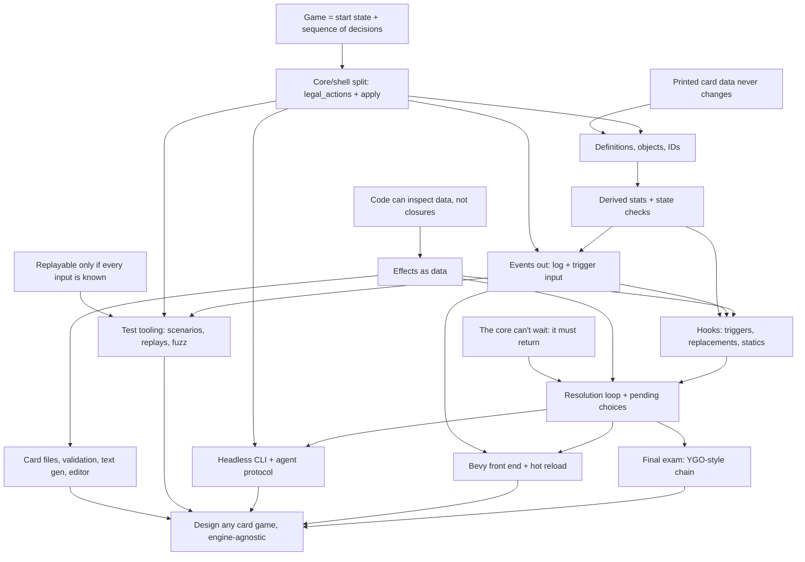

# Card game systems course

Read this at the start of every session. Update it at the end of every session.

## Goal

Understand card game systems well enough to design MTG, Hearthstone, or Yu-Gi-Oh style games from scratch, plus original ones. Focus on code quality, extensibility, card data, card effects, tooling, and automated testing. The rules core is engine-agnostic Rust. Bevy is the main front end.

## How sessions work

- Teaching follows `.pi/skills/teach/SKILL.md`: motivate, establish, connect, quiz-check, one node at a time.
- One pi session per course session. Start with `/new`, `/name NN-topic`, `/md-log course/sessions/NN-topic.md` (the file must exist first), then "continue the course".
- Every session opens with a short retrieval quiz on the previous session's nodes, and adjusts the knowledge map below if something didn't stick.
- Roles in exercises. First we agree on the design in discussion. The learner writes the design-bearing code (types, traits, key function signatures and bodies). The agent writes scaffolding and tests against that API, then reviews. Tests come before the implementation.
- End at a node boundary, not mid-node. Commit once per node.
- Core track (A to G, T, K) is concept-first with one small exercise per session. Application track (H, I, J) gets one design session each. Implementation there is optional.

## Knowledge map (from the 2025-09-28 probe, updated in session 01)

Session 01 (R1, S, L, P, G all landed on the first node check):
- Determinism: a seeded RNG in the state, the clock in the shell (timer becomes an `EndTurn` input). Knows `HashMap`, `thread_rng` and `Instant::now` break replay.
- State is everything (Markov): hidden info like deck order is state, and UI hover/animation is not. `Game` has no log.
- `legal_actions` is the one definition of legality. The UI reads it. `apply` is `Ok` iff the action is listed, and `Err` changes nothing (validate before mutating).
- Proposed per-player `apply(player, action)` himself, citing simultaneous decisions.
- Rust reading is solid: `Clone` for search, `self` by value loses the game on `Err`, `?` does no rollback, owned `Vec` vs a borrowed iterator.
- Action granularity was the one probe miss. He picked `Attack(Vec<Id>)` because he read staging as imposing an order. Fixed once the draft-in-state idea was explicit. His own model was fixed-order yes/no per creature.
- Vocabulary slip: said the core is "influenced by events" when he meant actions. Actions in, events out. Watch for this in session 03.
- Retrieval: now says unprompted that death is a state check, not a setter side effect, and that a boxed closure is opaque.
- Seeds: answered "I don't know" on seed-shift test robustness (the abstract phrasing was the problem). It landed once shown as code: a seed fixes a stream, each random event takes the next number, and an unrelated extra draw shifts every later outcome. Tests should assert properties across seeds, not pin a seed to an outcome.

Session 01 exercise (`crates/rules`, all green):
- He writes the validate/mutate split by instinct (`apply` checks membership, then an infallible `apply_action`). Derived `winner()` from health instead of setting a flag in N places.
- Strong TDD discipline: didn't implement WildBolt because no test pinned it. That was right, and the gap was in my tests.
- Pushed back on my review, correctly. Player identity (`PlayerId` → `Player`) and turn sequence (`TurnOrder`) are separate concepts, and I had wrongly called `TurnOrder` a second copy. Argue specifics with him and concede when he's right. Only the setup line that coupled them needed changing.
- Leans toward N-player generality (`TurnOrder`, `(idx + 1) % len`). Wants explicit targeting, since `opponent()` doesn't generalize.
- Removed an early `HashMap<PlayerId, _>` for determinism and simplicity, unprompted.
- Rust he produced: newtypes (`Deck`, `Hand`, a private-field `PlayerId` with `const fn new`), enum pending state, `std::mem::take`, `let`-`else`. Used `VecDeque` and changed `deck()` to return a `Vec` copy.

Session 02 retrieval and probe (all probe questions right; the edge is in design instinct, not concepts):
- Retrieval: seed streams (transfer to cosmetic RNG), one-place legality, and actions vs events all held. The OpenSpiel chance-player model had faded ("not sure what it means"). Re-taught as "a chance node is a Forage pick where the dice decide", and it landed.
- Probe, all right: a stable-ID-keyed buff survives a bounce (wrong); design X (one mutable attack number) ends at 0; the observer Giant costs 12 when created late; snapshot vs standing cost reductions; a fixed-point state-check loop; store damage and derive toughness (MTG anthem case); scan-on-read for a silenced aura; `Rc`/`&'a` block a Bevy `Resource`; zone-reset rules are per game (HS forward vs backward).
- The edge: when designing from scratch he still reaches for a stored mirror plus hooks. Notes: "counter would probably be a modifier on player state"; "3 is better performance, and when silenced it removes the aura from the player". He picks derived when shown a failing case, but defaults to mirrors for performance. Teach into this: one source of truth per fact, and cache the whole view at defined moments rather than patching incrementally.

Session 02 nodes (all landed on the node check):
- R2: printed data never changes, so it's shared via a `Copy` `DefId` and can be `static`. It's still an input in $s_0$: a balance patch breaks old replays unless the data version is pinned.
- B: Lure's `hand_index` failing case; `ObjectId` from a counter in `Game` (a global counter breaks replay once bot clones allocate); a stale ID lookup returns `None`; the zone-reset table is per game; the UI links a reset object through an old/new event (Arena `ObjectIdChanged`) or a stable card ID.
- C: "store history, derive the rest" plus "a stored copy of a derived fact is a mirror" (the same as session 01's UI legality check). His own question opened it: counters multiply, and his objection that generated cards break setup registration. Resolved with a history slice (`Vec<SpellCast { def, turn }>`) queried by filters, where "this turn" is a filter and needs no reset hook. Session 01's "full history is overkill" held only for one known question; an open card pool pushes toward history slices. He said "it's basically a log", and it is, but it lives inside `Game` (not the shell's log).
- Caching: he picked per-minion event-driven invalidation (miss). His model was "every change emits an event, so recache on every change." The dependent-values gap was shown with a silenced Captain leaving a stale Recruit, and that landed. He then asked whether a full rebuild is too costly. Answered with rough costs (about 100 steps per rebuild, and caching only pays when reads far outnumber actions). Ranking: no cache, then a lazy full rebuild (dirty flag), then incremental only with a real dependency graph.
- State checks: death is committed because it has consequences, and deriving it creates a fixed-point cycle. Collect then commit; loop to a fixed point. Outcome needs `Draw`. With N players, elimination must be committed, because a derived one is undone by a heal.

Session 02 exercise design (guided by questions, at his request, not presented):
- Got these right: the `DefId` candidates (index, enum, `&'static str`; not `String`); per-field `match` scatters a card's data; nested `Kind` instead of a flat struct (his own concern: "atk on spells"); an enum can't name a file-defined card. His note: an index breaks on reorder and a name on rename. He proposed UUIDs, with the codes known at compile time.
- Missed load-time validation: he picked "catch it when the effect resolves" and over-applied node B's stale-ID `None` to definitions. Fixed by splitting runtime staleness (`Option`) from fixed data (validate at load).
- Raised hot reload mid-game, which led to pinning the data version (R2). On "where does each game's table live" he proposed append-only versioned definitions in one table (the version goes in the `DefId`). That's valid, and I conceded. The per-game `Arc<CardDb>` alternative is deferred to session H.
- Gap: he didn't know effects can be data ("is there a point of cards as data if effects can't be data?"). Taught that code defines the vocabulary (enum plus interpreter) and data composes it (variant plus numbers). The draw-vs-damage check landed.
- Chose `DefId(&'static str)` stable codes, `CardDef` with a nested `Kind`, behavior as `Effect`/`CostRule`/`Aura` data, and a `static` table behind one `def(id)` lookup.
- Process: the quiz UI doesn't show the prose above it. Put any code the question depends on into the question or its `details`.

Solid:
- Card definition (never changes) vs instance with its own ID and modifiers.
- Non-commuting modifiers ("set to 1" vs "+2") need an ordering rule. Noted himself that 1 vs 3 is a design choice.
- Replacement effects ("if X would happen, do Z instead") vs triggers ("whenever X happens"). A listener can't undo an event.
- Effects referring to cards by ID, not `Rc<RefCell>` or `&mut`. Game owns everything.
- Stable card ID vs object ID that changes on zone change (MTG 400.7).
- Expression problem: enum makes new operations cheap, new variants touch every `match`. Knows `_` arms hide the checklist.
- Core returns a pending choice instead of blocking.

Partial:
- Effects as data. Got it once shown in concrete Rust (inspect, serialize, highlight targets). First guess was "enum is faster than dyn dispatch". Did not reach for inspectability unprompted.
- Pending choice: has the idea. Session 01 update: solid for simple drafts (Discover picks, attacker drafts, and Forage in the exercise are all state in `Game`). Not yet tested on a half-finished effect *mid-resolution* ("deal 3, then if it died draw" paused for a target). That's session 06.

Gaps (teach into these):
- Timing, i.e. *when* things run. Put the death check in a health setter ("every change goes through the setter"). Dislodged by the "can't die this turn" expiry case, but still needs a proper node. Chose the trigger queue for decoupling reasons, not for re-entrancy and timing reasons.
- Core to shell output. Unsure whether the core should return events or push them.
- ~~Determinism sources.~~ Closed in session 01 (`HashMap`, `thread_rng`, `Instant::now`, and seeds as streams).
- Property-based testing. Sees crashes and rejected legal moves as fuzz findings. Missed invariants you assert yourself (card in two zones, replay divergence).

Rust: knows traits, generics, lifetimes, but they don't come naturally when designing. Explain *why* each trait, generic, or ownership choice is the one to make.

## Decisions so far

- Build a tiny Hearthstone-like game first.
- Final exam (K): add a Yu-Gi-Oh style chain without rewriting the core. Learner knows YGO best.
- Effects: `enum` by default (open to a code escape hatch later).
- Two IDs: stable card ID and per-zone object ID.
- Core API (session 01): `legal_actions(&self, player) -> Vec<Action>`, `apply(&mut self, player, action) -> Result<(), Illegal>`, and a pure `applied(&self, …) -> Result<Game, Illegal>` wrapper. There's no `current_player()`: whoever has a non-empty list is being waited on. Crate `rules` in a `crates/` workspace. The seeded SplitMix64 `rules::Rng` lives in `Game`. Hand indices are the card identity until session 02, deliberately. `PlayerId` has a private field, with `const fn new(usize)` and `idx()`. `deck()` returns `Vec<Card>`. Cost payment lives once in the `Play` arm, not per card.
- Session 02: `DefId(&'static str)` stable codes; `CardDef { code, name, cost, kind }` with `Kind::Spell { effect } | Kind::Minion { attack, health, aura }`; mechanics as enums (`Effect`, `CostRule`) interpreted by code; a `static` table behind one `def(id)` lookup for now. `Outcome { Won(PlayerId), Draw }`. `Action::{Play, Pick}` carry `ObjectId`. Tests accept either hand to board ID policy.
- Tooling wanted: card data files with validation, generated rules text, test tooling (scenario DSL, replays, fuzzer), headless CLI with a machine-readable protocol so bots and LLM agents can playtest, a visual editor, hot reload.

## Open threads

- Where does a half-finished effect live between `apply` calls? (node 06-G)
- Two dead heroes: the derived `winner()` returns `None` when both are at 0 or less, so the game would continue. Nothing can cause it yet. Use it in session 02 (C, state checks) together with "can't die this turn".
- The decider is always the turn player: `legal_actions` returns empty for the non-turn player before it reads their `interaction_state`, so an opponent-side pick or response is never offered. Sessions 06 and 08.
- Explicit targeting: he wants it. Session 04 (effects as data, `TargetSpec`, target choice as a decision).
- Chance as an input (OpenSpiel style) for testing random effects without seeds. Session 07.
- Minor: Bolt targets `(caster.idx() + 1) % len`, which treats the identity index as seat order. That contradicts his own identity vs turn-order split. Mention it when targeting comes up.
- Return vs push for events. (node D)
- "Costs (1) less per spell cast this turn": his observer design (a -1 modifier on the card) vs a counter in state. Which one handles a copy drawn after the spells? Open session 02 (C) with this.
- ~~Hand index vs ID~~: done in session 02 (Lure).
- Session H: versioned definitions in one append-only table (his design) vs a per-game `Arc<CardDb>` snapshot. Hot reload as a recorded input. Load-time validation of card codes referenced in data. Stable codes in files vs runtime index.
- Session 02 review: ask about where objects live (per-zone `Vec` vs arena), the hand to board ID policy, counter vs list for spells cast, derived vs committed outcome, hero damage vs health, and the per-field `match` in the old `Card::mana_cost`.

## Dependency map

## Sessions

| # | Nodes | Topic | Status |
|---|-------|-------|--------|
| 00 | probe | Knowledge probe and plan | done |
| 01 | R1, A | Game as a state machine, `legal_actions` + `apply` | done (exercise green: 3 rng + 20 contract tests) |
| 02 | R2, B, C | Definitions, objects, IDs; derived stats and state checks | nodes done; exercise tests committed (`4d459e0`), learner implementing |
| 03 | D | Events out; return vs push | |
| 04 | R3, E | Effects as data | |
| 05 | F | Triggers, replacements, statics | |
| 06 | R4, G | Resolution loop, pending choices, stored half-finished effects | |
| 07 | R5, T | Scenario DSL, replays, determinism trap, invariant fuzzing | |
| 08 | K | YGO chain: spell speed, right to act, LIFO, SEGOC, missing the timing | |
| app | H | Card files, validation, text generation, editor (design session) | |
| app | I | Headless CLI + agent protocol (design session) | |
| app | J | Bevy front end + hot reload (design session) | |

## Verified facts to reuse

- Hearthstone applies enchantments in the order granted, auras after. Deaths are processed after the outermost phase ends, all at once. Source: hearthstone.wiki.gg Advanced rulebook, Set attribute page.
- MTG Arena's rules engine (GRE) is C++ plus CLIPS. Much of the card behavior code is machine-generated from card text. Source: magic.wizards.com "On Whiteboards, Naps, and Living Breakthrough".
- Forge card scripts separate abilities (`A:`), triggers (`T:`), statics (`S:`), and replacement effects (`R:`). Source: Card-Forge wiki, Card scripting API.
- Spellsource/Metastone cards are JSON `CardDesc` with `SpellDesc` trees and value providers. Source: playspellsource.com javadoc.
- YGO SEGOC order: turn player mandatory, non-turn player mandatory, turn player optional, non-turn player optional. Same category, the owner picks order. Source: Yugipedia "Simultaneous Effects", YGOrganization part 3.
- YGO spell speed: respond only with equal or higher speed. Spell Speed 1 can't respond. Source: Yugipedia "Spell Speed".
- YGO: optional "when... you can" triggers miss the timing unless their condition was the last thing to happen. "If" and mandatory triggers don't miss it. Source: Yugipedia "If... You Can VS When... You Can".
- OpenSpiel `State`: `legal_actions()`, `apply_action()` (in place), `child()` (clone + apply), `current_player()`, `is_terminal()`, `returns()`, `is_chance_node()`, `chance_outcomes()` giving `(action, prob)` pairs. `kChancePlayerId = -1`, simultaneous `-2`. Chance moves are ordinary actions in explicit-stochastic mode. In sampled mode the game keeps its own RNG. Source: open_spiel docs/concepts.md, spiel.h, spiel_globals.h.
- SabberStone: `Controller.Options()` returns `List<PlayerTask>`, empty for the player who isn't acting. `Game.Process(task)` mutates in place. `Game.Clone(...)` for search. Source: SabberStoneCore Controller.cs, Game.cs.
- Metastone: public `GameContext.getValidActions()`. `performAction` is private; `GameLogic.performGameAction(playerId, action)` is public. The engine calls out with `IBehaviour.requestAction(context, player, validActions)`. Source: demilich1/metastone GameContext.java, IBehaviour.java.
- Forge: the engine calls out to `PlayerController` (`chooseSpellAbilityToPlay()`, `declareAttackers(...)`), with human and AI implementations. Source: Card-Forge PlayerController.java, PhaseHandler.java.
- Rust std `HashMap`: each instance gets its own random seed, so iteration order differs even within one process. Source: doc.rust-lang.org HashMap, RandomState.
- `.pi/agents/researcher.md` now uses `anthropic/claude-opus-5-5` and works (session 02).
- MTG CR 400.7: "An object that moves from one zone to another becomes a new object with no memory of, or relation to, its previous existence." Exceptions 400.7a onward. 704.3: SBAs are checked whenever a player would get priority, all applicable ones are performed simultaneously as one event, and the check repeats. 104.4a: "If all the players remaining in a game lose simultaneously, the game is a draw." Layer 7 sublayers are 613.4a–d: CDA, set, modify (counters merged into 7c in the Ikoria update, 2020), switch. Timestamp order within a sublayer (613.7). Source: yawgatog CR (effective 2026-09-25).
- MTG Arena GRE sends `AnnotationType_ObjectIdChanged` (`orig_id` → `new_id`) when a zone move gives a card a new instance ID. Source: manasight-parser (third-party; the protocol is undocumented).
- Hearthstone: both heroes dead at the end of a sequence is a draw (Hellfire example). Arcane Giant: "Costs (1) less for each spell you've cast this game." Moving "backwards" (Play → Hand) resets tags and enchantments (Z5a), while hand buffs survive being played. Health rule H2: when max Health drops, current Health drops only if it exceeds the new max, so a damaged minion survives losing an aura (MTG: it dies). Deaths are processed only after the outermost phase: Aura Update, then Death Creation Step (simultaneous), then Death Phases, repeated until no new deaths. Source: hearthstone.wiki.gg Advanced rulebook, Health, Return to hand.
- Forge: `GameAction.checkStaticAbilities()` calls `StaticEffects.clearStaticEffects` (removes every applied static effect) and then reapplies all continuous statics layer by layer (timestamp order, dependencies per 613.8). It runs at the start of every pass of `checkStateEffects`'s SBA loop (`for q < 9`, a capped fixed point) and also inside `changeZone`. Source: Card-Forge GameAction.java, StaticEffects.java.
- Hearthstone Aura Updates (Advanced rulebook 4a/4b): after the outermost Phase there's an Aura Update (Health/Attack), then the Death Creation Step, then an Aura Update (Other). Both also run whenever a minion is summoned (not played). Auras aren't recalculated mid-Phase, so stats can be stale (the Mana Wyrm and Cone of Cold example).
- YGO: a monster flipped face-down or leaving the field loses effects previously applied to it (Relay Soul and Junk Synchron rulings). The "treated as a new card" wording is community phrasing. Source: Yugipedia card rulings.
- Toolchain on this machine: rustc/cargo 1.92. Check crate versions (bevy, rand, ron, proptest, insta) when adding them. Bevy was at 0.20 RC in the index at probe time.
