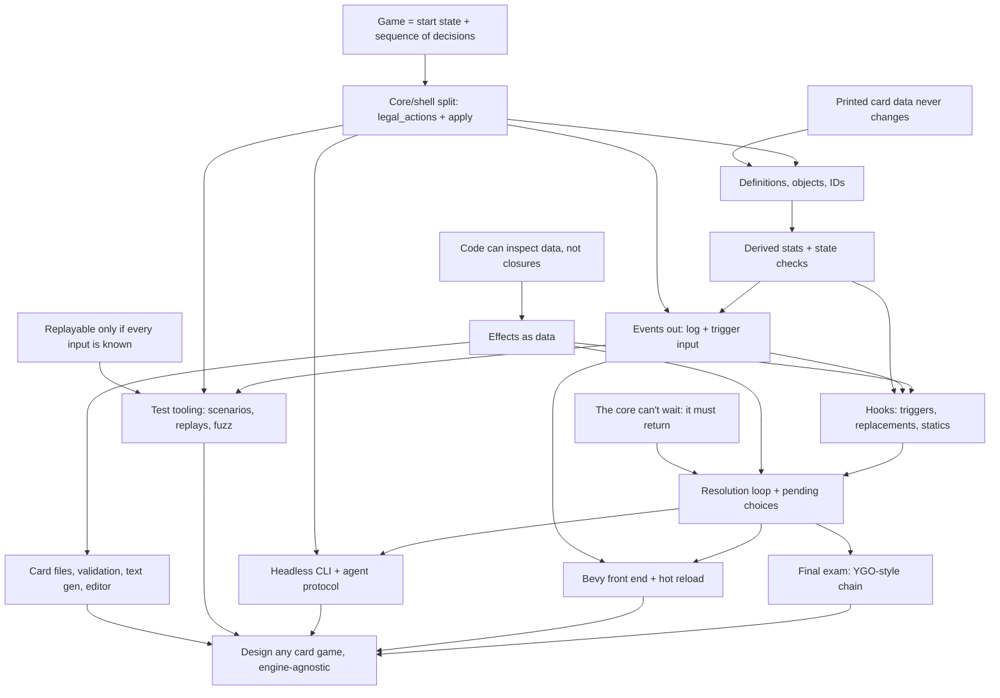

# Card game systems course

Read this at the start of every session. Update it at the end of every session.

## Goal

Understand card game systems well enough to design MTG, Hearthstone, or Yu-Gi-Oh style games from scratch, plus original ones. Focus on code quality, extensibility, card data, card effects, tooling, and automated testing. The rules core is engine-agnostic Rust. Bevy is the main front end.

## How sessions work

- Teaching follows `.pi/skills/teach/SKILL.md`: motivate, establish, connect, quiz-check, one node at a time.
- One pi session per course session. Start with `/new`, `/name NN-topic`, `/md-log course/sessions/NN-topic.md` (the file must exist first), then "continue the course".
- Every session opens with a short retrieval quiz on the previous session's nodes, and adjusts the knowledge map below if something didn't stick.
- Roles in exercises. First we agree on the design in discussion. The learner writes the design-bearing code (types, traits, key function signatures and bodies). The agent writes scaffolding and tests against that API, then reviews. Tests come before the implementation.
- End at a node boundary, not mid-node. Commit once per node.
- Core track (A to G, T, K) is concept-first with one small exercise per session. Application track (H, I, J) gets one design session each. Implementation there is optional.

## Knowledge map (from the 2025-09-28 probe, updated in session 01)

Session 01 (R1, S, L, P, G all landed on the first node check):
- Determinism: a seeded RNG in the state, the clock in the shell (timer becomes an `EndTurn` input). Knows `HashMap`, `thread_rng` and `Instant::now` break replay.
- State is everything (Markov): hidden info like deck order is state, and UI hover/animation is not. `Game` has no log.
- `legal_actions` is the one definition of legality. The UI reads it. `apply` is `Ok` iff the action is listed, and `Err` changes nothing (validate before mutating).
- Proposed per-player `apply(player, action)` himself, citing simultaneous decisions.
- Rust reading is solid: `Clone` for search, `self` by value loses the game on `Err`, `?` does no rollback, owned `Vec` vs a borrowed iterator.
- Action granularity was the one probe miss. He picked `Attack(Vec<Id>)` because he read staging as imposing an order. Fixed once the draft-in-state idea was explicit. His own model was fixed-order yes/no per creature.
- Vocabulary slip: said the core is "influenced by events" when he meant actions. Actions in, events out. Watch for this in session 03.
- Retrieval: now says unprompted that death is a state check, not a setter side effect, and that a boxed closure is opaque.

Solid:
- Card definition (never changes) vs instance with its own ID and modifiers.
- Non-commuting modifiers ("set to 1" vs "+2") need an ordering rule. Noted himself that 1 vs 3 is a design choice.
- Replacement effects ("if X would happen, do Z instead") vs triggers ("whenever X happens"). A listener can't undo an event.
- Effects referring to cards by ID, not `Rc<RefCell>` or `&mut`. Game owns everything.
- Stable card ID vs object ID that changes on zone change (MTG 400.7).
- Expression problem: enum makes new operations cheap, new variants touch every `match`. Knows `_` arms hide the checklist.
- Core returns a pending choice instead of blocking.

Partial:
- Effects as data. Got it once shown in concrete Rust (inspect, serialize, highlight targets). First guess was "enum is faster than dyn dispatch". Did not reach for inspectability unprompted.
- Pending choice: has the idea, hasn't yet seen that the half-finished effect must be stored as data, not on the call stack.

Gaps (teach into these):
- Timing, i.e. *when* things run. Put the death check in a health setter ("every change goes through the setter"). Dislodged by the "can't die this turn" expiry case, but still needs a proper node. Chose the trigger queue for decoupling reasons, not for re-entrancy and timing reasons.
- Core to shell output. Unsure whether the core should return events or push them.
- Determinism sources. Knows the core must be deterministic, didn't know std `HashMap` iteration order is randomized per process.
- Property-based testing. Sees crashes and rejected legal moves as fuzz findings. Missed invariants you assert yourself (card in two zones, replay divergence).

Rust: knows traits, generics, lifetimes, but they don't come naturally when designing. Explain *why* each trait, generic, or ownership choice is the one to make.

## Decisions so far

- Build a tiny Hearthstone-like game first.
- Final exam (K): add a Yu-Gi-Oh style chain without rewriting the core. Learner knows YGO best.
- Effects: `enum` by default (open to a code escape hatch later).
- Two IDs: stable card ID and per-zone object ID.
- Core API (session 01): `legal_actions(&self, player) -> Vec<Action>`, `apply(&mut self, player, action) -> Result<(), Illegal>`, and a pure `applied(&self, …) -> Result<Game, Illegal>` wrapper. There's no `current_player()`: whoever has a non-empty list is being waited on. Crate `rules` in a `crates/` workspace. The seeded SplitMix64 `rules::Rng` lives in `Game`. Hand indices are the card identity until session 02, deliberately.
- Tooling wanted: card data files with validation, generated rules text, test tooling (scenario DSL, replays, fuzzer), headless CLI with a machine-readable protocol so bots and LLM agents can playtest, a visual editor, hot reload.

## Open threads

- Where does a half-finished effect live between `apply` calls? (node G)
- Return vs push for events. (node D)
- "Costs (1) less per spell cast this turn": his observer design (a -1 modifier on the card) vs a counter in state. Which one handles a copy drawn after the spells? Open session 02 (C) with this.
- Hand index vs ID: open session 02 (B) with a failing case, like an effect that remembers a card or a log entry after the hand shifts.

## Dependency map

## Sessions

| # | Nodes | Topic | Status |
|---|-------|-------|--------|
| 00 | probe | Knowledge probe and plan | done |
| 01 | R1, A | Game as a state machine, `legal_actions` + `apply` | nodes done; exercise in progress (`crates/rules`, tests red) |
| 02 | R2, B, C | Definitions, objects, IDs; derived stats and state checks | |
| 03 | D | Events out; return vs push | |
| 04 | R3, E | Effects as data | |
| 05 | F | Triggers, replacements, statics | |
| 06 | R4, G | Resolution loop, pending choices, stored half-finished effects | |
| 07 | R5, T | Scenario DSL, replays, determinism trap, invariant fuzzing | |
| 08 | K | YGO chain: spell speed, right to act, LIFO, SEGOC, missing the timing | |
| app | H | Card files, validation, text generation, editor (design session) | |
| app | I | Headless CLI + agent protocol (design session) | |
| app | J | Bevy front end + hot reload (design session) | |

## Verified facts to reuse

- Hearthstone applies enchantments in the order granted, auras after. Deaths are processed after the outermost phase ends, all at once. Source: hearthstone.wiki.gg Advanced rulebook, Set attribute page.
- MTG Arena's rules engine (GRE) is C++ plus CLIPS. Much of the card behavior code is machine-generated from card text. Source: magic.wizards.com "On Whiteboards, Naps, and Living Breakthrough".
- Forge card scripts separate abilities (`A:`), triggers (`T:`), statics (`S:`), and replacement effects (`R:`). Source: Card-Forge wiki, Card scripting API.
- Spellsource/Metastone cards are JSON `CardDesc` with `SpellDesc` trees and value providers. Source: playspellsource.com javadoc.
- YGO SEGOC order: turn player mandatory, non-turn player mandatory, turn player optional, non-turn player optional. Same category, the owner picks order. Source: Yugipedia "Simultaneous Effects", YGOrganization part 3.
- YGO spell speed: respond only with equal or higher speed. Spell Speed 1 can't respond. Source: Yugipedia "Spell Speed".
- YGO: optional "when... you can" triggers miss the timing unless their condition was the last thing to happen. "If" and mandatory triggers don't miss it. Source: Yugipedia "If... You Can VS When... You Can".
- OpenSpiel `State`: `legal_actions()`, `apply_action()` (in place), `child()` (clone + apply), `current_player()`, `is_terminal()`, `returns()`, `is_chance_node()`, `chance_outcomes()` giving `(action, prob)` pairs. `kChancePlayerId = -1`, simultaneous `-2`. Chance moves are ordinary actions in explicit-stochastic mode. In sampled mode the game keeps its own RNG. Source: open_spiel docs/concepts.md, spiel.h, spiel_globals.h.
- SabberStone: `Controller.Options()` returns `List<PlayerTask>`, empty for the player who isn't acting. `Game.Process(task)` mutates in place. `Game.Clone(...)` for search. Source: SabberStoneCore Controller.cs, Game.cs.
- Metastone: public `GameContext.getValidActions()`. `performAction` is private; `GameLogic.performGameAction(playerId, action)` is public. The engine calls out with `IBehaviour.requestAction(context, player, validActions)`. Source: demilich1/metastone GameContext.java, IBehaviour.java.
- Forge: the engine calls out to `PlayerController` (`chooseSpellAbilityToPlay()`, `declareAttackers(...)`), with human and AI implementations. Source: Card-Forge PlayerController.java, PhaseHandler.java.
- Rust std `HashMap`: each instance gets its own random seed, so iteration order differs even within one process. Source: doc.rust-lang.org HashMap, RandomState.
- `.pi/agents/researcher.md` points at an OpenRouter model with no login on this machine. Use the `general-purpose` subagent for fact checks until that's changed.
- Toolchain on this machine: rustc/cargo 1.92. Check crate versions (bevy, rand, ron, proptest, insta) when adding them. Bevy was at 0.20 RC in the index at probe time.
