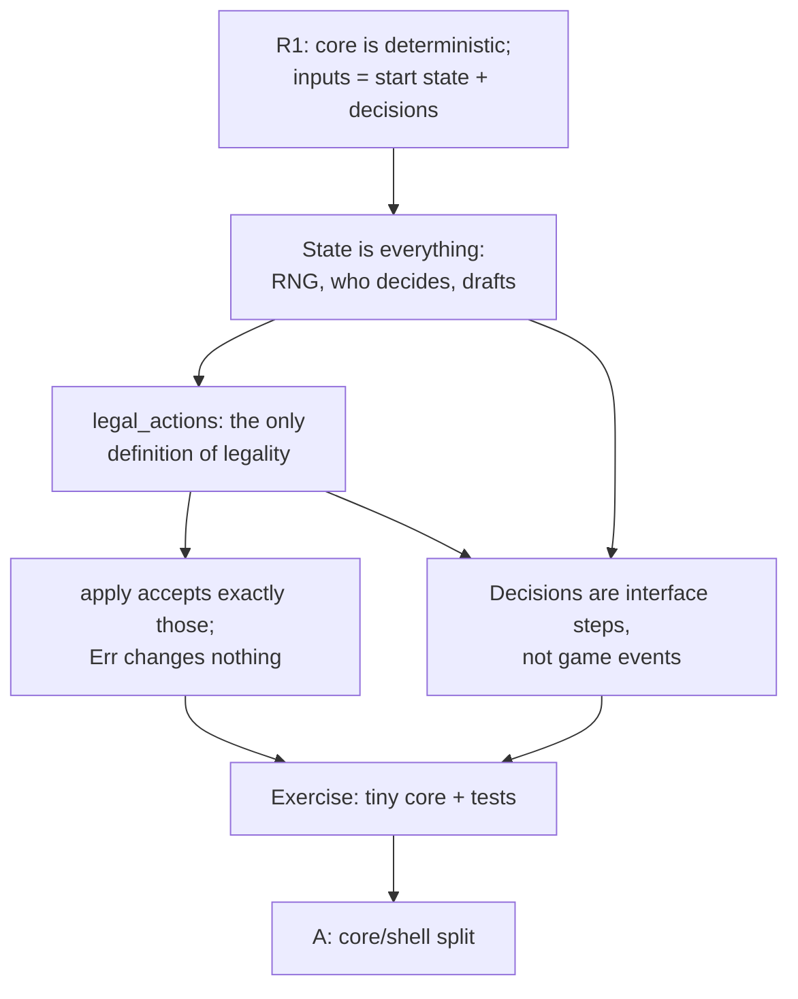

> [!quote] YOU

continue the course

> [!quote] YOU

i installed pi subagents lite

> [!quote] YOU

continue the course.

> [!abstract] PI

Session 01: game as a state machine, `legal_actions` + `apply`. First, two quick retrieval questions on things from the probe session.

> [!question] Quiz
> From the probe: a minion is at 0 health but has "can't die this turn." The death check lives inside the health setter. At end of turn the protection expires. What happens?
>
> 1. It dies at expiry, since removing the protection runs the health setter.
> 2. It dies at end of turn, since the setter re-checks every minion then.
> 3. It stays on the board at 0 health until its health next changes.

> [!success] Quiz — correct ✓
> Your answer: 3. It stays on the board at 0 health until its health next changes.
> Correct answer: 3
>
> Note: that is a incorrect way to solve the problem, death should not happen on health change and instead on a state check
>
> The setter runs only when health is written. Expiring "can't die" doesn't write health, so nothing calls the check and the minion lingers at 0 as a zombie. That's why death has to be a state check the engine runs at defined moments, not a side effect of one field changing. It's the "timing" gap from the probe, and it gets its own node in session 02.

> [!question] Quiz
> Also from the probe: why store a card's effect as enum data like `Deal { amount: 3, target: AnyMinion }` rather than as a closure `Box<dyn Fn(&mut Game)>`?
>
> 1. Code can read it: list its targets, write its rules text, serialize it.
> 2. It compiles: the borrow checker rejects closures taking `&mut Game`.
> 3. It runs faster: a `match` on a variant beats a vtable call per effect.
> 4. It extends cheaper: a new effect variant doesn't touch existing code.

> [!success] Quiz — correct ✓
> Your answer: 1. Code can read it: list its targets, write its rules text, serialize it.
> Correct answer: 1
>
> Note: a boxed function pointer is opaque
>
> A closure is a black box: you can only call it. Data can be inspected before it runs, so the UI can highlight targets, a generator can write "Deal 3 damage to a minion," and a file or replay can store it. Speed is a minor side effect, not the reason. Extension goes the other way: a new variant touches every `match` (the expression problem). And closures taking `&mut Game` compile fine.

> [!abstract] PI

Both landed, and your notes put them in your own words ("state check," "opaque"). Now a few probe questions for today's topic, so I know where to start.

> [!question] Quiz
> You save a game as the start state plus the list of actions both players took. On replay it diverges on turn 3, when "deal 1 damage to a random enemy" resolves. Which input did the record leave out?
>
> 1. The RNG seed, which belongs in the start state.
> 2. The action timestamps, which belong in the action list.
> 3. The emitted events, which belong in the action list.

> [!success] Quiz — correct ✓
> Your answer: 1. The RNG seed, which belongs in the start state.
> Correct answer: 1
>
> Replay recomputes everything from inputs. The random pick came from an input the record never saved: the RNG's seed, or more precisely its state. Put the seeded RNG inside the game state and the start state covers it. Events are outputs: saving them tells you what happened, but it doesn't make recomputation reproduce it. Timestamps don't matter at all, because the core never reads the clock.

> [!abstract] PI

The fact-check came back, and I'll use it. Next probe question:

> [!question] Quiz
> A core exposes only `legal_actions(&self)` and `apply(&mut self, action)`. You play a Discover card, and the core must now let you pick 1 of 3 randomly offered cards. What does `legal_actions` return at that moment?
>
> 1. An empty list, since picks go through a separate `choose` call.
> 2. Only the three picks, since the pick is the next decision.
> 3. The turn actions plus the three picks, since it's still your turn.
> 4. The turn actions, since the pick was a parameter of the play action.

> [!success] Quiz — correct ✓
> Your answer: 2. Only the three picks, since the pick is the next decision.
> Correct answer: 2
>
> Note: I believe legal actions should always reflect the expected actions
>
> A pending choice isn't a separate channel. It's just the state the game is in, and `legal_actions` always answers "what can be decided *right now*." While Discover is pending, the only legal decisions are the three picks. Playing another card mid-Discover isn't allowed. The pick can't be a parameter of the play action, because the three options don't exist until the play resolves and the RNG rolls them. A separate `choose` call would mean the shell has to know which API to call when, and that's rules knowledge leaking out of the core.

> [!abstract] PI

Correct again. The next ones are harder.

> [!question] Quiz
> A bot wants to score 50 candidate moves from the current position. The core offers only `legal_actions(&self)` and `apply(&mut self, a) -> Result<Vec<Event>, Illegal>`. What does the bot need?
>
> 1. Nothing extra, since `apply` returning `Err` rolls the move back.
> 2. `Rc<RefCell<Game>>`, so each candidate shares and mutates one game.
> 3. `Game: Clone`, so each candidate is applied to its own copy.
> 4. An `&mut Game` borrow per candidate, so each apply stays isolated.

> [!success] Quiz — correct ✓
> Your answer: 3. `Game: Clone`, so each candidate is applied to its own copy.
> Correct answer: 3
>
> `apply(&mut self)` changes the game in place, and nothing undoes it. To try 50 moves independently you need 50 independent games, so `Game` must be `Clone`. That's why SabberStone has `Game.Clone(...)`, and why Metastone's AI does `context.clone()` and then applies to the copy. `&mut` borrows the one game, so every candidate would write to the same state. `Rc<RefCell>` is also shared mutation of one game. `Err` means the core rejected an illegal move before changing anything. It is not an undo for legal moves.

> [!question] Quiz
> MTG-style declare attackers: you may attack with any subset of your 10 creatures. You want every legal decision to be enumerable (bots and fuzzers pick straight from `legal_actions`) and the list to stay small. How should the attack declaration be modeled?
>
> 1. As a sequence of small decisions: add one attacker at a time, then `Done`.
> 2. As one decision per subset: all 1024 combinations listed as actions.
> 3. As one decision with a payload: `Attack(Vec<Id>)`, filled in by the shell.

> [!failure] Quiz — incorrect ✗
> Your answer: 3. As one decision with a payload: `Attack(Vec<Id>)`, filled in by the shell.
> Correct answer: 1
>
> Note: 2 has too many options and the problem I see with 1 is that it requires to decided on attacker at a time which is not how it should work as there is no order between the decisions for the attackers
>
> Splitting one big combinatorial choice into a sequence of small ones keeps each list short (at most 11 entries here), and every entry can still be enumerated. Listing subsets blows up as $2^n$. A payload the shell fills in freely isn't enumerable: a bot can't pick "one of the legal actions," it has to invent a vector, and the core can only reject bad ones afterwards. The sequence works because the core can hold the half-built declaration in its state between `apply` calls, the same way Discover held its three options.

> [!abstract] PI

That's the first real miss, and your note explains it: you rejected the sequence because attackers have no order among themselves. Let me dig into that before planning.

> [!question] Quiz
> Take the add-one-at-a-time model: the core stores the attackers picked so far, and legal actions are "add creature X" (for each unpicked creature) or `Done`. Player 1 adds A, then B, then `Done`. Player 2, in an identical game, adds B, then A, then `Done`. What differs between the two games afterwards?
>
> 1. Nothing: both commit the same set {A, B} at `Done`.
> 2. The trigger order: "whenever X attacks" fires for A first.
> 3. The attack order: A strikes before B in the first game.

> [!success] Quiz — correct ✓
> Your answer: 1. Nothing: both commit the same set {A, B} at `Done`.
> Correct answer: 1
>
> Note: Nothing. That was not how I understood the actions to work, I tought u first had to Decide A attacks or A does not attack and then decide for B and so on
>
> Nothing happens in the game until `Done`. The adds only build a set in a draft the core holds, and as a set it has no order. At `Done` the core commits the whole declaration at once: attackers are declared simultaneously, and "whenever X attacks" triggers fire together. So the sequence is how the question is asked, not an ordering the rules impose. The decisions happen in steps, but the game event happens once.

> [!question] Quiz
> Hearthstone has a turn timer: if you take too long, your turn ends for you. The core must stay replayable from start state + recorded inputs. Where does the timer belong?
>
> 1. In the core: a background thread ends the turn when time runs out.
> 2. In the core: `apply` reads the clock and ends overdue turns itself.
> 3. In the shell: it tracks time and submits `EndTurn` for the player.

> [!success] Quiz — correct ✓
> Your answer: 3. In the shell: it tracks time and submits `EndTurn` for the player.
> Correct answer: 3
>
> Note: I think it is on the shell to preserve the core purity, it is only influenced by events
>
> Wall-clock time is an input from outside the game, like a mouse click. If the core read the clock, a replay would run at different times and diverge. A background thread would change state without any recorded input, which is worse. So the shell watches the clock and, when time is up, submits an ordinary action (`EndTurn`, or a dedicated `Timeout` if the log should show why). The replay records that action like any other, and the core never has to know that time exists.

> [!abstract] PI

Right. One word to fix: the core is driven by actions (inputs). In this course "events" means what the core sends out (node D, session 03). Actions in, events out. Two more probes.

> [!question] Quiz
> Someone proposes a "pure" signature: `fn apply(self, a: Action) -> Result<Game, Illegal>`. The shell calls `game = game.apply(bad_action)?` with an illegal action. What happens to the game?
>
> 1. It's rejected: the compiler refuses `self` on a non-`Copy` type.
> 2. It's intact: `self` was copied in, and the caller kept its own.
> 3. It's gone: `self` was moved in, and `Err` doesn't hand it back.
> 4. It's intact: `self` was moved in, and `Err` restores the original.

> [!success] Quiz — correct ✓
> Your answer: 3. It's gone: `self` was moved in, and `Err` doesn't hand it back.
> Correct answer: 3
>
> Note: its gone, apply returned the result with the error variant and the ? makes so the shell compiles by immediately returning the error when it happens
>
> Taking `self` by value moves the game into `apply`. On the `Err` path the function returns only `Illegal`, so the moved `Game` is dropped when `apply` returns, and the caller's `game` variable is already moved-from. Moving a value in Rust doesn't copy it (unless the type is `Copy`, which a `Game` holding `Vec`s can't be). Nothing restores it automatically. To make this signature work you'd return the game inside the error too, e.g. `Result<Game, (Game, Illegal)>`. That clumsiness is one reason `&mut self` + `Result<_, Illegal>` is the usual choice: validate first, change nothing on error, and the caller still owns the game.

> [!abstract] PI

That's right, and the note is right about `?` too. The Rust strand looks solid when you're reading code. Last probe:

> [!question] Quiz
> Still the add-one-at-a-time attack model, with `legal_actions(&self)` taking only the game. The player has applied "add A" and the core has returned. Where must the draft {A} live until the next `apply`?
>
> 1. In the shell, which passes the draft back in with every `apply`.
> 2. In a local of the combat function, paused until the next `apply`.
> 3. In a field of `Game`, e.g. `pending: DeclaringAttackers { chosen }`.

> [!success] Quiz — correct ✓
> Your answer: 3. In a field of `Game`, e.g. `pending: DeclaringAttackers { chosen }`.
> Correct answer: 3
>
> Note: I see it as game state
>
> After `apply` returns, its stack frame is gone. Nothing "pauses" in ordinary Rust, so a local can't outlive the call. If the shell kept the draft, `legal_actions(&self)` couldn't know A is already chosen, because it only sees the game. The draft has to be data inside `Game`. That's also what keeps the state machine honest: the state alone decides what's legal next, and the state is everything, including "we're halfway through declaring attackers."

> [!abstract] PI

That's the probe done. Here's where you stand and the plan.

**Where you are.** You already hold most of today's topic. You knew that the RNG lives in the state, that a pending choice becomes the only legal actions, that search needs `Clone`, that the clock belongs to the shell, and that a draft is a field of `Game`. The one miss was action granularity: you took a staged decision to be an ordering the rules impose. Once the draft was spelled out, you had it. You read Rust ownership well. Writing it is what needs practice, so today is light on theory and heavier on the exercise.

**Approach.**
1. **R1 as the root.** A core is deterministic, and its only inputs are the start state and the decisions. It'll be quick. I'll add OpenSpiel's alternative to a seeded RNG, where randomness is a "chance" player whose moves are actions. R1 still holds that way, just differently.
2. **State is everything,** derived from R1. Anything that affects the future has to be inside `Game`: the RNG, whose decision it is, any half-built draft.
3. **The contract.** `legal_actions` is the only definition of legality. `apply` accepts exactly what it lists and changes nothing on `Err`. For contrast, Forge and Metastone do the opposite: the engine calls out to a player object when it needs a decision.
4. **Decisions are interface steps, not game events.** Big choices get staged, the draft lives in state, and ordering the steps (your yes/no per creature) gives each outcome exactly one path.
5. **Exercise.** A tiny game: two heroes, a seeded deck of mana-costed damage cards, and one "Choose One" card that forces a pending choice. We agree on the API, I write the Cargo project and the tests first, and you write `Game`, `Action`, `legal_actions` and `apply`. The tests check four things:
   - a rejected action leaves the game unchanged
   - a pending choice restricts the legal actions
   - random playouts never see a listed action rejected
   - replaying from the seed plus the recorded actions reproduces the game

   Cards will be referred to by their position in the hand. That breaks in a useful way next session.

**Housekeeping.** "Commit once per node" needs a git repo. I'd run `git init` here and add `.pi/` to `.gitignore`, since `.pi` is its own repo. Commits stay local, with no remote.

> [!question] Question
> Go ahead with this plan, including `git init` in this folder?
>
> 1. Go ahead (Recommended)
> 2. Go ahead, but skip git for now
> 3. Change something first

> [!example] Answer
> 1. Go ahead (Recommended)

> [!abstract] PI

## Node R1: the core is deterministic

**Why this node first.** Nearly everything you listed as tooling needs to reproduce a game exactly: replays, the fuzzer, bots that search, the headless CLI, a network server that checks clients. If the core's behavior depended on anything unrecorded, every one of those tools would break. So this is the root.

**The truth.** A rules core is deterministic. Give it the same inputs and it produces the same result, every time. Its inputs are the start state $s_0$ and the decisions $d_1, \dots, d_n$. Nothing else.

$$
s_n = \text{apply}(\dots\text{apply}(\text{apply}(s_0, d_1), d_2)\dots, d_n)
$$

So the pair $(s_0, [d_1, \dots, d_n])$ *is* the game. Everything else, the board and the log and the winner, can be recomputed from that pair.

**Randomness is the only tricky input.** There are two ways to keep it inside R1:

- **Seeded RNG in the state.** $s_0$ contains the RNG's state, and each draw advances it. SabberStone does this with `Game.Random`. The log holds only player decisions.
- **Chance as a player.** OpenSpiel's default: randomness is a special player with id `kChancePlayerId = -1`. At a chance node, `chance_outcomes()` returns `(action, probability)` pairs, and the outcome is applied like any other action. The log records "chance drew card 7" as a decision.

The second way puts every random outcome in the log. That helps search algorithms, which can enumerate what might be drawn, and tests, which can force a draw. The first way keeps the log short. We'll use the seeded RNG today because it's simpler, but both satisfy R1.

**The connection.** You've been applying R1 all probe long. The seed belongs in $s_0$, the timer becomes a decision, and the draft lives in the state, all so that $(s_0, \text{decisions})$ stays complete. The session-00 gap was that std's `HashMap` breaks R1 without you noticing. The fact-check turned up something stronger: each `HashMap` instance gets its own random seed, so two maps in the same process can iterate in different orders.

> [!question] Quiz
> Which of these, used inside the core, break R1? Select all that do.
>
> 1. Calling `rand::thread_rng()` to pick a random enemy target
> 2. Iterating a std `HashMap<ObjectId, Trigger>` to order simultaneous triggers
> 3. Reading `std::time::Instant::now()` to decide when the turn ends
> 4. Calling a PRNG seeded from a `u64` stored in `Game` to pick a random enemy target
> 5. Iterating a `BTreeMap<ObjectId, Trigger>` to order simultaneous triggers

> [!success] Quiz — correct ✓
> Your answer: 1. Calling `rand::thread_rng()` to pick a random enemy target, 2. Iterating a std `HashMap<ObjectId, Trigger>` to order simultaneous triggers, 3. Reading `std::time::Instant::now()` to decide when the turn ends
> Correct answer: 1, 2, 3
>
> Each of the three breaks R1 by reading an input that isn't in $(s_0, \text{decisions})$. The `HashMap` reads its per-instance random hash seed. `thread_rng()` reads OS entropy. `Instant::now()` reads the clock. `BTreeMap` iterates in key order, which depends only on the keys, so that's fine. A PRNG whose state lives in `Game` is part of $s_0$, and it advances only when `apply` runs, so it's deterministic too.

> [!abstract] PI

R1 is locked in. Setting up the repo now so we can commit per node.

> [!question] Quiz
> A card reads "Costs (1) less for each spell you've cast this turn." `legal_actions(&self)` has to know whether you can afford it right now. What must `Game` contain for that?
>
> 1. A counter of spells cast this turn, reset when the turn ends.
> 2. The full list of every action taken since the game began.
> 3. Nothing extra: the card's current cost can be stored by the shell.
> 4. Nothing extra: `legal_actions` can scan the shell's event log.

> [!failure] Quiz — incorrect ✗
> Your answer: 4. Nothing extra: `legal_actions` can scan the shell's event log.
> Correct answer: 1
>
> Note: How I would do it: playing a card is an event and the card observes when cards are played and if they are speels it adds a -1 cost modifier to itself.
>
> `legal_actions(&self)` sees only `Game`, so any fact a rule asks about has to be inside `Game`. The shell's log and a cost the shell stored are both outside it, and in a replay or a bot's clone they may not exist at all. The full history would work, but it's far more than the rule needs. The rule asks one question, how many spells this turn, so the state keeps just the answer to it. That's the general pattern: the state is a summary of the past, holding exactly what future rules can ask about.

> [!question] Quiz
> A bot clones the `Game` mid-turn to try a move, after you've cast two spells. The bot's clone has no shell and no shell event log. The card in your hand should cost 2 less. In which design does the clone still know that?
>
> 1. Log scan: the core rescans the log, so the clone recomputes the count.
> 2. Both: the modifiers and the log are copied along with the `Game`.
> 3. Yours: the −1 modifiers live on the card inside `Game`, so they're cloned.

> [!success] Quiz — correct ✓
> Your answer: 3. Yours: the −1 modifiers live on the card inside `Game`, so they're cloned.
> Correct answer: 3
>
> Note: game does not have log, only current state
>
> `Clone` copies what's inside `Game` and nothing else. Your modifiers are fields of a card instance in `Game`, so they come along. The shell's log isn't part of `Game`, so the clone has nothing to rescan, and the log-scan design gets the cost wrong in every bot simulation. Your observer design and the counter design both pass for the same reason: the fact lives in the state.

> [!question] Quiz
> Which of these belong inside `Game`? Select all that do.
>
> 1. The order of the cards in each player's deck
> 2. The attack animation still playing on screen
> 3. The RNG's current state
> 4. Which card the mouse is hovering over
> 5. Which player must make the next decision

> [!success] Quiz — correct ✓
> Your answer: 1. The order of the cards in each player's deck, 3. The RNG's current state, 5. Which player must make the next decision
> Correct answer: 1, 3, 5
>
> Note: 2 and 4 only live on an ui shell
>
> The test is whether any future rule can depend on it. The next random pick depends on the RNG state. The next draw depends on the deck order, even though neither player can see it. The core holds hidden information too, and per-player views come later in node I. What's legal right now depends on who decides. Hover and animation are shell state: no rule asks about them, so they stay out, and the core would be wrong to read them.

> [!abstract] PI

S is locked in. Committing, then on to the contract.

> [!question] Quiz
> Your Bevy UI highlights playable cards using its own check: `card.cost <= mana && is_my_turn`. Later you add a card: "Your opponent can't cast spells next turn." Your opponent plays that turn with 5 mana and a 3-cost spell. What happens?
>
> 1. The UI dims the spell, since the core's new rule updates it.
> 2. The UI highlights the spell, and the core rejects it when played.
> 3. The core accepts the spell, since the UI already validated it.

> [!success] Quiz — correct ✓
> Your answer: 2. The UI highlights the spell, and the core rejects it when played.
> Correct answer: 2
>
> Note: 2 which is wrong, ui playable cards should come from available_actions
>
> The UI's check is a second copy of the rules, and only the core's copy learned the new restriction. Nothing links them, so they drift apart, and the player sees a move offered and then refused. The core must never accept a move just because a shell said it's fine. Bots, network clients and fuzzers send whatever they send, so the core validates everything. The fix is to keep one copy: the UI highlights a card when some action in `legal_actions()` plays it.

> [!question] Quiz
> Metastone's engine builds `validActions`, then calls `behaviour.requestAction(context, player, validActions)` and waits for the answer. What's the real difference from our core?
>
> 1. Where randomness lives: there the behaviour object supplies the RNG.
> 2. What gets offered: there the engine offers every action, legal or not.
> 3. Who drives the loop: there the engine calls the player; here the shell calls the core.
> 4. Who defines legality: there the player object decides which actions are valid.

> [!success] Quiz — correct ✓
> Your answer: 3. Who drives the loop: there the engine calls the player; here the shell calls the core.
> Correct answer: 3
>
> In both designs the engine computes the legal list. Metastone hands the player `validActions`, already filtered. The only difference is control flow. In Metastone the engine owns the loop and calls out, and while it waits, its call stack is holding the game mid-step. In our core, `apply` returns, and everything needed to continue is in `Game` (node S). That's why a Bevy frame loop, a network server or a test can drive our core without the engine blocking anyone. It's also the seed of R4 in session 06.

> [!abstract] PI

L is locked in.

> [!question] Quiz
> `apply` validates with its own hand-written checks, separate from `legal_actions`, and the two drift apart. Which direction of drift lets a hacked network client do something no honest player can?
>
> 1. `apply` accepts an action that `legal_actions` doesn't list.
> 2. `legal_actions` lists an action that `apply` rejects.
> 3. Neither, since the server only forwards actions from `legal_actions`.

> [!success] Quiz — correct ✓
> Your answer: 1. `apply` accepts an action that `legal_actions` doesn't list.
> Correct answer: 1
>
> Honest clients only send listed actions, so an action that's accepted but unlisted is reachable only by someone crafting packets. That's an exploit. The other direction is a bug honest players hit, with a move offered and then refused, and the fuzzer's `expect` catches it. A hacked client isn't bound by anything the server "forwards": it sends raw bytes. The only defense is `apply` itself.

> [!question] Quiz
> A different `apply` skips the membership check. For `Play`, it subtracts the card's cost from mana, then looks up the chosen target, finds it's gone, and returns `Err`. What's wrong?
>
> 1. Nothing, since the caller's `?` rolls the mutation back on `Err`.
> 2. The player lost mana on a rejected action, so `Err` changed the game.
> 3. Nothing, since returning `Err` tells the caller to discard the game.

> [!success] Quiz — correct ✓
> Your answer: 2. The player lost mana on a rejected action, so `Err` changed the game.
> Correct answer: 2
>
> `Err` promises the game is untouched. A server rejects the packet and keeps playing, and a bot drops the move and tries another. Here mana is already spent, so the rejected action leaked a state change. `?` only returns the error early, and it never undoes writes. The fix is the pattern above: finish every check before the first write.

> [!abstract] PI

P is locked in.

> [!question] Quiz
> Free-order attacker staging. The player has added A and B but hasn't sent `Done`, and now wants B not to attack after all. What can the core offer?
>
> 1. A "remove B" action, since nothing has happened in the game yet.
> 2. Nothing, since adding B already declared B as an attacker.
> 3. An undo of the last `apply`, since `Game` stores its past states.

> [!success] Quiz — correct ✓
> Your answer: 1. A "remove B" action, since nothing has happened in the game yet.
> Correct answer: 1
>
> Note: a remove B action is fine, the amount of actions is bounded by the number of attackers still
>
> The draft is only a question half-answered. No game event has fired, so the core can offer an action that edits the draft, "remove B" or `Cancel`, and nothing needs undoing. Adding B didn't declare anything, because declaring happens at `Done`. `Game` also doesn't keep past states: node S says it holds only what future rules need. Undo, if you ever want it, is a shell feature. The shell keeps old clones or replays $(s_0, \text{decisions})$ minus the last one.
