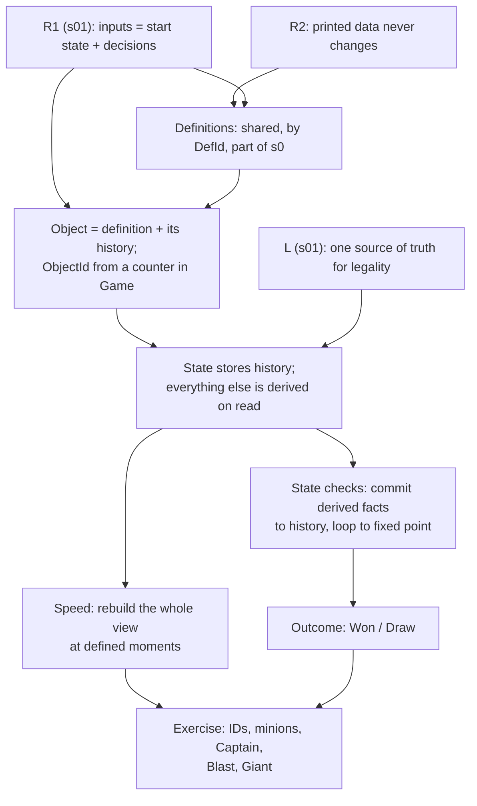

> [!quote] YOU

continue session

> [!quote] YOU

I mean continue the course

> [!abstract] PI

Session 02: definitions, objects and IDs, then derived stats and state checks. We start with three retrieval questions on session 01.

> [!question] Quiz
> You add a cosmetic feature: when Bolt resolves, the core calls `self.rng` to pick one of three flavor lines for the event text. Nothing else changes. What happens to replays (seed + decks + actions) saved before this change?
>
> 1. They fail to load, since the saved seed no longer matches the RNG state.
> 2. They may diverge, since every later roll now reads a later number.
> 3. They replay the same, since flavor text changes no health, hand or deck.

> [!success] Quiz — correct ✓
> Your answer: 2. They may diverge, since every later roll now reads a later number.
> Correct answer: 2
>
> The seed fixes a stream of numbers, and each call takes the next one. The flavor roll uses up a number, so every random event after the first Bolt (WildBolt's target, a shuffle) reads a different position in the stream than it did when the replay was recorded. It doesn't matter that the flavor line itself affects nothing. Nothing fails to load, because a replay stores the seed and the RNG simply starts from it again. The fix: cosmetic randomness goes in the shell, or on a second RNG that the rules never read.

> [!question] Quiz
> In this course's vocabulary, which of these are actions, meaning inputs to `apply`? Select all.
>
> 1. "Forage revealed two cards", produced when Forage resolves
> 2. "P1's hero took 3 damage", produced when Bolt resolves
> 3. `EndTurn`, submitted by the shell when the turn timer runs out
> 4. `Pick { index: 0 }`, submitted while a Forage is pending
> 5. "chance chose card 7", under OpenSpiel's chance-player model

> [!failure] Quiz — incorrect ✗
> Your answer: 3. `EndTurn`, submitted by the shell when the turn timer runs out, 4. `Pick { index: 0 }`, submitted while a Forage is pending
> Correct answer: 3, 4, 5
>
> Note: not sure what OpenSpiel's chance-player model means exactly
>
> An action is a decision that goes into the core. An event is a report the core sends out about what happened. `EndTurn` is an action no matter who submitted it: the shell's timer is just another decider. `Pick` is a player decision. Under OpenSpiel's model, a random outcome is an action taken by the chance player, and that's how it ends up in the log. Damage taken and cards revealed are consequences the core computes. They're events (node D, session 03), and a replay never needs to store them because it recomputes them.

> [!question] Quiz
> Under the chance-player model, a test wants WildBolt to hit its own caster. How does the test get that outcome?
>
> 1. It swaps the game's RNG for a mock whose rolls always pick the caster.
> 2. It applies the chance action "hit the caster" when the chance player is asked.
> 3. It searches seeds until one makes WildBolt hit the caster, then pins that seed.

> [!success] Quiz — correct ✓
> Your answer: 2. It applies the chance action "hit the caster" when the chance player is asked.
> Correct answer: 2
>
> Note: so I remember the chance player was that rng was not a seed but instead a special player, I assume tests would be able to have it deterministic while the game would use rng
>
> In the chance model the core never rolls anything. It stops and asks, and the outcome arrives as an action like `Pick`. So the test just picks the outcome it wants, with no seed and no mock. Pinning a seed is the fragile test from last session: one extra roll anywhere shifts the stream. A mock RNG is a way to make the seeded design testable, but it still depends on how many rolls happen and in what order. The chance model doesn't need one at all, because the core has no RNG to swap.

> [!abstract] PI

Right. In live play a driver outside the core rolls the dice and submits the result. Since the log records that result as an action, a replay doesn't even need the seed. Last retrieval question:

> [!question] Quiz
> A new card: "Your opponent can play only one card next turn." With session 01's design (UI reads `legal_actions`, `apply` checks membership first), which code has to know about this rule?
>
> 1. Three places: `legal_actions`, `apply`, and the UI's highlight check.
> 2. One place: `legal_actions`, reading a counter kept in `Game`.
> 3. Two places: `legal_actions` for the UI, and `apply` for validation.

> [!success] Quiz — correct ✓
> Your answer: 2. One place: `legal_actions`, reading a counter kept in `Game`.
> Correct answer: 2
>
> Note: counter would propably a modifier on player state tho
>
> `apply` validates by asking whether the action is in `legal_actions`, and the UI highlights whatever `legal_actions` lists. Both inherit the new restriction without being touched. The rule needs a fact to read ("cards played this turn" plus the restriction), and by node S that fact lives in `Game`. Writing a second check in `apply` is the drift from last session, where two copies of the rules eventually disagree.

> [!question] Quiz
> A YGO-style effect: "Target monster gains 500 ATK until end of turn." The core stores it as `Modifier { target, atk: +500, until: EndOfTurn }`. Before end of turn, the monster is returned to hand and summoned again. If `target` is the stable card ID (the same across every zone), what does the re-summoned monster have?
>
> 1. The +500, since the stored target still matches its ID.
> 2. No +500, since the modifier is dropped when its target moves.
> 3. No +500, since the stable ID changed when it moved.

> [!success] Quiz — correct ✓
> Your answer: 1. The +500, since the stored target still matches its ID.
> Correct answer: 1
>
> A stable card ID never changes, so a modifier keyed on it keeps matching the card wherever it goes, including back on the field. That contradicts the rule, since a monster that left the field comes back as a new card with no leftover effects (in MTG, rule 400.7). Nothing drops the modifier automatically either: dropping it would need code that watches zone moves, and that's exactly the job a per-zone object ID does for free. Key the modifier on an ID that changes on a zone move, and it points at an object that no longer exists.

> [!question] Quiz
> A minion has base attack 2. An aura minion gives "other friendly minions have +1 attack." Design X stores attack as one mutable number: +1 when the aura enters, −1 when it leaves. Sequence: aura enters (attack 3), then "Set this minion's attack to 1" (attack 1), then the aura dies. What attack does design X show at the end?
>
> 1. 0, since the aura's leave step subtracts 1 from the set value.
> 2. 1, since the set effect overrides every change made before it.
> 3. 2, since the base attack comes back once the aura is gone.

> [!success] Quiz — correct ✓
> Your answer: 1. 0, since the aura's leave step subtracts 1 from the set value.
> Correct answer: 1
>
> Design X only remembers the current number, not how it was built. The set overwrote 3 with 1, and that erased the aura's +1. When the aura leaves, the −1 is still applied, so the result is 0. The minion ends up worse off than the "set to 1" effect intended. By Hearthstone's rules it should be 1: enchantments apply in the order they were granted, and auras on top. So it showed 2 while the aura was up and 1 once it left. Design X can't reach that answer, because the information it needs, which changes are still active, is gone once the number is overwritten.

> [!question] Quiz
> Arcane Giant (Hearthstone, 12 mana): "Costs (1) less for each spell you've cast this game." Use your observer design from last session: each Giant listens for spell casts and adds a −1 cost modifier to itself. You cast 5 spells. Then an effect creates a brand-new Arcane Giant in your hand. What does the new Giant cost?
>
> 1. 7, since a newly created card replays past casts on creation.
> 2. 12, since it didn't exist when the five spells were cast.
> 3. 7, since every Giant in the game observed the five casts.

> [!success] Quiz — correct ✓
> Your answer: 2. 12, since it didn't exist when the five spells were cast.
> Correct answer: 2
>
> Note: 12 if each giant instance observes and add the modifier for its own cost.
>
> An observer only sees events that happen while it's listening. The new Giant was created after the five casts, so it never received them, and it starts with no modifiers at 12. The real card costs 7 here. The observer design ties the discount to what that particular object witnessed, while the card text describes the game's history ("spells you've cast this game"). Nothing replays past events for new objects unless you write that, and writing it would mean storing the history anyway. Store one counter, `spells_cast_this_game`, and compute the cost when asked: $12 - \text{count}$. Every Giant, whether old, new, or in the deck, then agrees.

> [!abstract] PI

Three for three, so the next ones get harder.

> [!question] Quiz
> Which of these cost reductions should be stored as a modifier on each affected card, instead of computed from game state every time the cost is asked for? Select all.
>
> 1. "Reduce the Cost of a random minion in your hand by (2)."
> 2. "At the end of your turn, reduce the Cost of cards in your hand by (1)."
> 3. "Costs (1) less for each spell you've cast this game."
> 4. "Costs (2) less while you're holding a Dragon."
> 5. "Costs (1) less for each minion on the battlefield."

> [!success] Quiz — correct ✓
> Your answer: 1. "Reduce the Cost of a random minion in your hand by (2).", 2. "At the end of your turn, reduce the Cost of cards in your hand by (1)."
> Correct answer: 1, 2
>
> Note: I think 1 and 2 because they are things that happenned to the cards while 3 4 5 are computations based on the game/board state
>
> The test is whether the reduction is a snapshot or a standing condition. The end-of-turn reduction and the random −2 happen once, at a particular moment, to the particular cards that were there. A card drawn afterwards doesn't get them, and nothing in the current state can tell you they happened, so they have to be recorded on the objects. The other three are standing conditions: the cost is a function of what's true right now (minions on board, the spell counter, a Dragon in hand), so it's computed when asked. Stored, they'd go stale the moment the board, counter or hand changed, which is the same failure as the aura's −1.

> [!abstract] PI

You're clearly solid on derived vs stored. Moving to state checks.

> [!question] Quiz
> Your core runs a state check after each action finishes: it removes every minion at 0 health or less and resolves their deathrattles. One deathrattle deals 1 damage to all minions, and that drops another minion to 0. What should the state check do about that second minion?
>
> 1. Run again, repeating until a pass finds nothing to do.
> 2. Leave it, since the next action's check will remove it.
> 3. Nothing, since the deathrattle's damage already killed it.

> [!success] Quiz — correct ✓
> Your answer: 1. Run again, repeating until a pass finds nothing to do.
> Correct answer: 1
>
> Resolving the check changed the state, and the new state can make the check applicable again. So the check loops until it reaches a fixed point, meaning a pass that changes nothing. MTG 704.3 does exactly this ("if any state-based actions are performed…, the check is repeated"), and so do Hearthstone's death phases, which repeat until no new deaths occur. If you wait for the next action, `legal_actions` gets called with a 0-health minion on the board, and it could attack. That's a zombie. "The damage killed it" is the setter design from session 00: damage doesn't kill anything, the check does.

> [!question] Quiz
> MTG: a 1/1 creature under an anthem ("creatures you control get +1/+1") is a 2/2. It takes 1 damage. Then the anthem leaves play, and by the rules the creature dies. Which representation gets that right with no code that runs when the anthem leaves?
>
> 1. Store current health (1); derive toughness, and clamp health to it on read.
> 2. Store damage marked (1); derive toughness, and die when damage ≥ toughness.
> 3. Store current health (1); derive toughness, and die when health ≤ 0.

> [!success] Quiz — correct ✓
> Your answer: 2. Store damage marked (1); derive toughness, and die when damage ≥ toughness.
> Correct answer: 2
>
> Current health mixes two things: a derived fact (toughness, which changes whenever the anthem comes or goes) and a historical fact (the 1 damage it took). Store it as one number and the core can't recompute it when the anthem leaves, which is the same problem as design X. Keep the history as its own field, `damage: 1`, and derive everything else: toughness $= 1$ once the anthem is gone, and $1 \ge 1$, so the state check kills it. Clamping stored health gives $\min(1, 1) = 1$ and the creature survives. That's roughly Hearthstone's rule for losing a health aura, but it's wrong for MTG. With stored health and a "health ≤ 0" check, it sits at 1 health and nothing ever notices.

> [!abstract] PI

Correct again. I just attributed a rule to Hearthstone ("roughly"), so I'm getting it verified in the background. I'll correct it if it turns out wrong. Next probe:

> [!question] Quiz
> An aura minion: "Other friendly minions have +1 attack." Later it gets silenced, which removes its card text but leaves it on the board. Which design stops granting the +1 without any silence-specific code?
>
> 1. `attack(id)` scans the board for active aura texts every time it's read.
> 2. Each friendly minion gets a +1 modifier when the aura enters, removed when it leaves.
> 3. The player gets a +1 attack modifier when the aura enters, removed when it leaves.

> [!success] Quiz — correct ✓
> Your answer: 1. `attack(id)` scans the board for active aura texts every time it's read.
> Correct answer: 1
>
> Note: I think 3 is better performance and when the card is silenced it removes the aura from the player
>
> Silence doesn't move the minion, so no "leave" code runs, and both stored modifiers stay in place, granting +1 from a minion with no text. Each stored copy is a mirror of a fact that's already in the state ("an aura with this text is on the board"), and a mirror has to be kept in sync by every code path that could change the fact: leaving, silence, transform, text swap, and whatever you add next year. If the +1 is computed from the aura's current text whenever attack is read, silence changes the text and the +1 disappears by itself. It doesn't matter whether the mirror sits on the minions or on the player. Storing it anywhere is the problem.

> [!question] Quiz
> Each card instance needs its printed definition (name, base cost, stats, effect). Later, `Game` becomes a Bevy `Resource`, which requires `Send + Sync + 'static`. Which instance fields would stop `Game` from being a Resource? Select all.
>
> 1. `def: Rc<CardDef>`, shared with the card database
> 2. `def: Arc<CardDef>`, shared with the card database
> 3. `def: &'a CardDef`, borrowed from the database, making `Game<'a>`
> 4. `def: CardDef`, a full copy stored in each instance
> 5. `def: DefId`, a `Copy` key into an `Arc<CardDb>` held by `Game`

> [!success] Quiz — correct ✓
> Your answer: 1. `def: Rc<CardDef>`, shared with the card database, 3. `def: &'a CardDef`, borrowed from the database, making `Game<'a>`
> Correct answer: 1, 3
>
> `Rc` uses a non-atomic reference count, so it's neither `Send` nor `Sync`. Two threads bumping the count at once would corrupt it, and Rust refuses to let it cross threads. `&'a CardDef` makes `Game<'a>` borrow from something else, so it isn't `'static` unless the database itself lives forever (`&'static`, e.g. a leaked or `static` database). Bevy can't hold a resource that might outlive what it borrows. `Arc` has an atomic count, so it's `Send + Sync` whenever `CardDef` is. A `Copy` key and a full owned copy are plain data. The copy works but costs you: every bot clone duplicates every effect tree.

> [!abstract] PI

Rust reading is solid, so that strand's edge is in writing designs, and the exercise will show us that. Last probe, a harder one on IDs:

> [!question] Quiz
> Hearthstone: "Give a minion in your hand +1/+1." You play it and it enters buffed. Later it's returned to your hand, and the buff is gone. What does this tell you about the rule "a zone move makes a new object"?
>
> 1. It's per game: Hearthstone keeps the object on some moves and resets it on others.
> 2. It's universal: Hearthstone keys the handbuff on the stable card ID instead.
> 3. It's universal: Hearthstone stores the handbuff on the card's definition instead.

> [!success] Quiz — correct ✓
> Your answer: 1. It's per game: Hearthstone keeps the object on some moves and resets it on others.
> Correct answer: 1
>
> Note: playing the card keeps its object id while returning it to hand resets it, I believe its a design choice
>
> Hearthstone's rulebook says that when an entity moves "backwards" (for example Play → Hand), its tags and enchantments are reset. Moving forward, Hand → Play, keeps them. So whether a move creates a fresh object is a rule of the particular game, and even of the particular move. MTG resets on almost every move (400.7, with a list of exceptions). A buff on the definition would buff every copy of the card in the game, and printed data never changes, which is today's root. A buff keyed on the stable ID would also survive the bounce, but the question says it's gone. The takeaway for the engine: "which moves reset the object" is a table the game defines, not something built into IDs.

> [!abstract] PI

That was the last probe. I'm verifying two engine facts before I write the plan.

> [!abstract] PI

While that check runs, here's the plan.

**Where you are.** You got every probe question right: zone resets and IDs, derived vs stored, snapshot vs standing reductions, damage vs health, the fixed-point state check, and `Send`/`Sync`. So today has little new theory. The one edge is your default when you design something yourself, as opposed to choosing between options I give you. You reach for a stored copy of a value and keep it in sync with hooks, and you justify that with performance. Three examples: the observer Giant, "a modifier on player state," and "silence removes the aura from the player." So the theory centers on one idea that should pull all of today's answers together, and the exercise will be bigger.

**Approach:**
1. **R2, the root (quick).** Printed card data never changes during a game. That's why it can be shared and referenced by a small `Copy` key. It also has a consequence you may not have seen: card data is part of the start state, so a balance patch breaks old replays unless the replay records which version of the card data it used.
2. **B: objects and IDs.** An object is a definition plus the history of what has happened to it. `ObjectId`s come from a counter in `Game`, which R1 requires. I'll bring the hand-index failing case from the open thread. A lookup with a stale ID returns `None`, and which zone moves reset an object is a table each game defines.
3. **C: the main node.** *State stores only history. Everything else is a function of it, computed on read.* Every question you got right today is an instance of that rule. The mirror-plus-hooks design is the same mistake as session 01's UI legality check: a second copy that drifts. Then performance, properly: derive first. If profiling shows it's slow, cache the *whole* derived view and rebuild it from scratch at defined moments, which is what Hearthstone's Aura Update does. Don't patch a cache piece by piece.
4. **C: state checks.** Why can't death just be derived? Because a death has consequences, so it has to be recorded as history. That's why the checks run at defined moments and loop until nothing changes. This is also where `Outcome::Draw` fixes the two-dead-heroes thread.
5. **Exercise.** Port `rules` to `DefId`/`ObjectId` and add minions, with no combat yet:
   - Recruit, a 2/2.
   - Captain, a 1/1 with "other friendly minions have +1/+1."
   - Blast, "deal 2 to all characters."
   - Giant, "costs 1 less per spell you've cast this game."

   Blast on Captain + Recruit only works if the check loops a second time. Blast when both heroes are at 2 is a draw. We agree on the API first. I port the contract tests, and you write the types, the derived stats and the check.



> [!question] Question
> Go ahead with this plan?
>
> 1. Go ahead (Recommended)
> 2. Go ahead, but make the exercise smaller
> 3. Change something first

> [!example] Answer
> 1. Go ahead (Recommended)

> [!quote] YOU

I have a question tho, about the giant, "spell you've cast this game." we dont track it per instance, but should we track it globally? what if a game has no giant? I mean it is just a counter but then every trackable thing has a counter? what if we have "X per odd spell you cast" and "Y per even spell" now there are 3 counters, if I had a system for cards to register what should be tracked at the start of the game I would have to still register all counters because a card could be generated in the middle of the game, but at least the tracking code would be generic and the specifics for that card would live on the card but then I would have duplicates, so yea I dont know what is best here

> [!question] Quiz
> Patch 1.1 changes Bolt from 2 damage to 3. You replay a game recorded on 1.0 (seed + decks + actions), but you load the 1.1 card data. What happens?
>
> 1. It may diverge, since card data is an input the record didn't pin.
> 2. It replays the same, since card data isn't part of the game state.
> 3. It replays the same, since each Bolt object copied its damage when created.

> [!success] Quiz — correct ✓
> Your answer: 1. It may diverge, since card data is an input the record didn't pin.
> Correct answer: 1
>
> A replay recomputes everything from its inputs, and the card data is one of them. It's constant during a game but not across patches. Every Bolt in the replay now deals 3, so health differs, a hero may die a turn early, and after that the recorded actions may not even be legal. Being outside `Game` doesn't make data stop being an input. The seed also lives in the start state and not in any single field that "matters." Copying the damage into each object doesn't help either: the replay creates those objects again, from the 1.1 data. So a replay records a data version, or embeds the data itself.

> [!question] Quiz
> Your hand after Lure: indices 0–3, and the drawn card is at index 3. You then play the card at index 0 and end your turn. What does `DiscardAtEndOfTurn { hand_index: 3 }` do?
>
> 1. It discards nothing, since the play at index 0 cancels the pending effect.
> 2. It discards the drawn card, since that card's index is still 3.
> 3. It discards whatever is at index 3 now, or finds no card there at all.

> [!success] Quiz — correct ✓
> Your answer: 3. It discards whatever is at index 3 now, or finds no card there at all.
> Correct answer: 3
>
> Playing index 0 shifts every later card down one, so the drawn card is now at index 2. Index 3 is either the card that came after it (if you drew more in between) or past the end of a four-card hand, which panics on `hand[3]` or silently does nothing, depending on the code. An index is a position, and positions change whenever anything before them moves. Nothing cancels the pending effect, and nothing would, unless you wrote a hook that fixes up stored indices every time the hand changes. That would be a mirror kept in sync by hooks again.

> [!question] Quiz
> Which source of `ObjectId`s keeps R1 (replay from start state + decisions) and bot clones working?
>
> 1. A `next_id: u32` field in `Game`, incremented on each new object.
> 2. A random `u64` per object from `rand::random()`, so IDs never collide.
> 3. A global `static NEXT_ID: AtomicU32`, incremented on each new object.

> [!success] Quiz — correct ✓
> Your answer: 1. A `next_id: u32` field in `Game`, incremented on each new object.
> Correct answer: 1
>
> Note: what are bot clones?
>
> The counter is state, and it's the same kind of thing as the RNG: the next ID depends on how many objects came before it. Inside `Game` it's part of $s_0$, a replay reproduces every ID, and a bot's clone continues from the same number. A global counter is shared by every `Game` in the process. The second game you create, a test running in parallel, or a bot's 50 clones all advance it, so a replay gets different IDs, and a stored `ObjectId(17)` points at something else. A random ID reads OS entropy, which is the `thread_rng` break from session 01.

> [!question] Quiz
> Your core gives an object a new `ObjectId` on every zone move. The Bevy UI has a sprite for `ObjectId(17)` in hand. The card is played and is `ObjectId(23)` on the board. Which designs let the UI slide the same sprite over, instead of despawning 17 and spawning 23? Select all.
>
> 1. The UI pairs the vanished 17 with the new 23 by matching card names.
> 2. The core reports the move as an event carrying both IDs, 17 and 23.
> 3. Each card also has a stable card ID that zone moves never change.
> 4. The core keeps ID 17 for this move, since the UI is tracking it.

> [!success] Quiz — correct ✓
> Your answer: 2. The core reports the move as an event carrying both IDs, 17 and 23., 3. Each card also has a stable card ID that zone moves never change.
> Correct answer: 2, 3
>
> Both correct designs give the UI an explicit link that the rules produced. MTG Arena does the first: its engine sends an `ObjectIdChanged` annotation with the old and new instance IDs. The second is the two-ID decision from the probe: a stable card ID for "the same physical card" and an object ID for "the same rules object." Name matching breaks as soon as two copies move together, for example when Blast kills two Recruits. Keeping 17 because the UI wants it lets the shell change the rules: every modifier keyed on 17 would survive the move. The core must never bend a rule for presentation.

> [!question] Quiz
> Three cards ask "spells you've cast this game," "spells you've cast this turn," and "odd-cost spells you've cast this game." What one piece of state answers all three, with no per-question counters and no reset code?
>
> 1. A per-player registry that each card fills at setup with the counters it needs.
> 2. A per-player list of spells cast, each record holding its definition and turn number.
> 3. A per-player set of three counters, with a hook resetting the turn one at end of turn.

> [!success] Quiz — correct ✓
> Your answer: 2. A per-player list of spells cast, each record holding its definition and turn number.
> Correct answer: 2
>
> Note: 1 and 3 require per question counters and reset code, but 2 is balically a log
>
> All three questions are filters over the same history: spells cast. Keep that history as `Vec<SpellCast { def, turn }>` and each question becomes a query. "This game" is `len()`. "This turn" is filtering on `turn == current_turn`, so nothing needs resetting. "Odd cost" is filtering on the definition's cost. A card nobody has designed yet ("spells costing 5+ cast last turn") needs no new state. The three counters are three precomputed answers, and the "this turn" one needs a reset hook, which is a sync point. The registry fails for generated cards, as you said, and if you register from the whole database it grows with the card pool.

> [!abstract] PI

Yes, it's a log, and that deserves a straight answer, because in session 01 I said the full history was "far more than the rule needs." Both statements hold, and the question you're asking decides between them:
- **One known question** (session 01's "spells this turn"): the smallest sufficient state is one counter.
- **An open set of questions** (any card in the database, including cards added next year): the smallest state that answers *all* of them is the history slice they ask about. Hearthstone's Zul'jin recasts every spell you played this game, and no counter can answer that. A list can.

The one thing session 01 ruled out was a log **outside** `Game`, in the shell, where a bot's clone can't see it. A history inside `Game` is ordinary state. You don't need to keep *everything* either, only the slices rules can ask about: spells cast, cards played, deaths. (The event stream the shell sees is a separate topic, node D next session.)

**The principle.** Every fact in a card game is one of two kinds:
- **History:** things that happened and can't be recomputed from anything else. Examples: damage taken, a snapshot "costs (1) less," spells cast, deck order, RNG state.
- **Derived:** a function of history plus printed data. Examples: current attack, current cost, "spells this turn," "is there an aura on board."

**Store history. Compute derived facts when they're read.** Every question you got right today is this one rule:

| Case | History (store) | Derived (compute) |
|---|---|---|
| Anthem | damage marked | toughness, alive? |
| Cost reductions | Thaurissan's −1, the random −2 | board / spell / Dragon discounts |
| Arcane Giant | spells cast | its cost |
| Aura | nothing | +1 from each aura text on board |
| Session 01 | the game state | legal actions, which the UI must not recompute on its own |

The last row matters most. A stored copy of a derived fact is a **mirror**, and the UI's own legality check from session 01 was exactly that: a second copy that drifts. The observer Giant, the player-level aura modifier and the "this turn" reset hook are all mirrors too.

> [!question] Quiz
> You shipped card A with `minions_died_this_turn: u32` (reset at end of turn). Now card B: "Summon a copy of each friendly minion that died this turn." Following the history/derived rule, what should the state become?
>
> 1. A list of deaths (definition, owner, turn) replaces the counter; A counts it, B reads it.
> 2. A list of deaths (definition, owner, turn) is added next to the counter; A keeps its counter, B reads the list.
> 3. A counter of deaths stays as it is; B summons that many copies of a random minion instead.

> [!success] Quiz — correct ✓
> Your answer: 1. A list of deaths (definition, owner, turn) replaces the counter; A counts it, B reads it.
> Correct answer: 1
>
> Note: both are derived state
>
> Once the list exists, the counter can be derived from it (`deaths.iter().filter(this turn).count()`), which makes the counter a mirror: two stores of one fact, kept in sync by two write paths plus a reset hook. The first time a code path records a death in the list and forgets the counter, A and B disagree about the same turn. That's the "duplicates" you were worried about. Replace the counter, and each fact has one store. Changing B's text to fit the state is backwards: the state serves the cards.

> [!question] Quiz
> A search bot makes `legal_actions` hot, so you cache derived stats (attack, health, cost). Which caching scheme can't drift from the rules?
>
> 1. Update a minion's cached stats inside each hook that changes something about it.
> 2. Recompute a minion's cached stats whenever an event names that minion.
> 3. Rebuild every cached stat from scratch each time an action finishes resolving.

> [!failure] Quiz — incorrect ✗
> Your answer: 2. Recompute a minion's cached stats whenever an event names that minion.
> Correct answer: 3
>
> Note: if enough events I should be able to reconstruct the board state just be reaplying the logs thus, that would mean any change would result in an event and so re cache on every change
>
> A full rebuild is the derivation function run at a defined moment. It reads only history and printed data, so it can't disagree with them, and adding a new card needs no cache code at all. Hook-updating is the mirror again: every code path that changes anything a stat depends on has to remember to update the cache. The event-driven scheme looks more automatic but misses indirect dependencies. Silence the Captain, and the only event names the Captain, while the Recruits' attack changed too. The cost of rebuilding is the stale window between rebuilds. Hearthstone accepts that window, and the Mana Wyrm example is what it looks like.

> [!question] Quiz
> Per-minion invalidation: on each event, recompute cached stats only for the minions the event names. A Recruit sits next to the Captain ("other friendly minions have +1/+1"), cached as 3/3. The Captain is silenced, and the only event is `Silenced { target: Captain }`. What does the cache show for the Recruit?
>
> 1. 2/2, since the Recruit's entry is recomputed from its definition on read.
> 2. 2/2, since the silence event makes the cache recompute every minion.
> 3. 3/3, since no event named the Recruit, so its entry was never recomputed.

> [!success] Quiz — correct ✓
> Your answer: 3. 3/3, since no event named the Recruit, so its entry was never recomputed.
> Correct answer: 3
>
> Note: I see, event driven misses indirect updates but rebuilding every cache every action is worth it? inst it too costly for low gains?
>
> Under this scheme, only the Captain's entry is recomputed. The Recruit's 3/3 depended on the Captain's text, but nothing in the event says so. The dependency lives inside the derivation function ("scan the board for aura texts"), not in the event. So the cache keeps showing 3/3, and the Recruit attacks for 3. Recomputing every minion on every event is a different scheme, the full rebuild, and that one is safe. A cache that recomputes on read isn't a cache: that's the plain derived design with no cache at all.

> [!question] Quiz
> Why can't "this minion is dead" stay a derived fact (`damage >= health`, with dead minions skipped by every query), and why must a state check instead move it off the board as history?
>
> 1. Deriving it each time is too slow: every query would have to test every minion for death.
> 2. Dying has consequences later rules read: it leaves the board, its deathrattle fires, it's added to the deaths list.
> 3. Deriving it breaks R1: a replay could compute deaths in a different order than the original.

> [!success] Quiz — correct ✓
> Your answer: 2. Dying has consequences later rules read: it leaves the board, its deathrattle fires, it's added to the deaths list.
> Correct answer: 2
>
> A derived fact has no effects of its own. It's only true or false when someone asks. Death, though, has consequences: the deaths list gets a record, a deathrattle resolves, the board slot frees up, and an aura stops. Those consequences are history, and they have to happen once, at a particular moment. So the check is where a derived condition ("damage ≥ health") gets committed as history ("died on turn 4"). There's a second reason: dead-by-derivation has a cycle. A dead Captain shouldn't grant +1, but whether the Recruit is dead depends on that +1, so "who is dead" becomes a fixed-point problem inside every query. Speed isn't the reason, since the test is one comparison. Deriving doesn't break R1 either, because a derivation is deterministic.

> [!question] Quiz
> Three-player free-for-all. P2's hero hits 0, and P0 and P1 play on. Later, "Restore 5 Health to all heroes" resolves. Elimination is derived: `eliminated(p) = hero_health(p) <= 0`. What happens to P2?
>
> 1. P2 stays out, since heal effects skip heroes whose health is 0 or less.
> 2. P2 is back in the game, since its health is now 5, so `eliminated` reads false.
> 3. P2 stays out, since the elimination was recorded when its health hit 0.

> [!success] Quiz — correct ✓
> Your answer: 2. P2 is back in the game, since its health is now 5, so `eliminated` reads false.
> Correct answer: 2
>
> A derived fact is re-evaluated on every read, so it goes back to false the moment its inputs change. Nothing was recorded, because under this design nothing records anything. That's the difference from a committed fact. In a 2-player game a derived outcome gets away with it, since once someone loses, `legal_actions` goes empty and nothing can heal anyone. With 3 players the game continues, and elimination has consequences: P2 stops taking turns, and in MTG multiplayer its cards leave the game. So it has to be committed by the state check, e.g. `eliminated: Vec<PlayerId>` or a per-player `lost_on_turn`, and the outcome is then derived from that. Heals skipping dead heroes would be a rule someone added by hand, and it wouldn't stop the next effect that reads health.

> [!abstract] PI

C is locked in, both halves. Saving progress to `COURSE.md` before the exercise design:

> [!abstract] PI

## Exercise proposal

**What changes from session 01.** Cards become data (R2), and every card in the game becomes an object with an `ObjectId` (B). Minions arrive and sit on the board. There's no combat: they only exist to be buffed, damaged and killed (C). Fatigue, mana, the turn structure and Forage all stay the same.

**Cards** come from a built-in table and are referred to by constants like `rules::cards::RECRUIT: DefId`:

| Card | Cost | Kind | Text |
|---|---|---|---|
| `SPARK` | 1 | spell | Deal 1 damage to the enemy hero |
| `BOLT` | 2 | spell | Deal 2 damage to the enemy hero |
| `WILD_BOLT` | 1 | spell | Deal 3 damage to a random hero |
| `FORAGE` | 1 | spell | As before; the pick is now by `ObjectId` |
| `BLAST` | 3 | spell | Deal 2 damage to all characters (both heroes, all minions) |
| `RECRUIT` | 2 | minion 2/2 | — |
| `CAPTAIN` | 3 | minion 1/1 | Other friendly minions have +1/+1 |
| `GIANT` | 8 | minion 5/5 | Costs (1) less for each spell you've cast this game (minimum 0) |

**Rules the tests will pin:**
- Minions go on the right end of their owner's board. Spells are gone after they resolve.
- Attack and health are derived. Health is max health minus damage taken.
- The state check runs at the end of every `apply`, including after the turn-start draw. It removes every minion with damage ≥ health, collecting before committing, and loops until a pass does nothing.
- If both heroes are at ≤ 0 in the same check, the result is `Draw`. Otherwise the surviving hero's player wins.
- Two Captains buff each other, and a Recruit next to both gets +2/+2. Blast kills the Captain in pass 1 and the Recruit in pass 2. Giant is the case where damage persists: after one Blast, a 5/5 is at 3 health.

**API** (tests compile against this):

```rust
pub struct PlayerId(/* private */);  // as now
pub struct DefId(/* private */);     // Copy, Eq, Hash, Debug; constants in rules::cards
pub struct ObjectId(/* private */);  // Copy, Eq, Ord, Hash, Debug
pub enum Action { Play { card: ObjectId }, Pick { card: ObjectId }, EndTurn }
pub struct Illegal { pub player: PlayerId, pub action: Action }
pub enum Outcome { Won(PlayerId), Draw }

impl Game {
    pub fn new(seed: u64, decks: [Vec<DefId>; 2]) -> Game;
    pub fn with_deck_order(seed: u64, decks: [Vec<DefId>; 2]) -> Game;
    pub fn legal_actions(&self, p: PlayerId) -> Vec<Action>;
    pub fn apply(&mut self, p: PlayerId, a: Action) -> Result<(), Illegal>;
    pub fn applied(&self, p: PlayerId, a: Action) -> Result<Game, Illegal>;
    pub fn outcome(&self) -> Option<Outcome>;         // replaces winner()
    pub fn hero_health(&self, p: PlayerId) -> i32;    // was health()
    pub fn mana(&self, p: PlayerId) -> u8;
    pub fn hand(&self, p: PlayerId) -> Vec<ObjectId>;     // oldest first
    pub fn deck(&self, p: PlayerId) -> Vec<ObjectId>;     // top first
    pub fn revealed(&self, p: PlayerId) -> Vec<ObjectId>;
    pub fn board(&self, p: PlayerId) -> Vec<ObjectId>;    // left to right
    pub fn def(&self, id: ObjectId) -> Option<DefId>;     // Some for anything in a hand, deck, reveal or board
    pub fn cost(&self, id: ObjectId) -> Option<u8>;       // Some for cards in a hand; derived
    pub fn attack(&self, id: ObjectId) -> Option<i32>;    // Some for minions on a board; derived
    pub fn health(&self, id: ObjectId) -> Option<i32>;    // likewise: max − damage
}
```

The accessors return owned `Vec<ObjectId>` so the storage layout stays your choice. The tests never assume an object keeps its ID when it moves, and never assume it gets a new one either. That's your call too.

**The property tests gain two invariants,** checked after every step of every random playout:
- No `ObjectId` is in two places at once.
- No minion on a board has health ≤ 0, so no zombies.

**Your design choices.** Be ready to say why for each:
1. **Where objects live.** Each zone as a `Vec<CardObject>`, or one arena (`BTreeMap<ObjectId, CardObject>`) with zones as `Vec<ObjectId>`. Which one makes `health(id)` cheap, and which one makes "in two places at once" impossible to represent?
2. **Zone-reset table.** Does hand → board get a new ID?
3. **The card table.** A `static` array indexed by `DefId`, or a `match`.
4. **Spell history.** A counter or a list. Only Giant asks today. Today's node says one thing and YAGNI ("you aren't gonna need it") says another, so pick one and defend it.
5. **Outcome.** Derived from hero health, or committed by the check.
6. **Heroes.** Stored health, or damage.

> [!question] Question
> Agree on this game and API so I can write the tests?
>
> 1. Agreed, write the tests (Recommended)
> 2. Change the API first
> 3. Change the cards or rules first

> [!example] Answer
> Other: agreed, I did reestructure the project tho, including tests, ideally try to keep unit tests on the same file as code

> [!abstract] PI

Let me look at the new layout first.

> [!question] Question
> Go with this test placement?
>
> 1. Yes, as proposed (Recommended)
> 2. Yes, but I'll name the new modules
> 3. Change the split

> [!example] Answer
> Other: yes, as proposed, once we finish the lesson and the modules are settled u can reestructure the test placement and I may ask another agent to also review that so dont stress about it

> [!abstract] PI

Now the `game.rs` tests. I'm replacing only its test module and adding the two `mod` lines:

> [!abstract] PI

Now the `resolve.rs` tests, for card effects and costs:

> [!abstract] PI

Now the two new files, `derived.rs` and `check.rs`:

> [!abstract] PI

Now the contract suite. The playout driver gains an independent board model, a cost oracle and the ID invariants:

> [!abstract] PI

Now `SPEC.md` for session 02:

> [!abstract] PI

Now a throwaway reference implementation in `/tmp`, to check that the tests themselves are right. It keeps my test modules and replaces everything above them:

> [!abstract] PI

All green against the reference, and the contract suite runs in 1.7s. Now mutation checks: I plant the bugs I'd expect and make sure the tests catch each one.

> [!abstract] PI

Two of the mutations had typos in my mutation script. Redoing them, plus two more: a global ID counter, and a hero-death check that skips turn start.

> [!abstract] PI

The hero-death mutation hung instead of failing: `while game.outcome().is_none()` loops forever when the check never ends the game. A test should fail, not hang, so I'm bounding those loops.

> [!quote] YOU

continue

> [!abstract] PI

The reference is green with the bounded loops. Rerunning the three remaining mutations, with a hard time limit this time:

> [!abstract] PI

That error comes from my throwaway reference code, not from the tests. Fixing it in `/tmp` so clippy can get through to the test code:

> [!abstract] PI

The spec and tests are written, and nothing is committed. Per `CLAUDE.md`, they need your review first.

## What I changed

- **`SPEC.md`**: rewritten for session 02. It has the new cards, the state check, `Outcome`, the ID rules, and the API we agreed on. It also says outright that `def` returns `None` for an ID that's in no zone (a spell that resolved, a minion that died). That's node B's "stale ID gives `None`." Keeping the ID from hand to board is left to you.
- **`testkit.rs`**: new helpers that use only the public API: `play_def`, `summon`, `turn_with_mana`, `end_turns_until_over`, and `hand_defs`/`board_defs`/…
- **Rule tests in-file** (35 with the RNG tests):
  - `game.rs`: setup, copies being distinct objects, turns, fatigue, `applied`.
  - `game/resolve.rs`: each card's effect, costs, Forage, WildBolt, minions entering on the right.
  - **new** `game/derived.rs`: printed stats, Captain buffs (it doesn't buff itself or the enemy, two Captains stack), damage staying marked, the buff ending when the Captain leaves, and Giant's cost. For Giant that means only its holder's spells count, spells cast before it was drawn count, the cost stops at 0, and the cost decides legality.
  - **new** `game/check.rs`: Blast deaths, the second pass, draw vs loss.
- **Contract tests** (8): ported to IDs. The playout driver now keeps an **independent board model** (defs, damage and Captain buffs, with a fixed-point death check) and a cost oracle, and compares every minion's attack and health against them at every step. It also checks the ID invariants: no ID in two places, an ID's def never changes, a gone ID never comes back, and every accessor answers only for its own zone. Old IDs are included as candidate actions and must be rejected.

## How I checked the tests

A throwaway reference implementation in `/tmp` passes everything, and the full suite takes 1.5s. Then I planted bugs one at a time, and each one was caught:

| Planted bug | Caught by |
|---|---|
| single-pass state check | `the_check_repeats_until_a_pass_removes_nothing` |
| Captain buffs itself / both boards | three `derived` tests / `minions_enter_with_their_printed_stats` |
| Giant counts both players' spells, or no spells | Giant tests |
| no `Draw` | `a_blast_that_drops_both_heroes_to_zero_is_a_draw` |
| no check after `EndTurn` | `fatigue_at_turn_start_can_end_the_game` (this one hung the test run at first; the loops are bounded now) |
| a global `AtomicU32` ID counter | the 3 property tests (replay, determinism) |
| board IDs reused | `minions_enter_with_their_printed_stats` |
| **keeping the ID from hand to board** | **nothing, on purpose: the spec accepts it** |

Clippy and fmt are clean on all the test code. The crate won't compile until your API exists, and your internal tests in `player.rs`, `zones.rs` and `cards.rs` use `Card`, so those are yours to adapt or delete.

## Once you've approved: your turn

A suggested order:
1. Types and signatures with `todo!()` bodies (`DefId`, `ObjectId`, `pub mod cards`, `Outcome`, the new `Game` methods), so everything compiles and each test fails on its own.
2. Objects and IDs through setup, draw and Forage: `cargo test -p rules game::tests`, then `forage`.
3. Minions and derived stats: `derived`.
4. The state check and `Outcome`: `check`.
5. The property tests last.

The design choices from the proposal are still yours, and I'll ask about them in review: where objects live, the reset table, the card table, counter vs list for spells, whether the outcome is derived or committed, and hero damage vs health.

Two housekeeping notes:
- `course/sessions/02-definitions-objects.md` is still empty. Run `/md-log course/sessions/02-definitions-objects.md` if you want today's log.
- You're responsible for what goes into the repo, so read the tests with the same care you'd give code from a colleague.

Review the tests and spec. When you approve, I'll commit them, and then you implement.


> [!quote] YOU

it looks good, I am not sure about the check and derived files but we can move on and refactor later, I would like u to remove this separator comments like // ---------------------------------------------------------------------------
// Invariants checked at every step of every playout
// ---------------------------------------------------------------------------
and /unslop the other


> [!quote] YOU

also, wasnt support suposed to only be support functions? now u added test to it


> [!question] Question
> How should the contract suite be split so support.rs holds only helpers?
>
> 1. support + model + playout (Recommended)
> 2. Move it all into properties.rs
> 3. Leave it for the later test restructure


> [!example] Answer
> Other: I will leave how to structure the tests to u, just giving general guidance, but your recomendation looks good


> [!abstract] PI

I'll go with that split and unslop the comments while I'm in there. Writing the new contract modules:


> [!abstract] PI

Now the unslop pass on the in-crate comments and the spec's test-file table:


> [!abstract] PI

Clippy is clean and the reference is green. One mutation re-run, to make sure the split didn't drop the contract suite's board check:


> [!abstract] PI

Done. Here's what changed.

**Separator comments.** There aren't any in the repo. I searched every `.rs`, `.md` and `.toml` file, and the only match is your message in the session log. If your review agent has a copy with them, point me at the file and I'll remove them there.

**The contract suite is split, so `support.rs` holds only helpers:**

| File | Holds |
|---|---|
| `support.rs` | builders (`play`, `pick`, `in_hand`, `zone_ids`), turn helpers, and the two assertions `legality` and `playout` both use (`assert_actions`, `assert_unlisted_rejected`) |
| `model.rs` | the independent model: printed data, `expected_cost`, `BoardModel`. It contains no assertions and exposes `minions(owner)` for the checks |
| `playout.rs` | the driver and every per-step invariant, each as a named function: `assert_outcome_consistent`, `assert_ids`, `assert_accessors`, `assert_boards_match`, … |
| `properties.rs` | only the three `#[test]`s |

`SPEC.md`'s test table and the module doc in `main.rs` now list these files.

**Unslop pass.** I rewrote the docstrings and test comments I'd added. They're shorter and have no mid-sentence colons or parentheses. The check-loop comment now states the numbers instead of "(1 health, 2 damage)". Your original comments are unchanged.

**Verified.** fmt is clean. Clippy `-D warnings` is clean on all the test code. The reference implementation is still green (35 + 8 tests). After the split, the single-pass mutation still fails the contract suite, with `seed 0, step 23: a minion at Some(0) health is on the board`.

Nothing is committed yet. OK to commit the spec and tests as one commit?


> [!quote] YOU

commit, hey, actually I have no idea how should I model the cards, I am not what the DefId should be or where to store the card data


> [!quote] YOU

dont present the design, instead guide me with questions so I feel confident I am chossing the best design


> [!quote] YOU

no need to run checks, I am ok with they being red, just commit


> [!question] Quiz
> Which of these could be `DefId` and still satisfy the spec (`pub const SPARK: DefId = ...;`, `Copy`, `Eq`, `Hash`)? Select all.
>
> 1. `pub struct DefId(u16)`, a position in a table of definitions
> 2. `pub enum DefId { Spark, Bolt, ... }`, one variant per card
> 3. `pub struct DefId(String)`, the card's name
> 4. `pub struct DefId(&'static str)`, the card's name


> [!success] Quiz — correct ✓
> Your answer: 1. `pub struct DefId(u16)`, a position in a table of definitions, 2. `pub enum DefId { Spark, Bolt, ... }`, one variant per card, 4. `pub struct DefId(&'static str)`, the card's name
> Correct answer: 1, 2, 4
>
> `String` owns a heap buffer, so it can't be `Copy`, and a `const` can't allocate one. The other three are plain `Copy` data that can be written in a `const`: `DefId(3)`, `DefId::Spark`, `DefId("Spark")`. So the spec doesn't make the decision for you. Three real candidates are left, and the next questions are about what separates them.


> [!abstract] PI

So it's index, enum or name. What separates them is where each card's printed data ends up. Your current `Card::mana_cost()` is a `match` that returns one field per variant, so let's start from that.


> [!question] Quiz
> You add a 9th card, Healer: 2 mana, a 1/3 minion. Which designs let you write all of Healer's printed data in one place? Select all.
>
> 1. `DefId(u16)`, indexing `static CARDS: [CardDef; 9]` with one struct literal per card
> 2. `enum DefId`, with one `match` per field: `fn cost(self)`, `fn stats(self)`, `fn kind(self)`
> 3. `enum DefId`, with one `fn def(self) -> CardDef` whose `match` returns a whole struct per variant


> [!success] Quiz — correct ✓
> Your answer: 1. `DefId(u16)`, indexing `static CARDS: [CardDef; 9]` with one struct literal per card, 3. `enum DefId`, with one `fn def(self) -> CardDef` whose `match` returns a whole struct per variant
> Correct answer: 1, 3
>
> Note: but the problem I see here is that adding a new field for one card means modifying all cards and not every field makes sense on every card, e.g. atk on spells
>
> With one `match` per field, Healer's cost lives in `cost()`, its stats in `stats()` and its kind in `kind()`. To read or review one card, you have to visit every function. And a `_ =>` arm lets you forget a field silently. Both other designs keep a card's data together as one `CardDef { name, cost, kind, ... }` literal, whether that literal sits in a `match` arm or an array slot. So locality doesn't separate enum from index. The fix is to stop matching per field and keep a `CardDef` struct. What does separate them is the next question.


> [!abstract] PI

Your note is the next question, so let's take it now. A flat `CardDef` where every card carries every field would give a spell an `attack`. Where should kind-specific fields go?


> [!question] Quiz
> You want one table of definitions, and you want "a spell with an attack value" to be impossible to write. Which `CardDef` shape gives you both?
>
> 1. `CardDef { name, cost, attack: Option<i32>, health: Option<i32>, effect: Option<SpellEffect> }`
> 2. `SpellDef { name, cost, effect }` and `MinionDef { name, cost, attack, health }`, in a table each
> 3. `CardDef { name, cost, kind: Kind }`, with `enum Kind { Spell { effect }, Minion { attack, health } }`


> [!success] Quiz — correct ✓
> Your answer: 3. `CardDef { name, cost, kind: Kind }`, with `enum Kind { Spell { effect }, Minion { attack, health } }`
> Correct answer: 3
>
> The fields every card has (name, cost) stay on `CardDef`. Fields that only some cards have go inside the enum variant they belong to, so `Kind::Spell { effect }` simply has no `attack` to set. That's the same move you made with `PlayerInteractionState::Picker { options }`: the options exist only in the variant where they mean something. The flat struct can represent a spell with `attack: Some(3)`, so every reader has to handle a case that should never happen. Two tables also rule it out, but now `DefId` has to say which table it points into, and "every card" means looping over two lists. On your other point, adding a minion-only field like an aura touches only the `Minion` variant. A `const fn minion(...)` constructor, or `#[serde(default)]` once cards come from files, keeps the existing literals from all changing.


> [!abstract] PI

Two candidates are still tied: enum and index (name too). Here's what separates them. Your goals include card data files and hot reload, the application session H.


> [!question] Quiz
> In session H, designers add a card by writing it into a data file that the game reads at runtime, with no recompile. Which `DefId` can't name that new card, whatever you do?
>
> 1. `struct DefId(&'static str)`, the card's name
> 2. `enum DefId { Spark, Bolt, ... }`
> 3. `struct DefId(u16)`, a position in the loaded table


> [!success] Quiz — correct ✓
> Your answer: 2. `enum DefId { Spark, Bolt, ... }`
> Correct answer: 2
>
> Note: the others could, but 3 we need to make the order never change and 1 we must not rename the card which is worse
>
> An enum's variants are fixed when the crate compiles. A card that first exists in a file has no variant, so a new card always means editing Rust and rebuilding. An index has no such limit: load the file into a `Vec<CardDef>`, and card 8 is simply `DefId(8)`. A name works too, though awkwardly. A `&str` read from a file isn't `'static`, so you'd have to leak it or keep it in an interned table. Keep in mind that the enum gives you something real in exchange: an exhaustive `match` on cards, checked by the compiler. That's worth having when every card's behavior is code. Your goal is behavior as data, so that benefit points the wrong way for you.


> [!abstract] PI

That's confirmed: Hearthstone's Fireball is `CS2_029`, and SabberStone registers its behavior under that string (`cards.Add("CS2_029", ...)`). Now the question your note raises:


> [!question] Quiz
> Replays, deck lists and save files must keep naming the same card after you reorder the card file and after you rename a card. What should they store?
>
> 1. A code assigned once when the card is created, written in its file entry, never reused or changed
> 2. The card's position in the file, with new cards always appended at the end of it
> 3. A hash of the card's printed data, recomputed from its file entry each time the file loads


> [!success] Quiz — correct ✓
> Your answer: 1. A code assigned once when the card is created, written in its file entry, never reused or changed
> Correct answer: 1
>
> Note: the code makes sense, I must never change it, but we use something like an uuid that would work, if the game discovers the id at runtime we would not be able to reference a specific card by id because we would not know it exists, hence I think it should be done at compile way, I see a easy way to do this by simple hardcoding the id or a hard way by having some code generation or by reading the file at compile time and getting its id
>
> An identity that survives reorders and renames can't be derived from the order or the name. It has to be its own field, assigned once and then left alone. That's what `CS2_029` is: Fireball's text, cost and even its name have changed over the years, and its code never has. A hash of the data changes with every balance patch, so after a cost change a deck list would point at a card that no longer exists. Append-only positions survive new cards, but not deleting a card or tidying the file. Inside one running game you can still use a cheap `u16` index, as long as nothing outside the game stores it. The loader maps the stable code to the index.


> [!question] Quiz
> Hot reload is on, so designers edit card files while the game runs, with no recompile. Antonidas's file entry says its effect adds card `CS2_029` to your hand. A designer deletes Fireball from the file. When should that be caught?
>
> 1. When the crate compiles, by codegen that turns every card code in the file into a constant.
> 2. When the effect resolves, by the lookup for `CS2_029` returning `None` mid-game.
> 3. When the file loads, by validation that every card code referenced in the data exists.


> [!failure] Quiz — incorrect ✗
> Your answer: 2. When the effect resolves, by the lookup for `CS2_029` returning `None` mid-game.
> Correct answer: 3
>
> Load time is the last moment before the data is used, and it runs every time the data changes. Compile time doesn't run at all during a hot reload, so codegen would check last week's file, not the one being loaded. It also can't see references that live inside data. Resolving is far too late: a game is half played, and a bad file turns into a crash or a silently fizzled card. This is the "card files with validation" item from your tooling list. A reference from data to a card works like a foreign key, and the loader checks it, the way a database checks constraints on insert. So codegen isn't needed. Code that names a card holds the card's code as a constant, and the load step guarantees that the code exists.


> [!abstract] PI

I'd like to know why you picked that one before moving on. My guess is today's node B: a stale ID returning `None` is normal there. Let's see whether that's what happened:


> [!question] Quiz
> Two lookups return `None`. (a) Lure looks up `ObjectId(17)` at end of turn, and you already played that card. (b) Antonidas looks up card `CS2_029`, which a designer deleted from the file. Which statement is right?
>
> 1. (a) is a normal game outcome; (b) is broken data that could be found before any game starts.
> 2. (a) and (b) are both normal game outcomes, so each effect should simply do nothing.
> 3. (a) and (b) are both bugs, so the core should panic on any lookup that returns `None`.


> [!success] Quiz — correct ✓
> Your answer: 1. (a) is a normal game outcome; (b) is broken data that could be found before any game starts.
> Correct answer: 1
>
> Note: b is something unusual, but with hot reload wouldnt the designer be able to change/delete the card mid game?
>
> Objects move during a game. That's what playing does, so a remembered `ObjectId` going stale is part of the rules, and `None` is the rule working. Definitions never change during a game (R2), so whether `CS2_029` exists is a fixed fact about the data, the same before turn 1 as on turn 30. Since it can't change, it can be checked once, up front, before anyone plays. If the check waits until resolution, a designer's typo shows up as a card that silently does nothing, maybe in a ranked game, maybe never noticed. Rule of thumb: anything that can only go wrong at runtime gets an `Option`, and anything fixed by the data gets validated at load.


> [!abstract] PI

Yes. That's the real tension, and it decides where the table lives. Hot reload produces a *new version* of the card data. The question is what a game that's already running should see:


> [!question] Quiz
> A designer hot-reloads the card file, changing Bolt from 2 damage to 3, while a game is running. Which design keeps that game replayable from (start state, decisions)?
>
> 1. The game reads the newest data on every lookup, through a global that the reload replaces.
> 2. The game copies each card's data into its object when the card is drawn.
> 3. The game keeps the data version it started with; only new games get the new file.


> [!success] Quiz — correct ✓
> Your answer: 3. The game keeps the data version it started with; only new games get the new file.
> Correct answer: 3
>
> Note: I see, mid game edits break replay
>
> By R2, the data version is part of the start state. If the game pins its version, the replay is (version, seed, decks, decisions) and recomputes exactly. Reading through a swappable global changes an input mid-game without recording it, so a replay of turns 1 to 10 can't know that Bolt dealt 2 before the reload and 3 after. Copying on draw mixes versions: cards drawn before the reload are old, cards still in the deck are new, and a replay recreates every object from whatever data it loads. If you *want* a live game to pick up the edit while you're playtesting, make the reload an input. The shell submits "data changed to version 7" like the timer submits `EndTurn`, the log records it, and the reload is validated before it's applied. Then a broken file is rejected at reload and never reaches a game.


> [!abstract] PI

Right. And that settles where the table lives:


> [!question] Quiz
> Two games run side by side in one process, one pinned to card data v6 and the other to v7. Where does each game find its card table?
>
> 1. In a field of `Game`, like `cards: Arc<CardDb>`, set when the game is created.
> 2. In a `static CARDS` table, which both games read.
> 3. In a `thread_local!` table, with each game running on its own thread.


> [!failure] Quiz — incorrect ✗
> Your answer: 2. In a `static CARDS` table, which both games read.
> Correct answer: 1
>
> Note: Once we are loding card for files we should never modify a file then and instead always create a new version of a card, all versions would be loaded at game start then
>
> If the version is part of the game's start state, the game has to carry it, and node S says what a game depends on lives in `Game`. `Arc` makes that cheap: a bot's `clone()` copies a pointer, not the table, and `Arc<CardDb>` is `Send + Sync + 'static`, so Bevy can hold it. A single `static` holds exactly one version. A `thread_local!` ties data to a thread instead of a game, and a bot cloning 50 games on one thread, or Bevy moving work between threads, breaks it. That said, nothing in today's exercise reloads anything. The tests call `Game::new(seed, decks)` with the built-in cards, so a `static` table is enough for now. The question for later is how much changes when you switch.


> [!question] Quiz
> `DefId`'s field is private, the tests use only `cards::X` constants and `Game` methods, and every read of printed data goes through one function, `def(id) -> &CardDef`. Today you pick a `DefId(u16)` index into a `static` table. In session H you switch to versioned codes from files. What has to change?
>
> 1. Every test, since each one builds its decks out of `DefId` values.
> 2. `cards.rs`, its new loader, and the one lookup function; the tests and rules code stay.
> 3. Every rule that reads a card, since each one depends on how `DefId` is laid out.


> [!success] Quiz — correct ✓
> Your answer: 2. `cards.rs`, its new loader, and the one lookup function; the tests and rules code stay.
> Correct answer: 2
>
> The tests hold `DefId`s but never look inside one. They get them from `cards::SPARK`, so changing the private field doesn't touch them. Rules code reads printed data only through `def(id)`, so it never sees the layout either. What actually changes is the table, the constants (now holding codes) and the lookup's body. That's the payoff of the private field and the single lookup function: the decision is cheap to reverse. So today, pick the simplest design that passes the tests, keep every read behind `def(id)`, and make the real choice in session H, when files and reload exist and can show you which costs matter.


> [!abstract] PI

That leaves the last piece: how a card's *behavior* is stored, meaning Captain's aura and Giant's discount.


> [!question] Quiz
> Where should Giant's "costs 1 less per spell you've cast" live, given that designers will later write cards in data files?
>
> 1. In the derived cost function, as an `if def == GIANT` branch that subtracts the spell count.
> 2. On the Giant object, as a −1 modifier it adds to itself each time its holder casts a spell.
> 3. In Giant's `CardDef`, as a field like `cost_rule: CostRule::LessPerSpellCast`, read by the derived cost.


> [!question] Quiz — I don't know
> Your answer: I don't know
> Correct answer: 3
>
> Note: in the data file? is there a point of making cards as data if I cant put their effects as data?
>
> As a field, the rule belongs to the card. A designer can write `cost_rule: LessPerSpellCast` on a new card in a file, the loader can validate it, and a text generator can turn it into "Costs (1) less for each spell you've cast." That's R3, inspectable data. The `if def == GIANT` branch passes today's tests, but it puts Giant's behavior outside Giant's definition, so reading the card no longer tells you what it does. A file-defined card also can't get its own `if` without a recompile. The −1 modifier is the observer design from the probe, the one that charges a Giant created late full price. Captain's aura gets the same treatment, `aura: Some(Aura { attack: 1, health: 1 })` on its `Minion` variant, and the spell effects become an enum like `Effect::DamageEnemyHero(2)`. That enum is session 04's subject, so a plain one is enough today.


> [!question] Quiz
> With exactly that `Effect` enum, which of these new spells need a recompile? Select all.
>
> 1. "Reveal the top 3 cards of your deck. Pick one."
> 2. "Deal 5 damage to the enemy hero."
> 3. "Deal 1 damage to all characters."
> 4. "Draw 2 cards."


> [!question] Quiz — I don't know
> Your answer: I don't know
> Correct answer: 4
>
> Note: what effect enum
>
> "Deal 5," "deal 1 to all" and "reveal 3" are existing kinds with new numbers: `DamageEnemyHero(5)`, `DamageAllCharacters(1)`, `Reveal { count: 3 }`. Each is a new line in the data file. Drawing is a mechanic the enum doesn't have yet, so it needs `Effect::Draw(u8)` and an interpreter arm, written once. After that, "draw 1," "draw 3" and every other draw card are data too. The numbers live in data and the mechanics live in code. When designers ask for something the vocabulary can't say, that's the signal to grow the vocabulary.


> [!abstract] PI

My fault: the enum was in the text above the quiz, and the quiz didn't show it. Here it is again, inside the question:


> [!question] Quiz
> The code has exactly this vocabulary: `enum Effect { DamageEnemyHero(u8), DamageRandomHero(u8), DamageAllCharacters(u8), Reveal { count: u8 } }`. Card files pick a variant and its number, like `effect: DamageEnemyHero(2)` for Bolt. Which of these new spells need a recompile? Select all.
>
> Bolt in the data file: (code: "bolt", cost: 2, kind: Spell(effect: DamageEnemyHero(2))). Forage is (code: "forage", cost: 1, kind: Spell(effect: Reveal(count: 2))).
>
> 1. "Reveal the top 3 cards of your deck. Pick one."
> 2. "Deal 1 damage to all characters."
> 3. "Draw 2 cards."
> 4. "Deal 5 damage to the enemy hero."


> [!success] Quiz — correct ✓
> Your answer: 3. "Draw 2 cards."
> Correct answer: 3
>
> "Deal 5," "deal 1 to all" and "reveal 3" are existing variants with new numbers: `DamageEnemyHero(5)`, `DamageAllCharacters(1)`, `Reveal { count: 3 }`. Each is one new line in the data file, with no recompile. Drawing is a mechanic the enum doesn't have, so it needs a new variant `Effect::Draw(u8)` plus the code that performs it, written once. After that, every draw card is data too. The numbers live in data and the mechanics live in code.


> [!question] Question
> What should DefId be for today's exercise?
>
> 1. Position in a static table (Recommended)
> 2. A stable code


> [!example] Answer
> 2. A stable code


> [!abstract] PI

I saved today's progress to `COURSE.md` but haven't committed it. Your review is the gate, so check it whenever you like. The exercise is yours now. Say when it's green or if you get stuck.


> [!quote] YOU

commit the course files and I will do the exercise


> [!abstract] PI

I committed `COURSE.md` and the session 02 log as `dc8349a`, and the working tree is clean.

Over to you for the exercise. The tests and spec are in `4d459e0`. They're red until your new API exists, because `src/` still has the old `Card` code. When you're done or stuck, tell me and I'll review against `SPEC.md`. I'll also ask you about the design choices still open: where objects live, whether a card keeps its `ObjectId` from hand to board, counter vs list for spells cast, whether the outcome is derived or committed, and whether heroes store damage or health.


> [!quote] YOU

hey, I think I am done, wdyt?


> [!abstract] PI

The three checks are green: fmt, clippy, and 13 + 57 tests. The test counts don't match what I committed (35 in-file + 8 contract), so first I'll see what changed in the tests since `4d459e0`:


> [!abstract] PI

He moved the rule tests into `tests/spec/` and rewrote them, so first I'll make sure no check got lost. Before and after, by test name:


> [!abstract] PI

I've read the whole implementation. Two more things before I write the review: how the spec changed, and a quick check of two suspected bugs.


> [!abstract] PI

Both suspicions are confirmed by the throwaway tests in `/tmp/review`. Your repo is untouched.

## Review

The checks are green: fmt, clippy, and 70 tests. You also kept every check from my suite when you moved it to `tests/spec/`, except the "gone ID has no def" assertions. That removal is consistent with your design, since objects stay in the bag forever.

**What's good, with today's nodes in mind:**
- **History is node C done right.** `History` is a list of events, each with its turn number, and `HistoryQuery` filters it. "This turn" is a filter, so there's no reset hook. Giant's discount is data (`EffectAmount::History`), not an `if def == GIANT`. That's your counters question from this morning, answered in code.
- **The aura is derived.** `modifiers()` scans the board when it's read, so the Captain's buff disappears with no leave hook. The mirror instinct from the probe didn't show up here.
- **A per-game `Arc` table (`Binder`).** That's the pinned-snapshot design from R2.
- **Two session 01 threads are fixed.** `legal_actions` checks for a pending `Picker` *before* the turn check, so an opponent-side pick would now be offered. And targeting is relative to the caster (`get_player_after(caster)`).
- **The state check is one call** (`update()` at the end of `apply`), so fatigue at turn start is covered. You also added benchmarks before optimizing anything.

**Issues, most important first:**

1. **A minion's personal buff leaks to its friends.** In the probe, A got a personal `+2` attack and B, next to it, went from 2 to 4. `friendly_aura()` adds the source's `obj.modifiers`, which are its *own* buffs, to every friend. You probably meant `obj.friendly_aura`, the field `AddFriendlyAura` writes, which nothing ever reads. It's invisible today only because nothing writes `modifiers` yet.
2. **Every object's ID is stored twice, and the two disagree.** The probe shows key `ObjectId(6)` holding an `Object` whose `object_id` field is `ObjectId(0)`. `setup` calls `objects.next_id()` for the field, then `insert` allocates a *second* ID for the key. Nothing reads the field today, but `History` clones whole `Object`s into its log, so the first trigger that asks "which object died?" gets the wrong ID. This is today's mirror lesson in a new place: one fact, two stores, wrong from the first allocation. The fix is to allocate once and keep one source.
3. **The state check kills one at a time.** `while let Some(id) = find_dead() { kill(id) }` kills the first dead minion it finds, fires its `on_death` effects, then rescans. The question below is about what that does.
4. **Errors that can't happen are in the public API.** After the membership check, `ApplyError::Lookup` can't occur. `CardDefNotFound` is never constructed, so `DefinitionNotFound` can't occur either, and `Binder::get` panics instead. `apply_action` is fallible now, which weakens the session 01 split of "validate first, then mutation can't fail." Every caller has to handle variants that never arrive.
5. **`CardDef: Default` hides missing fields.** Forget `kind:` on a spell and it silently becomes a 1/1 minion. Forget `id:` and it's `"placeholder"`, which silently overwrites the other card with the same ID in the `BTreeMap`. `load_and_validate` doesn't validate anything yet. It's the same problem as a `_ =>` arm.
6. **Untested branches.** `HistoryQueryKind::MonsterDied` ignores its scope and turn filters, which becomes a bug the day a card uses it. Also unused by any card, and so untested: `PlayerFilter::Current`, `TurnFilter::Current`, `Effect::Draw`, `on_board_leave`, hostile auras, and `has_deck_presence` (which is always `true`). Either cut them until a card needs them, or give each one a test card.
7. **Nit.** `MonsterCardDef::new(health, attack)` takes the reverse of the "attack/health" order you use everywhere else. The first asymmetric minion will get swapped.

Item 3 is the one with the most to learn from, so here's a hypothetical card:


> [!question] Quiz
> Hypothetical card Medic, a 1/1 with "Deathrattle: give your other minions +2 health." Your board holds a Medic and a Recruit (2/2), and Blast hits both for 2. Your `update_deaths` runs `while let Some(id) = find_dead() { kill(id) }`, and `kill` fires `on_death` right away. What decides whether the Recruit survives?
>
> find_dead scans players in order, then each board left to right, and returns the first minion at 0 health or less.
>
> 1. Board order: it survives only if the Medic sits to its left.
> 2. Nothing: it always dies, since both were at 0 when the check began.
> 3. Nothing: it always survives, since the deathrattle resolves before any death.


> [!success] Quiz — correct ✓
> Your answer: 1. Board order: it survives only if the Medic sits to its left.
> Correct answer: 1
>
> Note: board order yes, I dont like it actually
>
> With the Medic on the left, `find_dead` returns it first, `kill` fires the deathrattle, and the Recruit becomes 2/4 with 2 damage. The rescan then finds it alive. With the Recruit on the left, the Recruit is found and killed first, and the Medic's +2 goes to nobody. The same position gives two different results depending on where the cards sit. That's what "collect, then commit" prevents. MTG 704.3 and Hearthstone's Death Creation Step both evaluate every minion against the same state, remove all the dead at once, and only then resolve deathrattles. Under both, the Recruit dies, every time. The fix is to have each pass collect every dead minion first, remove them together, and fire `on_death` after that. Session 05 will decide the order of those deathrattles.


> [!question] Question
> How do you want to handle the review findings?
>
> 1. Fix #1 and #2 now, carry #3 to session 05 (Recommended)
> 2. Fix #1, #2 and #3 now
> 3. Close the session, carry everything


> [!example] Answer
> Other: we carry 3 and 6, the others I would like to fix now


> [!abstract] PI

Fixing #1, #2, #4, #5 and #7 now, and carrying #3 and #6. Two of those (#4 and #5) change interfaces, so the decisions are yours. One question to ground #4 first:


> [!question] Quiz
> `apply` checks `legal_actions(p).contains(&action)` first. `legal_actions` lists `Play { object_id }` only when `mana_cost(object_id)` is `Ok(Some(cost))` and `cost <= mana`. Once that check passes, which `Err` can `apply` still return?
>
> 1. `ApplyError::Lookup`: `apply_action` repeats the lookup, and it can fail the second time.
> 2. None: the same state already gave `Ok(Some(cost))`, so every later lookup succeeds.
> 3. `ApplyError::IllegalAction`: the `ok_or` in `apply_action` can still reject the card.


> [!success] Quiz — correct ✓
> Your answer: 2. None: the same state already gave `Ok(Some(cost))`, so every later lookup succeeds.
> Correct answer: 2
>
> `apply_action` runs on the same state that `legal_actions` just read, and lookups are pure functions of that state, so it gets the same `Ok(Some(cost))`. Both later error paths are dead code. So the only error a caller can ever see is the membership failure, and the signature can say exactly that: `apply(...) -> Result<(), IllegalAction>`, with an infallible `apply_action` behind it. That's the session 01 split again: validate in one place, and after that, mutation can't fail. A `.expect("listed actions resolve")` inside `apply_action` documents the invariant, and the property tests would catch it if it ever broke.


> [!question] Question
> For #4, which signatures do you want?
>
> apply can only fail on membership. For lookups: DefinitionNotFound is never constructed; ObjectNotFound can happen for an id this game never allocated (from another game, say). Since your bag keeps every object forever, every id this game ever handed out resolves.
>
> 1. apply -> Result<(), IllegalAction>; lookups keep Result<Option<T>, LookupError> with only ObjectNotFound (Recommended)
> 2. apply -> Result<(), IllegalAction>; lookups return plain Option<T>
> 3. Keep ApplyError, only drop DefinitionNotFound


> [!example] Answer
> Other: I would like to keep all, definition not found is for the case where we have a static DefId and we cant find it when loading the cards, I just dont know how to do that without having to type every id again is a list to check, this check would happen on setup that is why binder always expects because after validation the error would never happen


> [!question] Quiz
> The constants (`SPARK`, `BOLT`, ...) and the list the validation walks are two copies of one fact, which is the mirror problem again. Which way gives you both from a single source, with no build step?
>
> Today's card table is Rust code in loader.rs, not a file on disk.
>
> 1. A unit test that lists every constant, updated by hand each time a card is added.
> 2. A `build.rs` that reads the card table and writes the constants into `OUT_DIR`.
> 3. A `macro_rules!` you call once with `SPARK = "spark", ...`, expanding to the constants and an `ALL` slice.


> [!question] Quiz — I don't know
> Your answer: I don't know
> Correct answer: 3
>
> Note: actually u are correct, we should remove the def not found error from the apply error as it never happens there. for this one I guess the macro but I dont know the syntax to write one
>
> A declarative macro takes the list once and expands it twice: one `pub const` per entry, plus `pub(crate) const ALL: &[DefId] = &[SPARK, BOLT, ...];`. Adding a card means adding one line to the macro call, and the constant and the list can't drift apart, because both come from the same tokens. Then `validate` checks that every id in `ALL` is in the loaded defs (that's `CardDefNotFound`) and that no two loaded defs share an id. A hand-maintained test list is the second copy you wanted to avoid. A `build.rs` gets one source too, but it needs a build step and a file to read, and today's table is Rust code. Codegen pays off in session H, if the constants should come from the card files.


> [!question] Quiz
> Your call will be `card_ids! { SPARK = "spark", BOLT = "bolt", }`. Which matcher accepts it?
>
> 1. `($name:ident = $code:literal),* $(,)?`
> 2. `($($name:ident = $code:literal),* $(,)?)`
> 3. `($($name:literal = $code:ident),* $(,)?)`


> [!failure] Quiz — incorrect ✗
> Your answer: 1. `($name:ident = $code:literal),* $(,)?`
> Correct answer: 2
>
> Note: could we have the name from the code or the oposite so we type the word once?
>
> `SPARK` is an identifier and `"spark"` is a string literal, so the fragments are `ident` then `literal`, and the pair has to sit inside `$( ... )` for the `,*` to repeat it. Without the inner `$( ... )`, the matcher describes one pair followed by stray `,*` tokens, and the second entry doesn't match. With the fragments swapped, `SPARK` isn't a literal, so the first token already fails.


> [!question] Quiz
> With the shortcut, `SPARK`'s stable code is `stringify!(SPARK)`, so `"SPARK"`. A year later you rename the constant to `LIGHTNING_SPARK` to match a new card name. What happens to saved decks and replays that stored the code?
>
> 1. They break: the code silently became `"LIGHTNING_SPARK"`, so the old `"SPARK"` resolves to nothing.
> 2. The build fails: `stringify!` refuses identifiers that differ from the card's name.
> 3. They still load: the constant was renamed, but the stable code stays `"SPARK"`.


> [!success] Quiz — correct ✓
> Your answer: 1. They break: the code silently became `"LIGHTNING_SPARK"`, so the old `"SPARK"` resolves to nothing.
> Correct answer: 1
>
> Note: hmmmm
>
> `stringify!` reads whatever identifier is there at compile time, so renaming the constant rewrites the code without anyone deciding to. That's the rename problem you pointed out earlier, moved from the card's name to the Rust name. The two words do different jobs. The identifier is for Rust readers, and you can rename it freely. The literal is the stable code, written once and never changed. Typing both is the price of keeping them independent. If repetition bothers you, keep the code short and meaningless (`"c001"`). Then nobody is tempted to "fix" it when the name changes.


> [!abstract] PI

Right, there's nothing magic to recover there: the rename problem doesn't go away, it only moves. Two interface decisions left before I write the red tests. First, #5:


> [!question] Question
> How should CardDef stop hiding missing fields?
>
> Today `..Default::default()` fills id with "placeholder" and kind with Monster 1/1, so a forgotten id or kind compiles silently.
>
> 1. Drop Default on CardDef; group the optional hooks (on_play, on_board_enter, on_board_leave, on_death, modifier_effects) in a Hooks struct that derives Default (Recommended)
> 2. Constructors CardDef::spell(...) and CardDef::monster(...), plus builder methods for the optional parts
> 3. Keep Default and rely on validation


> [!example] Answer
> 3. Keep Default and rely on validation


> [!abstract] PI

Your call. Validation can still catch one more case: any def that still carries the `"placeholder"` id. A forgotten `kind` stays invisible, since a 1/1 minion is a legal card. Last decision:


> [!question] Question
> What signature should validation have, so its failure paths can be tested?
>
> Your docs/testing.md asks for a happy and an unhappy test per behavior. Today load_and_validate(&self) takes no input, so a test can't feed it a broken table.
>
> 1. fn validate(defs: &[CardDef]) -> Result<(), CardDefError>, with CardDefError { NotFound(DefId), Duplicate(DefId), Placeholder }, checked against the macro's ALL (Recommended)
> 2. Same function, but keep CardDefNotFound as the only error
> 3. Keep load_and_validate(&self) as is


> [!example] Answer
> 1. fn validate(defs: &[CardDef]) -> Result<(), CardDefError>, with CardDefError { NotFound(DefId), Duplicate(DefId), Placeholder }, checked against the macro's ALL (Recommended)


> [!abstract] PI

Now I'll check the tests in the `/tmp/review` copy. They should be red against your current code, and green against a reference fix:


> [!abstract] PI

The red tests are written and nothing is committed. Please review them first.

**What I added** (fmt-clean):
- `cards/object.rs`, `mod tests`:
  - `an_inserted_object_is_stored_under_its_own_id` is red. It pins #2.
  - `each_new_id_is_distinct` is green. It's the happy path.
- `cards/loader.rs`, `mod tests`, against `validate(&[CardDef]) -> Result<(), CardDefError>`:
  - `the_built_in_table_is_valid`
  - `a_constant_missing_from_the_table_is_not_found`, which expects `NotFound(SPARK)`
  - `two_defs_with_one_id_are_a_duplicate`, which expects `Duplicate(BOLT)`
  - `a_def_left_with_the_placeholder_id_is_rejected`, which expects `Placeholder`

These don't compile until `validate` and `CardDefError` exist. In `/tmp/review` I ran them two ways. With a stub `validate` that always returns `Ok`, the three unhappy tests and the `ObjectBag` test fail. With a reference fix, the whole suite is green, 19 unit plus 57 spec tests. So fixing `insert` doesn't break setup.

**Your fixes:**
1. `friendly_aura()` reads the wrong field. This is a refactor that keeps everything green, since no public-API test can see it.
2. Allocate each `ObjectId` once. This turns `an_inserted_object_is_stored_under_its_own_id` green.
3. Reshape `ApplyError` the way you want. Then I'll update `tests/spec` and `SPEC.md` to match your code.
4. Write the `card_ids!` macro (constants plus `ALL`), `CardDefError`, and `validate`, with `load_and_validate` calling it.
5. Change `MonsterCardDef::new` to take `(attack, health)`.

**Carried to later sessions:** #3 (collect then commit) opens session 05 with the Medic, and #6 (untested branches). Both are in `COURSE.md` under open threads, together with your review notes. That file isn't committed yet either.

Once you're happy with the tests, should I commit them now (with a message listing the red ones, per your `docs/testing.md`), or wait and commit them together with your fixes?


> [!quote] YOU

done, I believe I aldo applyed the changes, commit as u wish


> [!abstract] PI

All three checks pass: fmt, clippy, and 19 unit plus 57 spec tests. Before committing, here's the review of your fixes plus my two small changes.

**Your fixes:**
- **#1:** `friendly_aura()` now reads `obj.friendly_aura`, so a personal buff stays personal.
- **#2:** `insert` uses the object's own ID, so each object is allocated once and the key matches the field.
- **#4:** `ApplyError` is just `IllegalAction` now, and `apply_action` can't fail. The `expect`s state the invariant ("listed actions resolve"). That's the session 01 split back in place.
- **#5:** the `def_ids!` macro produces the constants and `ALL_DEF_ID` from one list, and `validate` runs at load. Your codes are versioned (`"base.bolt.v0"`), which is your append-only design built into the IDs. Nice.
- **#7:** it's `(attack, health)` now, fields included.

**Nits.** None of these block the commit:
- `#[macro_export]` publishes `def_ids!` as `rules::def_ids!`. It wouldn't even work from outside the crate, because it calls `count!` and names `DefId` without a full path. Dropping the attribute keeps it local.
- `count!` exists only to size the array. A slice, `const ALL_DEF_ID: &[DefId] = &[$($name),*];`, needs no count.
- `insert` now trusts the caller's ID, and a reused ID silently overwrites an object in the `BTreeMap`. A single `bag.create(def_id, player_id) -> ObjectId` that allocates and inserts in one step would make double allocation impossible to write.

**My changes:**
- **`HashSet` → `BTreeSet` in `validate_duplicates`.** Your R1 lint caught it. In this case it was a false alarm: `seen` only answers membership and is never iterated, so its order can't leak into the game. The ban is deliberately blunt, though, and following it here costs nothing.
- **`SPEC.md` now matches your code:** `ApplyError { IllegalAction }`, `LookupError { ObjectNotFound }`, `DefId: Hash`, and the `loader.rs` row mentions validation.

I'm also closing out session 02 in `COURSE.md` and creating the session 03 log file, so everything can go in together:


> [!question] Question
> Commit everything (your fixes, my tests, the BTreeSet swap, the SPEC sync, COURSE.md and the session 03 log file)?
>
> 1. Commit, two commits: code+tests, then course notes (Recommended)
> 2. Commit everything as one commit
> 3. Wait, I want to change something first


> [!example] Answer
> Other: commit two commits, I am fine with insert trusting the caller's id, it was done this way so changes to Object dont ripple to object bag


> [!abstract] PI

Committed in two commits, and the working tree is clean:
- `952b2fa`: your review fixes, my tests, the `BTreeSet` swap, and the `SPEC.md` sync.
- `b56d8dd`: session 02 closed in `COURSE.md`, plus an empty `course/sessions/03-events.md`. I also recorded why you're keeping `insert` trusting the caller's ID.

**Session 02 covered:**
- **R2:** printed data never changes. It's still part of the start state, so a replay has to pin the data version.
- **B:** objects and IDs. `ObjectId`s come from a counter in `Game`, and which zone moves reset an object is a rule each game decides.
- **C:** the state stores history and everything else is derived. A cache gets rebuilt whole, never patched. State checks collect, then commit, and loop until nothing changes.
- **Card modeling:** you worked out stable codes, a nested `Kind`, and effects as data (code defines the mechanics, data combines them).

**Carried forward:**
- Session 05 opens with your one-at-a-time death check and the Medic card as the failing test.
- The untested branches are still listed under open threads.

**Session 03 (D, events out)** starts with a question your code raises. `History` with its `EventLog` lives inside `Game`, and the rules read it. Is that the same thing as the event stream the shell needs for animations and logs?

To start:
```
/new
/name 03-events
/md-log course/sessions/03-events.md
continue the course
```
