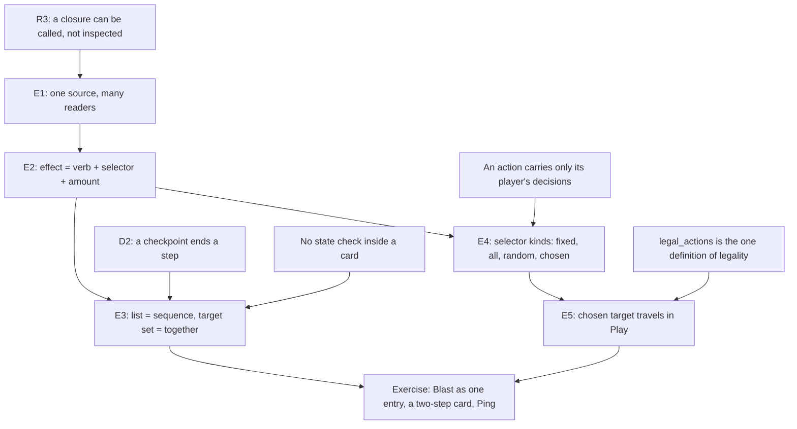

> [!quote] YOU

continue the course


> [!abstract] PI

Session 04 is on effects as data (nodes R3 and E). First, three quick retrieval questions on session 03.


> [!question] Quiz
> Someone edits Bolt in place in the card table: 2 damage becomes 3, under the same code `base.bolt.v0`. A judge wants to see what really happened in a game played last week. You have its trace (seed, deck lists, actions) and the event log the shell recorded while the game was played. Which one shows what really happened?
>
> 1. The event log
> 2. Either one
> 3. The trace


> [!failure] Quiz — incorrect ✗
> Your answer: 3. The trace
> Correct answer: 1
>
> Note: bolt being edited breaks the replay
>
> $E = f(s, a)$ holds only while the rules and the data stay fixed. Printed data is part of $s_0$ (R2). Replaying the trace runs last week's actions against today's data, so every Bolt hits for 3. A hero can then die earlier, and a later recorded action can become illegal. The event log stores outputs, not inputs, so it doesn't care what the data says today. That's the trace vs event-stream split from D1 (command sourcing vs event sourcing). Your versioned codes protect the trace, and that's why editing a version in place is the one forbidden move.


> [!abstract] PI

Your note has the right reasoning: the edit breaks the trace replay. That points to the event log, so I think the pick was a misread rather than a gap. One quick check from the other side to be sure:


> [!question] Quiz
> Same situation: Bolt was edited in place from 2 to 3 damage under `base.bolt.v0`. You replay last week's trace (seed, deck lists, actions) through today's `Game`. In last week's game, the first Bolt hit P1's hero for 2. What does the replay show for that first Bolt?
>
> 1. It hits P1's hero for 3
> 2. It hits P1's hero for 2
> 3. The replay stops before that Bolt resolves


> [!success] Quiz — correct ✓
> Your answer: 1. It hits P1's hero for 3
> Correct answer: 1
>
> A trace stores only inputs: seed, deck lists, actions. The replay recomputes every event with today's `Game`, and today's table says `base.bolt.v0` deals 3. Nothing in the trace remembers the 2. The first divergence is silent: the Bolt is still legal, so `apply` accepts it and reports 3. Things only break visibly later, if the extra damage ends the game early or makes a recorded action illegal. That's why the event log is the faithful record after an in-place edit. It stored the 2 when it happened.


> [!abstract] PI

D1 holds, so the first one was a misread. Next, D3:


> [!question] Quiz
> New card, Mark: "Reveal a random card in the enemy hand. It stays revealed to you while it stays in their hand." P0 casts Mark and a P1 card is revealed. Then P0's client crashes, reconnects, and rebuilds its screen from a fresh `view(P0)`. Where must "P0 can see that card" live so the reconnected client still shows it, and stops showing it once P1 plays the card?
>
> 1. In the server shell, as a set built from `Revealed` events
> 2. In P0's client, as a kept `Revealed` event
> 3. In `Game`, as a fact that `view(P0)` reads


> [!success] Quiz — correct ✓
> Your answer: 3. In `Game`, as a fact that `view(P0)` reads
> Correct answer: 3
>
> What a player knows is state, and `view(game, viewer)` is the one definition of visibility (D3). The client option fails on the reconnect: a fresh `view(P0)` doesn't know about the kept event. The server-set option survives the reconnect, but it's a mirror. The server has to decide when the knowledge ends (played, discarded, shuffled, bounced), and that's a second copy of a rule only the core should hold. A bot or replay viewer that reads `view` directly wouldn't see it either. With the fact in `Game`, `view` shows the face while the card is in P1's hand, and the zone move ends it with no extra code anywhere else.


> [!question] Quiz
> Last retrieval question (D4, triggers). Scavenger: "Whenever another minion dies, gain +1 attack." Blast kills two Recruits in one death pass. A deathrattle on one of those Recruits summons a Scavenger. Under pattern 2 (match triggers at event time, resolve later), how much attack does this Scavenger gain from those two deaths?
>
> 1. +2
> 2. +0
> 3. +1


> [!success] Quiz — correct ✓
> Your answer: 2. +0
> Correct answer: 2
>
> Pattern 2 asks "who is listening right now?" when each `Died` happens. Both deaths happen before the deathrattle runs, so the Scavenger isn't on the board yet and nothing is queued for it. +2 is what you'd get by scanning `History` when triggers resolve: both deaths are in the log by then, and the scan can't tell that the Scavenger wasn't there. That's the Scavenger case from session 03, and it's why trigger matching reads the event as it happens, not the log afterwards.


> [!abstract] PI

Retrieval held on all three nodes. Now a probe for today's node: effects as data. These questions map where your edge is, so "I don't know" is a useful answer.


> [!question] Quiz
> New card, Ping (1 mana): "Deal 2 damage to a minion." The player picks which minion. Suppose `CardDef` stored its behavior as a closure instead of `Effect` data:
>
> ```rust
> pub on_play: Box<dyn Fn(&mut Game, PlayerId, Option<Target>)>,
> ```
>
> Which job does the engine lose?
>
> 1. `apply` can't run Ping's effect as fast
> 2. `legal_actions` can't check Ping's cost
> 3. `legal_actions` can't list Ping's targets
> 4. `apply` can't keep Ping's random rolls deterministic


> [!success] Quiz — correct ✓
> Your answer: 3. `legal_actions` can't list Ping's targets
> Correct answer: 3
>
> Note: it loses type visibility
>
> A closure can only be called. `legal_actions` has to know, before anything runs, that Ping needs a target, that the target is a minion, and which minions qualify. The closure takes a target but doesn't say what a valid one is, or whether it needs one at all. Speed isn't the issue: a `match` and a dynamic call both cost nanoseconds next to a turn. Determinism isn't lost either: the closure gets `&mut Game`, so it can use the game's `Rng`. Cost is a separate field (`mana_cost`), so `legal_actions` still reads it.


> [!abstract] PI

Your note is the right instinct. "Type visibility" here means the engine can't look inside the value. All it can do with a closure is call it. Let's push on that:


> [!question] Quiz
> To fix Ping under the closure design, you give `CardDef` a second closure that lists the valid targets:
>
> ```rust
> pub on_play: Box<dyn Fn(&mut Game, PlayerId, Option<Target>)>,
> pub targets: Box<dyn Fn(&Game, PlayerId) -> Vec<Target>>,
> ```
>
> `legal_actions` calls `targets`, and Ping is offered once per minion. Months later, a designer changes Ping's `on_play` to "Deal 2 damage to a minion or hero" and doesn't touch `targets`. What happens?
>
> 1. Heroes are offered, since `on_play` accepts them
> 2. Heroes are never offered, and nothing reports it
> 3. `apply` panics the first time a hero is targeted
> 4. The build fails, since the two closures disagree


> [!success] Quiz — correct ✓
> Your answer: 2. Heroes are never offered, and nothing reports it
> Correct answer: 2
>
> `targets` is a hand-written second copy of something `on_play` already decides: what Ping can hit. It's a mirror, the same shape as a stored counter next to `History`. Nothing ties the two together, so they drift apart silently: `legal_actions` still lists only minions, and `apply` never sees a hero target, so nothing panics. The compiler can't help, because both closures still have valid types. Every new question you want to ask about a card (its text, its targets, how good it is for an AI) needs another companion like this, and each one can drift too.


> [!abstract] PI

Solid on why data beats closures. Next strand: what happens between the sentences of one card.


> [!question] Quiz
> New spell, Ripple: "Deal 1 damage to all minions. Then deal 1 damage to all minions."
>
> P0's board: Captain (1/1, "other minions on your board have +1/+1") and Recruit (2/2, shown as 3/3). P1 casts Ripple. After the first sentence the Captain is at 0 health.
>
> The rules say deaths are processed only after the card finishes resolving (Hearthstone and MTG both work this way). What is true while the second sentence resolves?
>
> 1. The Captain is still on the board, gets hit again, but no longer buffs the Recruit
> 2. The Captain has been removed, and the Recruit is back to its base 2/2 when hit
> 3. The Captain is still on the board, gets hit again, and still buffs the Recruit


> [!success] Quiz — correct ✓
> Your answer: 3. The Captain is still on the board, gets hit again, and still buffs the Recruit
> Correct answer: 3
>
> Note: it still on the board because it was not removed yet, gets hit again because is on the board, still buffs because is on the board.
>
> "Deaths are processed after the card" means nothing removes the Captain mid-card. At 0 health it's still an ordinary minion on the board: the second "all minions" hit finds it, and its aura still applies, because the aura is derived from what's on the board. Hearthstone calls this state "mortally wounded". MTG 704.4 says it outright: "state-based actions pay no attention to what happens during the resolution of a spell or ability." Your engine does the same: `update` runs once, at the end of `apply`. The third option mixes the two models. An aura can't stop while its source is still on the board, because it's derived from the board on every read.


> [!abstract] PI

Your reasoning is the derivation: each fact follows from "it's still on the board", with no extra rule. Next strand: targeting.


> [!question] Quiz
> Four spells, two players:
> - Bolt: "Deal 2 damage to the enemy hero."
> - Blast: "Deal 2 damage to every character."
> - Wild Bolt: "Deal 3 damage to a random hero."
> - Ping: "Deal 2 damage to a minion." (the caster picks which)
>
> Which of them need a target carried in the player's action, i.e. `Action::Play { object_id, target }`?
>
> 1. Ping, Bolt and Wild Bolt
> 2. Ping and Wild Bolt
> 3. Ping and Bolt
> 4. Only Ping


> [!success] Quiz — correct ✓
> Your answer: 4. Only Ping
> Correct answer: 4
>
> Note: bolt is weird for N player games
>
> An action carries only what the player decides. Bolt's target is fixed by the rules: with two players there's one enemy hero, so the core works it out from the caster. Blast hits everything, so there's nothing to choose. Wild Bolt's target is chance, not a choice: the game's `Rng` picks it during resolution, and putting it in the action would let the player pick the "random" result. Only Ping leaves a choice to the caster. Bolt changes with three or more players: "an enemy hero" becomes a choice too.


> [!question] Quiz
> Hearthstone, both boards empty. P0 has 5 mana and two cards in hand:
> - Ping, a spell: "Deal 2 damage to a minion."
> - Archer, a 2/1 minion: "Battlecry: Deal 1 damage to a minion."
>
> Which of them does Hearthstone let P0 play?
>
> 1. Only Ping
> 2. Neither
> 3. Only the Archer
> 4. Both


> [!success] Quiz — correct ✓
> Your answer: 3. Only the Archer
> Correct answer: 3
>
> Note: I believe the archer would spawn on the board then trigger battlecry while ping cannot be played because it has no target
>
> A spell that needs a target can't be played without one. Hearthstone won't let you pick "no target" for a card that requires one. A minion is "never prevented from being played due to a lack of Battlecry targets": it's summoned, and the Battlecry does nothing (hearthstone.wiki.gg, Target). The card data says which rule applies. Execute carries `REQ_TARGET_TO_PLAY`, and Fire Elemental's Battlecry carries `REQ_TARGET_IF_AVAILABLE`. These are data, and the engine reads them in `legal_actions` before anything runs. SabberStone skips a card with `MustHaveTargetToPlay` and no targets, and otherwise lists one play option per target.


> [!abstract] PI

Your note raises a good follow-up, because it fixes an order: the Archer spawns first, then the Battlecry picks its target.


> [!question] Quiz
> Take your order literally: the Archer (2/1, "Battlecry: Deal 1 damage to a minion.") enters the board first, and only then is its Battlecry target chosen from what's on the board. Both boards were empty before P0 played it. At the moment the target is chosen, what does "a minion" match?
>
> 1. The Archer itself
> 2. Nothing, so the Archer can't be played
> 3. Nothing, so the Battlecry does nothing


> [!success] Quiz — correct ✓
> Your answer: 1. The Archer itself
> Correct answer: 1
>
> Note: if battlecry trigered after the minion enters the board it could match the archer yes
>
> If the choice happens after entry, the Archer is a minion on the board, so it's a valid target. With nothing else on the board it's the only valid target, and a Battlecry that must hit something would kill its own 2/1 body. Hearthstone avoids this two ways. The player picks the target as part of playing the card, before the minion enters. And the data excludes the source: Elven Archer carries `REQ_NONSELF_TARGET`. The lesson for our design: when a target is chosen decides which objects exist to be chosen. "When" is part of the target rule, not a detail of the engine.


> [!abstract] PI

Also right, and your note reaches the same point I wanted to make: when the choice happens decides what can be chosen. One last probe, on cards the vocabulary can't express.


> [!question] Quiz
> One card needs behavior your `Effect` vocabulary can't express, and you don't want a new general-purpose variant for one card. You add an escape hatch variant. `CardDef` must keep `#[derive(Debug, Clone, PartialEq)]`, pass `cargo clippy -- -D warnings` on Rust 1.92, and the card must later be loadable from a data file. Which variant does all three?
>
> Option A: `Custom(CustomId)`, where `CustomId` is a fieldless enum with one variant per special card, and the interpreter has a `match` mapping each one to a function.
> Option B: `Custom(fn(&mut Game, PlayerId, ObjectId))`, a plain function pointer to a named `fn`.
> Option C: `Custom(Arc<dyn Fn(&mut Game, PlayerId, ObjectId)>)`, a shared closure.
>
> 1. A: `Custom(CustomId)`
> 2. C: `Custom(Arc<dyn Fn(&mut Game, PlayerId, ObjectId)>)`
> 3. B: `Custom(fn(&mut Game, PlayerId, ObjectId))`


> [!success] Quiz — correct ✓
> Your answer: 1. A: `Custom(CustomId)`
> Correct answer: 1
>
> Note: 2 not cloen and 3 not serializable
>
> A name for code is data; the code itself isn't. `CustomId` is a plain enum, so it derives everything, prints as `Custom(Mirror)`, and a file can say `"custom": "mirror"`. B gets surprisingly close. Function pointers do implement `Debug`, `Clone` and `PartialEq`, but comparing them is unreliable: the same function can have two addresses, and two functions can share one. Since 1.89 the `unpredictable_function_pointer_comparisons` lint fires inside `#[derive(PartialEq)]`, so `-D warnings` fails. `Debug` prints an address like `0x100650cc0`, and no file can name an address. C fails the derives outright: `dyn Fn` has no `Debug` and no `PartialEq`.


> [!abstract] PI

Right answer, but one claim in your note is off. Both B and C are `Clone`:
- A function pointer is `Copy`. It's just an address.
- `Arc<dyn Fn>` clones by bumping a reference count.

The real failures:
- **B (function pointer):** `PartialEq` is unreliable, so the 1.89+ lint fails `-D warnings`. `Debug` prints an address. A file can't name it.
- **C (`Arc<dyn Fn>`):** it has no `Debug` and no `PartialEq` at all, and it can't be serialized.

I checked both on this machine's rustc 1.92.

**Where the probe puts your edge.** You got every concept question right:
- what a closure hides from `legal_actions`;
- the second-closure mirror;
- no death check in the middle of a card;
- chosen vs fixed vs random targets;
- Hearthstone's playability rule;
- choosing the target before the minion enters.

The only miss was the Rust detail above. So the concepts aren't where you'll struggle today. Your edge is designing the data shape from scratch, with nobody prompting you. Three things your current `Effect` can't say yet:
1. Which entries happen together and which happen one after another. Today's Blast and a "Deal 1. Then draw a card." card are both just two-entry lists.
2. A target the caster chooses. Bolt's `NextPlayer` also encodes "the next seat", which the card text doesn't say.
3. A target described relative to an earlier choice, like "that minion's owner".

Before I plan the lesson, one question about scope. Which of these do you want today? Reply in text:

1. **The course plan as written** (recommended): steps in the effect data, a target vocabulary, the chosen target carried in the action, then the exercise (Blast as one step, a two-step card, Ping with a chosen target).
2. **Plan 1 plus generated rules text**: a small `text(def)` that writes "Deal 2 damage to a minion." from the data. It's the cheapest demo of "one source, many readers", and it previews session H.
3. **Plan 1 plus effects that read earlier results**: "Deal 3 to a minion. If it dies, draw a card." These are conditions and references in data. It overlaps with session 06's half-finished effects.


> [!quote] YOU

as recomended yes


> [!abstract] PI

## Plan for session 04

**Approach.** The probe showed the concepts are in place: what closures hide, no deaths in the middle of a card, choice vs fixed vs random, and when a target is chosen. So today isn't about new facts. It's about turning those facts into a data shape, which is your edge.

Each node is a design question about `Effect` that you answer from things you already hold. I'll mostly ask (Socratic) and keep the explanations short:

1. **One source, many readers.** This makes explicit what you showed in the probe. Card data is read by several interpreters: `apply` resolves it, `legal_actions` finds its targets, and later rules text and AI read it too. A companion closure next to it is a mirror. This is quick, because it mostly connects things you already said.
2. **An effect is verb + selector + amount.** Your `DamagePlayer` / `DamageMonster` split is a verb multiplied by a target kind. We find the axes that vary independently.
3. **List = one after another, target set = together.** This is the opener from session 03. Blast and "Deal 1. Then draw a card." are both two-entry lists today, so the data can't tell them apart. Once simultaneity lives in the selector, "one entry = one sentence = one step" holds, and a checkpoint per entry no longer leaks the encoding. A step boundary is still not a state check.
4. **Selector kinds: fixed, all, random, chosen.** These are your probe answers turned into a type. Forge splits them the same way (`Defined$` vs `ValidTgts$`). Bolt's `NextPlayer` comes up here.
5. **The chosen target travels in `Play`.** `legal_actions` reads the selector and lists one `Play` per valid target. A spell with no valid target isn't listed. This is the Archer lesson: the target is chosen before anything moves.

Then comes the exercise design, where the interface decisions are yours:
- the `Effect` / selector types;
- where the target rule lives (card-level, or inside the effect);
- `Play { object_id, target }`;
- the checkpoint rule;
- the new cards: Ping ("Deal 2 damage to a minion.") and a two-step card ("Deal 1 damage to the enemy hero. Then draw a card."), with Blast becoming one entry.

You write the types and bodies, and I write the tests first.



The five roots are things you've already confirmed, in earlier sessions or in today's probe. Nothing new has to be taken on faith. Does this plan work for you, or do you want to change the scope or the order?


> [!quote] YOU

good


> [!abstract] PI

## Node E1: one source, many readers

**Why we need it.** In the probe, the second closure (`targets`) drifted away from `on_play` without anyone noticing. Let's name why. There were two hand-written answers to one question ("what can Ping hit?"). That's the mirror from session 02 again, this time in card behavior.

**The node.** Each card's behavior is written once, as data. Every question the engine asks about it is a function that reads that data, an *interpreter*:

| Question | Interpreter over `Effect` | Who asks |
|---|---|---|
| What happens when it resolves? | `apply_effect` (exists) | `apply` |
| What can it target? | `valid_targets` (today's exercise) | `legal_actions` |
| What does the card say? | `text` (session H) | UI, card files |
| How good is it right now? | an evaluator (session I) | bots |

None of these readers can disagree with the others about what Ping does, because there's only one Ping. If a designer changes Ping's data to "a minion or hero", `apply_effect` hits heroes, `valid_targets` offers heroes, and `text` says "or hero" on the next build, with no companion to forget.

**How it connects.** It's the same move you've made three times already:
- **Session 01:** `legal_actions` is the one definition of legality, and the UI reads it instead of keeping its own check.
- **Session 02:** store `History` and derive counts from it, instead of keeping a counter beside it.
- **Session 03:** `view` is the one definition of visibility, instead of a client-side "seen" set.

Today the fact is "what this card does", and the readers are interpreters.

It also comes with a price you already know: the expression problem. Interpreters are `match`es over `Effect`, so adding a card is free, but adding a verb touches every interpreter. That's exactly why `_ =>` arms are dangerous: they'd let a new verb skip one of the readers silently.


> [!question] Quiz
> Your engine has three interpreters, each a `match` over `Effect`: `apply_effect` (resolve it), `valid_targets` (what `legal_actions` offers), and `text` (the rules text). None of them has a `_ =>` arm.
>
> You make two changes:
> (a) a new card, Sting: "Deal 3 damage to the enemy hero." It uses only existing variants.
> (b) a new verb, `Freeze`, used by a new card.
>
> What code do you touch for each?
>
> 1. (a) only the card table; (b) one new arm in each of the three interpreters
> 2. (a) one arm in each of the three interpreters; (b) only the card table
> 3. (a) the card table and `text`; (b) one new arm in each of the three interpreters
> 4. (a) only the card table; (b) one new arm in `apply_effect` only


> [!success] Quiz — correct ✓
> Your answer: 1. (a) only the card table; (b) one new arm in each of the three interpreters
> Correct answer: 1
>
> Sting is a new combination of existing words (`Damage`, the enemy hero, 3), so every interpreter already knows how to read it: it resolves, has no chosen target, and its text writes itself. A new card costs one table entry. `Freeze` is a new word, and every reader has to learn it: how it resolves, what it can target, and how it's worded. With no `_ =>` arm, the compiler lists all three places for you. "`apply_effect` only" is the trap a `_ =>` arm sets: the code builds, and then `legal_actions` and `text` silently do the wrong thing for Freeze. The trade is the expression problem: cards are free and verbs cost one arm per reader. Closures flip it: a verb is free, and every card pays for each companion.


> [!question] Quiz
> Your current `Effect`:
>
> ```rust
> enum Effect {
>     DamagePlayer  { targeteer: PlayerTargeteer,  damage: u8 }, // resolves to Vec<PlayerId>
>     DamageMonster { targeteer: MonsterTargeteer, damage: u8 }, // resolves to Vec<ObjectId>
>     Draw { .. }, Reveal { .. }, AddFriendlyAura { .. },
> }
> ```
>
> New card, Fireball: "Deal 3 damage to a character." The caster picks one hero or one minion. In this enum's style, what does Fireball take?
>
> 1. A third variant, `DamageCharacter`, with a third targeteer type
> 2. A new `PlayerTargeteer` variant that can also name a minion
> 3. Two entries, `DamagePlayer` and `DamageMonster`, each with a chosen targeteer


> [!success] Quiz — correct ✓
> Your answer: 1. A third variant, `DamageCharacter`, with a third targeteer type
> Correct answer: 1
>
> Fireball picks one target from heroes and minions together, and neither variant can describe that set. Two entries would mean two choices and two hits: Fireball would deal 3 to a hero and 3 to a minion. A `PlayerTargeteer` resolves to `PlayerId`s, so a minion can't come out of it without changing its result type, and every Bolt-style card would see the change. So the style forces `DamageCharacter`. Then Heal and Freeze arrive, and each needs its own hero, minion and character versions: verbs × target kinds. The bodies of `DamagePlayer` and `DamageMonster` differ only in how they find their targets. That's the sign they're one verb with the target lookup pulled out.


> [!question] Quiz
> Your vocabulary has two verbs:
> - `Damage { to: <character selector>, amount: <amount> }`
> - `Draw { who: <player selector>, count: <amount> }`
>
> Which one of these four cards needs a new verb, meaning a new `Effect` variant?
>
> 1. "Deal 1 damage to each enemy minion."
> 2. "Restore 3 health to your hero."
> 3. "Each player draws 2 cards."
> 4. "Deal damage equal to your hand size to the enemy hero."


> [!success] Quiz — correct ✓
> Your answer: 2. "Restore 3 health to your hero."
> Correct answer: 2
>
> Note: 4 is a computed, I think restore should be separate from damage
>
> Restoring health is something the core doesn't do yet. It removes damage and caps at max health, so it's a new verb, with one arm in each interpreter. "Each enemy minion" is `Damage` with a narrower selector. "Equal to your hand size" is `Damage` with a new kind of amount: one new arm where amounts are evaluated, and `Effect` doesn't change. "Each player draws 2" is `Draw` with an "all players" selector. Three of the four cost nothing at the verb level. That's the payoff of keeping the axes apart: most new cards are new combinations, not new words.


> [!question] Quiz
> Two spells:
> - Blast: "Deal 2 damage to every character." Should be one step.
> - Zap: "Deal 1 damage to the enemy hero. Then draw a card." Should be two steps (hit, then draw).
>
> The checkpoint rule becomes: a checkpoint after each entry of a card's effect list. You now have `Damage { to: <character selector>, amount }` from the last node. Which encoding gives Blast one step and Zap two?
>
> 1. Blast as one `Damage` entry whose selector is every character; Zap as two entries
> 2. Blast as two `Damage` entries (minions, then heroes); Zap as two entries
> 3. Blast as one `Damage` entry; Zap as one entry whose `then` field holds the draw


> [!success] Quiz — correct ✓
> Your answer: 1. Blast as one `Damage` entry whose selector is every character; Zap as two entries
> Correct answer: 1
>
> Note: blast should be one entry yes, it is not today because I believe players should have a object representation too (like heroes, but this is a topic I want to explore and learn about, should we pause course 4 and do it now? I think it is a big tangent, it also discovers how to properly do tokens). Zap should be two entries but its not clear to me how to split "second effect only happens if first succeds" from "second effect always happen" , this is important for card games with denys like MTG, YGO, LOR
>
> "Together" belongs to one verb acting on a set: Blast is one sentence and one `Damage`, and its selector names heroes and minions at once. "One after another" belongs to the list: Zap's two sentences are two entries, and the order is the "Then". With that, one entry = one sentence = one step, and the per-entry checkpoint reads the card's meaning instead of leaking how it's stored. Splitting Blast by target kind brings back two steps, and that split only existed because no single targeteer could name both kinds. A `then` field folds Zap back into one entry, so per-entry checkpoints give it one step, and it builds a second way to write a sequence beside the list.


> [!abstract] PI

Two good points. Short answers to both, then one decision for you.

**1. Heroes as objects.** This is a real design question, and it belongs to node B: what counts as an object.
- Hearthstone makes the hero a game entity with its own health. Lord Jaraxxus can replace your hero mid-game.
- In MTG, players aren't objects at all.

Tokens belong to the same question: an object created mid-game that no deck held. I've started a researcher on how Hearthstone, SabberStone and MTG model players, heroes and tokens.

My recommendation is not to pause mid-node, because today's work doesn't depend on it. Card data names characters by role ("the enemy hero", "every character", "a minion"), not by how they're stored. Whether a selector resolves to `Target::Hero(PlayerId)` or to an `ObjectId` is decided inside the interpreter that resolves selectors, and the card table doesn't change. That's E1 paying off. Doing heroes as objects later means one `Target` refactor in the resolver, with no card data rewritten.

I'd make it a short session 04b straight after this one, with the research ready.

**2. "Then B" vs "if A succeeded, B".** You've found a second axis. Together vs one after another is one question. Whether B depends on A's outcome is another, and they're independent. Take "Destroy a minion. Then draw a card." vs "Destroy a minion. If you do, draw a card." aimed at a minion that can't be destroyed: the first draws, the second doesn't. Yu-Gi-Oh's conjunctions encode both axes. I'm checking the exact table ("and if you do", "then", "also, after that") before I teach it, because the details matter for session 08.

In the data, "if A succeeded" needs two things:
- each verb reports what it actually did, for example which targets it really affected;
- a later entry has a condition that reads that report.

The report lives only while the card resolves. That's the same state as session 06's half-finished effect: if A pauses for a choice, the report has to survive between `apply` calls. So I'd design it in 06 and open 08 with the Yu-Gi-Oh conjunctions.

For today, no card needs a dependency. The one requirement is to leave room for it: entries in a list, where an entry can later gain a condition. Today's list does that.

**Your call.** Should we finish session 04 as planned, with heroes and tokens as session 04b and dependent sequencing in sessions 06 and 08 (my recommendation)? Or pause now and do heroes as objects first? Reply in text.


> [!quote] YOU

ok, I dont think it is short tho, agree with your recomendation


> [!abstract] PI

Agreed, it won't be short. Session 04b gets a full session of its own, with the research ready when it starts. Back to E3.

**How E3 connects.** Two things you already hold meet here:
- **D2:** a checkpoint ends a step. With "one entry = one sentence", a checkpoint after each entry follows the card's sentences. It no longer leaks how the data is stored, because the data now means what the text means. Your session 03 objection was right for the old data, and the fix was in the data, not in the checkpoint rule.
- **No state check inside a card:** a step boundary is not a state check. A checkpoint shows the shell where things are. Deaths still wait until the whole card has resolved. Between Ripple's two sentences the Captain is at 0 health, it's visible in that checkpoint's view, and it's still on the board.

So a checkpoint is about *what the shell sees*, and the state check is about *what the rules do*. They happen at different times.


> [!question] Quiz
> Rules: a checkpoint after each entry of a card's effect list; the state check only at the end of `apply`. No triggers exist in the game.
>
> - Ripple: two entries, "Deal 1 damage to all minions. Then deal 1 damage to all minions."
> - Wave: one entry, "Deal 2 damage to all minions."
>
> P0's board: Captain (1/1, "other minions on your board have +1/+1") and Recruit (2/2, shown 3/3). P1 casts Ripple in one game, and Wave in an identical copy of the game. What differs between the two games?
>
> 1. Only the report: Ripple shows two steps of 1 damage, Wave one step of 2
> 2. The Recruit: Ripple's second hit lands after the Captain has been removed
> 3. The order: Wave hits the minions one at a time, each in its own step
> 4. Nothing: both cards report the same events in the same steps


> [!success] Quiz — correct ✓
> Your answer: 1. Only the report: Ripple shows two steps of 1 damage, Wave one step of 2
> Correct answer: 1
>
> Note: the observed events
>
> Both cards put 2 damage on each minion before any state check, so both games reach the same state. Then the same death passes run: the Captain dies first, and then the Recruit, now at 2 max health with 2 damage, dies in the next pass. Only the report differs. Ripple emits two `Damaged { amount: 1 }` per minion across two checkpoints, and Wave emits one `Damaged { amount: 2 }` per minion in one checkpoint. Nothing is removed between Ripple's sentences, because the step boundary isn't a state check. Wave is one entry, so its hits share a step. Once triggers arrive (session 05), "whenever a minion takes damage" fires twice per minion for Ripple and once for Wave, and that's when the two cards start to play differently.


> [!abstract] PI

E3 landed. "The observed events" is exactly it: same state, different report.

**Follow-up on your dependency question**, now checked (YGOrganization, "Demystifying Rulings Part 5"). Yu-Gi-Oh's conjunctions really are the two axes, one per row and column:

| | B needs A to happen | B happens anyway |
|---|---|---|
| A and B together | "and if you do" | "also" |
| A, then B | "then" | "also, after that" |

There are two refinements:
- A plain "and" means both must be possible, or neither happens.
- The dependency only goes one way. "If you can't do B when the effect resolves, you still do A."

MTG's "if you do" (CR 118.12) depends on whether the player *paid or chose*, "regardless of what events actually occurred". So the games don't agree on what "succeeded" means. That's a good sign it belongs in the data and not hard-coded in the engine. It's recorded for sessions 06 and 08, and the source is saved in `course.ignore/research/04-effects/`.

## Node E4: selector kinds

**Why.** E2 pulled the selector out as its own type. Now we need to know what goes inside it. Your probe answers already sorted targets by **who picks them**:

| Who picks | Kind | Examples | When it's resolved |
|---|---|---|---|
| the rules | **reference** | "this minion", "your hero", "the enemy hero" | at resolution, from the context |
| nobody | **all** matching a filter | Blast: every character | at resolution, from the board |
| chance | **random** among a filter | Wild Bolt: a random hero | at resolution, with the game's `Rng` |
| the player | **chosen** among a filter | Ping: a minion | `legal_actions` lists the options, the action carries the pick |

Look at the shape:
- Three of the four kinds take a **filter** (heroes, minions or characters, friendly or enemy), and it's the same filter in all three. "All enemy minions", "a random enemy minion" and "an enemy minion" differ only in who picks. That's E2's move again, one level down: the filter is its own type, and the kinds wrap it.
- A **reference** has no filter. It names one thing relative to the context: the caster, the source card, the chosen target.

Forge draws the same line. `Defined$` is a reference ("Remember this is non-targeted!"), and `ValidTgts$` is a filter the player picks from.

**Bolt.** Your `NextPlayer` is a reference to "the seat after the caster". The text says "the enemy hero", a reference that only means one thing with two players. With N players the text has to choose: "an enemy hero" is chosen with a filter, and "each enemy hero" is all with a filter. Both give the same result with two players. You'll pick in the exercise.


> [!question] Quiz
> Outrage (spell): "Deal 4 damage to a minion. Then deal 2 damage to that minion's owner's hero."
>
> The first entry's selector is "chosen, filter: minion". The caster may pick their own minion or an enemy one. What should the second entry's selector be?
>
> 1. A chosen target, filter: hero, picked in the same action
> 2. A reference: the hero of the chosen target's owner
> 3. A reference: the enemy hero


> [!success] Quiz — correct ✓
> Your answer: 2. A reference: the hero of the chosen target's owner
> Correct answer: 2
>
> The player decides once, by picking the minion. Who takes the 2 follows from that pick by rule, so it's a reference into the context, like Forge's Chandra's Outrage: `ValidTgts$ Creature` for the first part and `Defined$ TargetedController` for the second. A second chosen target would put a decision in the action that the card doesn't give the player, and the player could pick a hero that doesn't match. "The enemy hero" is wrong whenever the caster targets their own minion: the text says the minion's owner takes the 2, not the caster's opponent. An action carries only its player's decisions, and everything that follows from them is a reference.


> [!question] Quiz
> Two choices in the same game:
> - Forage: "Reveal the top 2 cards of your deck. Pick one to put in your hand." The pick is a pending decision, a separate `Pick` action after `Play`.
> - Ping: "Deal 2 damage to a minion." The pick is part of the `Play` action itself.
>
> What justifies putting them in different places?
>
> 1. Forage's options are cards; Ping's are characters
> 2. Forage's options appear only during resolution; Ping's exist before it's played
> 3. Forage's pick is mandatory; Ping's target is optional
> 4. Forage's pick is hidden from the opponent; Ping's is public


> [!success] Quiz — correct ✓
> Your answer: 2. Forage's options appear only during resolution; Ping's exist before it's played
> Correct answer: 2
>
> Note: I wonder how to do a card like "spawn a 1/1 token. then choose a token to give +1/+1", bad card but I think u get it, I believe this is not common on Heartstone but it is possible on YGO and MTG
>
> A choice can go in an action only if its options are known when the player acts. Ping's options are the minions on the board right now, which `legal_actions` can list before anything moves. Forage's options don't exist until resolution reveals them: before that they're hidden cards in the deck, and listing them would leak the top of the deck. So Forage has to stop halfway and ask. Both are mandatory: a Ping with no target isn't offered, and a revealed Forage must pick. The card-vs-character difference doesn't matter, since either could be listed. Hiddenness is part of why Forage waits, but the general rule is about timing: options known before the card moves go in the action, and options that appear during resolution become a pending decision (session 06).


> [!question] Quiz
> P0's turn, 5 mana. P0's hand: Ping (1 mana, "Deal 2 damage to a minion.") and Bolt (2 mana, "Deal 2 damage to the enemy hero."). P0's board: one Recruit. P1's board: one Recruit and one Captain.
>
> The play action is `Play { object_id, target: Option<Target> }`. How many entries does `legal_actions(P0)` return?
>
> 1. 3
> 2. 4
> 3. 5
> 4. 6


> [!failure] Quiz — incorrect ✗
> Your answer: 2. 4
> Correct answer: 3
>
> Note: I am not sure I like the option, I dont see alternatives yet tho, I believe its 3 for ping and 1 for bolt , I am thinking about target filters now, e.g. friendly minion
>
> Ping: one `Play` per minion its filter matches. "A minion" includes P0's own, so that's 3 (P0's Recruit, P1's Recruit, P1's Captain). Bolt: no chosen selector, so one `Play` with `target: None`. Plus `EndTurn`. 3 + 1 + 1 = 5. Four would mean Ping offers only enemy minions, which its text doesn't say. Six would mean heroes counted as minions, or Bolt listed with a target. Three would mean one action per card, with the target picked later.


> [!question] Question
> Decision 1: where does a card's target rule ("the caster picks a minion") live?
>
> Both keep the filter in one place. They differ in which bad state the types allow, and which one load-time validation (session 02) has to reject.
>
> A) On the card: `CardDef { target: Option<TargetSpec>, .. }`, where `TargetSpec` holds the filter (kind + side). Effects point at the pick with a reference selector, e.g. `Damage { to: Chosen, .. }`. `legal_actions` reads one field. One target per card by construction. Bad state allowed: a spec that no effect uses, or an effect saying `Chosen` on a card with no spec. Precedent: Hearthstone `playRequirements` on the card, Metastone `targetSelection` on the card.
>
> B) Inside the effect: `Damage { to: Chosen(Filter), .. }`. The filter sits in the sentence that uses it, so an entry reads like the text. `legal_actions` scans the card's entries for a `Chosen`. Bad state allowed: two `Chosen` entries on one card, which means two picks, while the action has one slot. Outrage's second part still needs a reference to the pick. Precedent: Forge `ValidTgts$` inside each ability.
>
> My lean is A, because it matches an action with one target slot. B extends more naturally to multi-target cards later (Electrolyze). Both are defensible.
>
> 1. A: on the card, effects reference the pick (Recommended)
> 2. B: inside the effect, `Chosen(Filter)`


> [!example] Answer
> Other: neither, I think they are both bad design and dont generalize well, e.g. a card that chosses 2 minions and a card that chooses a minion and a hero, my guess it that it should live on the effect and how we are doing the legal actions is wrong


> [!abstract] PI

You're right, and it's the same lesson as your session 01 attacker draft.

**What breaks.** Listing every (card, target) pair works only while each card has at most one target. Take your two examples on a board with 6 minions and 2 heroes:
- "a minion and a hero" is 6 × 2 = 12 `Play` actions for one card;
- "two different minions" is 6 × 5 = 30;
- Forge's Electrolyze ("2 damage divided among one or two targets") multiplies again.

Hearthstone gets away with it because its cards have at most one target. MTG and Yu-Gi-Oh don't, and the final exam is a Yu-Gi-Oh chain.

**One correction to "legal actions is wrong".** Its role is right: it's still the one definition of legality. What's wrong is how big one action is. In session 01 you first picked `Attack(Vec<Id>)`, and we fixed it with a draft in state, one attacker per decision. Targeting is the same: one target per decision, with the partly chosen cast held in `Game`. MTG casts this way. Casting is a series of steps: targets in 601.2c, costs later in 601.2h, and if a step can't be completed, "the game returns to the moment before the casting of that spell was proposed."

**Where the target rule lives: in the effect, as you guessed.** Each `Chosen(filter)` in a card's entries is one target to fill, in entry order. "A minion and a hero" is two entries, so two picks. Nothing lives on the card, so nothing can disagree with the entries. B's flaw was "two `Chosen` entries but one slot in the action", and that's gone, because the action no longer has a fixed number of slots.

**What the draft looks like** (a sketch, the names are yours):
- `Play { object_id }` on a card with no `Chosen` entries resolves at once, as today.
- On a card with `Chosen` entries, it starts a draft: `Targeting { card, picked: Vec<Target> }`, a sibling of Forage's `Picker`.
- While the draft is open, `legal_actions` lists one action per valid target for the next pick (`Choose { target }`, say). When the last one is filled, the card is played: cost paid, out of the hand, resolved with `picked` as context.
- E5 still holds. Every target is chosen before anything moves, so the Archer case still works.

**Sub-decisions for you** (reply in text, e.g. "1a 2a 3a 4a"):
1. **When the card is paid for and leaves the hand.**
   - (a) Only once the last target is picked, so the draft changes nothing else (recommended).
   - (b) At `Play`, like MTG's card moving to the stack first.

   (a) makes cancelling free and keeps `Err`-leaves-unchanged reasoning simple.
2. **Cancelling a draft.**
   - (a) No `Cancel`: `legal_actions` only offers `Play` if every pick has at least one valid target, so a draft can always finish (recommended for today).
   - (b) Add a `Cancel` action now.

   With dependent picks later ("two *different* minions"), "can finish" needs a small search, or `Cancel`.
3. **Today's cards.**
   - (a) Ping (one pick) plus your "Deal 1 damage to a minion. Then deal 1 damage to a hero." (two picks, two steps), which proves the draft generalizes (recommended).
   - (b) Ping only.
4. **Can the opponent see the draft?** Hearthstone shows the targeting arrow live.
   - (a) No, `view` shows nothing of a draft until the card is played (recommended, smaller).
   - (b) Yes, the picks so far are public.

This makes the exercise bigger than planned: unified `Damage` with selectors, Blast as one entry, the two-step card, the targeting draft, and a per-entry checkpoint. It's about the size of your session 01 Forage picker plus session 03's effect work. If that's too much for one exercise, the draft can move to session 06, which is about pending choices anyway, and today could keep just the effect reshape.


> [!quote] YOU

sounds good, how exactly is legal actions work tho? what is the first action, e.g. 4 pings in hand 10 minions on board, is the first a action a Target and then a Play? A Play, then Target that plays once the conditions are meet? A Prepare, then Target, then Play? Does it auto plays once conditions are meet or does it require a Commit Action, That is all not clear to me. 1 only after the uses cannot cancel. 2 legal actions only allows to start the draft if the conditions can be meet is the ideal cenario but the cancel action is still usefull, e.g. user changing its mind mid draft or clicked the wrong minion and wants to retarget. 3 ping plus a card that picks two minions, the "Deal 1 damage to a minion. Then deal 1 damage to a hero." waits for Heros as creatures. 4 a for now, i see a b as a improvement later. I agree this is being too big, we should split it but I want to do then in sequence and not wait for 6, Heros as creatures also in this sequence.


> [!abstract] PI

Here's how it works, traced with your example: P0 has 5 mana, four Pings in hand, and 10 minions on the boards. This is the flow I'd recommend:

| Moment | P0's pending state | `legal_actions(P0)` |
|---|---|---|
| Turn starts | none | `Play` for each Ping (4), `EndTurn` → **5** |
| After `Play { ping2 }` | `Targeting { card: ping2, picked: [] }` | `Choose { m }` for each valid minion (10), `Cancel` → **11** |
| After `Choose { m7 }` | the last pick is filled, so it commits: pay 1 mana, Ping leaves the hand, resolves on m7 | back to none: 3 `Play`s, `EndTurn` → **4** |

The flat design would list 4 × 10 + 1 = **41** at the start, and a two-minion card on 10 minions would add 90 more.

Your questions in order:

- **Target first, then Play?** No, the card comes first. The card's entries say what can be targeted, so `legal_actions` can't list targets before it knows the card.
- **Prepare, Target, Play?** Our `Play` *is* the prepare: it opens the cast. It may deserve another name (`Cast`, `Begin`), and that's yours to pick.
- **Auto-play, or a Commit action?** There are two options:
  - **Auto-commit when the last pick is filled** (my recommendation): 2 decisions per Ping. That's how both games work. In Hearthstone, releasing on a target casts the spell. In MTG, once targets are chosen and costs paid, the spell is cast.
  - **An explicit `Commit`**: 3 decisions per Ping. It lets the player change the last pick before confirming.

  Your retarget case is mostly UI. Dragging the arrow over minions is hover, and hover isn't state (session 01), so the decision is the click. A misclick on an *earlier* pick of a multi-pick card is what `Cancel` is for.
- **One rule, no special case.** `Play` opens a cast, and a cast commits as soon as no picks remain. Bolt has zero picks, so it commits within the same `Play`. Ping has one, so it waits for one `Choose`.

Recorded from your answers:
- **1:** commit only after the last pick, and no cancelling after that.
- **2:** `Play` is offered only if the draft can finish, plus a `Cancel`.
- **3:** Ping and a two-minion card. The minion-and-hero card waits for heroes as objects.
- **4:** (a) for now, with (b) as a later improvement.

**The split, done in sequence:**
- **04 (today):** reshape the effects. Verb + selector + amount, Blast as one entry, Zap ("Deal 1 damage to the enemy hero. Then draw a card.") in two steps, a checkpoint per entry. No chosen selector yet, so Ping waits.
- **04b:** the targeting draft, with Ping and the two-minion card.
- **04c:** heroes, players and tokens as objects, then the minion-and-hero card.
- **05:** triggers, as planned.

Three things to settle for 04b while it's fresh (reply in text):
1. **Flow:** auto-commit plus `Cancel` (recommended), or an explicit `Commit`?
2. **The two-minion card:** "two *different* minions" or "a minion. Then a minion." (the same one twice is allowed)?
   - The first needs a "different from earlier picks" rule in the data, and `Play` is offered only with at least 2 minions on the board.
   - The second has independent picks.
3. **The pick action:** a new `Choose { .. }`, or reuse `Pick { object_id }`? Every target in 04b is a minion, so it's an `ObjectId`, and after 04c heroes are too. One action could then mean "pick one of the listed objects" for Forage and targeting alike.


> [!quote] YOU

1 commit, I think it is easier to add an auto play option later then to split the actions later. 2 deffer to 4b, "What happens when an already targeted minion is clicked again". 3 defer too. I think the task for today should be 04a on a new session.


> [!abstract] PI

Agreed on all three. An explicit `Commit` is the easy direction to change later: the shell can send it automatically, but splitting a fused action afterwards changes the API. The re-click question becomes the opener for 04b.

Today ends at a node boundary, with E1 to E5 all checked. I'll close the session in `COURSE.md`: the knowledge map, your design calls, the 04a, 04b and 04c sessions, open threads, and verified facts. I'll also create the log file for 04a. Nothing gets committed until you've reviewed it.


> [!abstract] PI

Session 04 is at a node boundary: E1 to E5 all passed their checks. Nothing is committed yet.

**What the session settled:**
- **E1:** card behavior is written once, as data, and several interpreters read it. A companion closure would be a mirror of it.
- **E2:** an effect is verb + selector + amount. `DamagePlayer` and `DamageMonster` are one verb, and restore is its own verb.
- **E3:** entries in a list happen one after another, and one entry's target set happens together. One entry is one step, and a step boundary is not a state check.
- **E4:** the selector kind says who picks (reference, all, random, chosen), and the last three share one filter.
- **E5:** a choice whose options are known before the card moves is made while casting. One whose options only appear during resolution is a pending pick.

**Your design calls:** targeting is a draft held in state. `Play` opens a cast, then one decision per pick, then an explicit `Commit`. `Cancel` works during the draft, nothing is paid or moved until `Commit`, and `Play` is offered only if the draft can finish. The exercise is split into 04a, 04b and 04c, in that order, before 05.

**`COURSE.md` changes (44 lines added, 9 removed):**
- **Knowledge map:** session 04 retrieval and probe, the nodes, and your design calls. Effects as data moves to Solid. The timing gap gets an update. The Rust line notes that function pointers are `Copy`.
- **Decisions:** the session 04 design.
- **Open threads:**
  - 04a: decisions to settle first (Bolt's selector, how the damage amount is typed, Zap's name and cost, unused branches).
  - 04b: the opener (re-clicking a targeted minion), "different" vs "same" minion, `Pick` reuse, and `Play`'s name.
  - 04c: research pointer.
  - Later sessions: dependent sequencing (06 and 08), "chosen" splitting into target vs choose, and playability with no target.
  - The finished session 04 opener is removed, and the Bolt thread now matches the code.
- **Sessions table:** 04 is done, and rows are added for 04a, 04b and 04c.
- **Verified facts:** targeting in Hearthstone, SabberStone, Metastone and Forge; the MTG rules (601.2, 608.2b/c/d, 704.4, 118.12, 109.1, 120.3); the Yu-Gi-Oh conjunction table; Hearthstone's entity model; Rust function pointers. The full reports are in `course.ignore/research/04-effects/`, which isn't tracked.

**Proposed commit:** `COURSE.md`, this session's log (`course/sessions/04-effects-as-data.md`), and the empty `course/sessions/04a-effects-reshape.md`, which needs to exist before `/md-log` can use it. Message: *"Close session 04: effects as data, targeting draft design, 04a to 04c plan; session log; prepare 04a log"*. Like last time, this log will keep getting messages after the commit, so it'll show as modified again.

Do you want to review the diff first (`git diff COURSE.md`), or shall I commit?

To start 04a afterwards:
```
/new
/name 04a-effects-reshape
/md-log course/sessions/04a-effects-reshape.md
continue the course
```


> [!quote] YOU

commit
