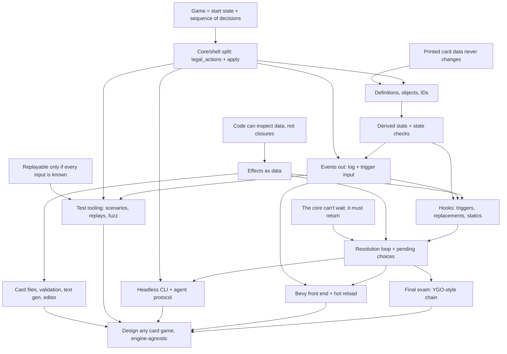

# Card game systems course

Read this at the start of every session. Update it at the end of every session.

## Goal

Understand card game systems well enough to design MTG, Hearthstone, or Yu-Gi-Oh style games from scratch, plus original ones. Focus on code quality, extensibility, card data, card effects, tooling, and automated testing. The rules core is engine-agnostic Rust. Bevy is the main front end.

## How sessions work

- Teaching follows `.agents/skills/teach/SKILL.md`: motivate, establish, connect, quiz-check, one node at a time.
- One pi session per course session. Start with `/new`, `/name NN-topic`, `/md-log docs/course/sessions/NN-topic.md` (the file must exist first), then "continue the course".
- Every session opens with a short retrieval quiz on the previous session's nodes, and adjusts the knowledge map below if something didn't stick.
- Roles in exercises. First we agree on the design in discussion. The learner writes the design-bearing code (types, traits, key function signatures and bodies). The agent writes scaffolding and tests against that API, then reviews. Tests come before the implementation.
- End at a node boundary, not mid-node. Commit once per node.
- Core track (A to G, T, K) is concept-first with one small exercise per session. Application track (H, I, J) gets one design session each. Implementation there is optional.

## Knowledge map (from the 2025-09-28 probe, updated through session 04)

Session 01 (R1, S, L, P, G all landed on the first node check):
- Determinism: a seeded RNG in the state, the clock in the shell (timer becomes an `EndTurn` input). Knows `HashMap`, `thread_rng` and `Instant::now` break replay.
- State is everything (Markov): hidden info like deck order is state, and UI hover/animation is not. `Game` has no log.
- `legal_actions` is the one definition of legality. The UI reads it. `apply` is `Ok` iff the action is listed, and `Err` changes nothing (validate before mutating).
- Proposed per-player `apply(player, action)` himself, citing simultaneous decisions.
- Rust reading is solid: `Clone` for search, `self` by value loses the game on `Err`, `?` does no rollback, owned `Vec` vs a borrowed iterator.
- Action granularity was the one probe miss. He picked `Attack(Vec<Id>)` because he read staging as imposing an order. Fixed once the draft-in-state idea was explicit. His own model was fixed-order yes/no per creature.
- Vocabulary slip: said the core is "influenced by events" when he meant actions. Actions in, events out. Watch for this in session 03.
- Retrieval: now says unprompted that death is a state check, not a setter side effect, and that a boxed closure is opaque.
- Seeds: answered "I don't know" on seed-shift test robustness (the abstract phrasing was the problem). It landed once shown as code: a seed fixes a stream, each random event takes the next number, and an unrelated extra draw shifts every later outcome. Tests should assert properties across seeds, not pin a seed to an outcome.

Session 01 exercise (`crates/rules`, all green):
- He writes the validate/mutate split by instinct (`apply` checks membership, then an infallible `apply_action`). Derived `winner()` from health instead of setting a flag in N places.
- Strong TDD discipline: didn't implement WildBolt because no test pinned it. That was right, and the gap was in my tests.
- Pushed back on my review, correctly. Player identity (`PlayerId` → `Player`) and turn sequence (`TurnOrder`) are separate concepts, and I had wrongly called `TurnOrder` a second copy. Argue specifics with him and concede when he's right. Only the setup line that coupled them needed changing.
- Leans toward N-player generality (`TurnOrder`, `(idx + 1) % len`). Wants explicit targeting, since `opponent()` doesn't generalize.
- Removed an early `HashMap<PlayerId, _>` for determinism and simplicity, unprompted.
- Rust he produced: newtypes (`Deck`, `Hand`, a private-field `PlayerId` with `const fn new`), enum pending state, `std::mem::take`, `let`-`else`. Used `VecDeque` and changed `deck()` to return a `Vec` copy.

Session 02 retrieval and probe (all probe questions right; the edge is in design instinct, not concepts):
- Retrieval: seed streams (transfer to cosmetic RNG), one-place legality, and actions vs events all held. The OpenSpiel chance-player model had faded ("not sure what it means"). Re-taught as "a chance node is a Forage pick where the dice decide", and it landed.
- Probe, all right: a stable-ID-keyed buff survives a bounce (wrong); design X (one mutable attack number) ends at 0; the observer Giant costs 12 when created late; snapshot vs standing cost reductions; a fixed-point state-check loop; store damage and derive toughness (MTG anthem case); scan-on-read for a silenced aura; `Rc`/`&'a` block a Bevy `Resource`; zone-reset rules are per game (HS forward vs backward).
- The edge: when designing from scratch he still reaches for a stored mirror plus hooks. Notes: "counter would probably be a modifier on player state"; "3 is better performance, and when silenced it removes the aura from the player". He picks derived when shown a failing case, but defaults to mirrors for performance. Teach into this: one source of truth per fact, and cache the whole view at defined moments rather than patching incrementally.

Session 02 nodes (all landed on the node check):
- R2: printed data never changes, so it's shared via a `Copy` `DefId` and can be `static`. It's still an input in $s_0$: a balance patch breaks old replays unless the data version is pinned.
- B: Lure's `hand_index` failing case; `ObjectId` from a counter in `Game` (a global counter breaks replay once bot clones allocate); a stale ID lookup returns `None`; the zone-reset table is per game; the UI links a reset object through an old/new event (Arena `ObjectIdChanged`) or a stable card ID.
- C: "store history, derive the rest" plus "a stored copy of a derived fact is a mirror" (the same as session 01's UI legality check). His own question opened it: counters multiply, and his objection that generated cards break setup registration. Resolved with a history slice (`Vec<SpellCast { def, turn }>`) queried by filters, where "this turn" is a filter and needs no reset hook. Session 01's "full history is overkill" held only for one known question; an open card pool pushes toward history slices. He said "it's basically a log", and it is, but it lives inside `Game` (not the shell's log).
- Caching: he picked per-minion event-driven invalidation (miss). His model was "every change emits an event, so recache on every change." The dependent-values gap was shown with a silenced Captain leaving a stale Recruit, and that landed. He then asked whether a full rebuild is too costly. Answered with rough costs (about 100 steps per rebuild, and caching only pays when reads far outnumber actions). Ranking: no cache, then a lazy full rebuild (dirty flag), then incremental only with a real dependency graph.
- State checks: death is committed because it has consequences, and deriving it creates a fixed-point cycle. Collect then commit; loop to a fixed point. Outcome needs `Draw`. With N players, elimination must be committed, because a derived one is undone by a heal.

Session 02 exercise design (guided by questions, at his request, not presented):
- Got these right: the `DefId` candidates (index, enum, `&'static str`; not `String`); per-field `match` scatters a card's data; nested `Kind` instead of a flat struct (his own concern: "atk on spells"); an enum can't name a file-defined card. His note: an index breaks on reorder and a name on rename. He proposed UUIDs, with the codes known at compile time.
- Missed load-time validation: he picked "catch it when the effect resolves" and over-applied node B's stale-ID `None` to definitions. Fixed by splitting runtime staleness (`Option`) from fixed data (validate at load).
- Raised hot reload mid-game, which led to pinning the data version (R2). On "where does each game's table live" he proposed append-only versioned definitions in one table (the version goes in the `DefId`). That's valid, and I conceded. The per-game `Arc<CardDb>` alternative is deferred to session H.
- Gap: he didn't know effects can be data ("is there a point of cards as data if effects can't be data?"). Taught that code defines the vocabulary (enum plus interpreter) and data composes it (variant plus numbers). The draw-vs-damage check landed.
- Chose `DefId(&'static str)` stable codes, `CardDef` with a nested `Kind`, behavior as `Effect`/`CostRule`/`Aura` data, and a `static` table behind one `def(id)` lookup.
- Process: the quiz UI doesn't show the prose above it. Put any code the question depends on into the question or its `details`.

Session 02 exercise review (green: fmt, clippy, 13 unit + 57 spec tests). He moved the rule tests to `tests/spec/` and wrote `docs/testing.md`; all checks survived except "gone id has no def" (objects stay in the bag forever, by design):
- Strong: `History` as a list of events with turn numbers, plus `HistoryQuery` filters, and Giant's discount as data (`EffectAmount::History`). That's node C, including "this turn" as a filter with no reset hook. The aura is derived on read (no leave hook). A per-game `Arc` `Binder`. Fixed the session 01 threads (a pending `Picker` is checked before the turn check; targeting is relative to the caster). Added benchmarks before optimizing. Effects-as-data vocabulary arrived early (`Effect`, targeteers, `EffectSequence` hooks).
- Bugs, shown by throwaway probes: (1) `friendly_aura()` adds the source's own `obj.modifiers` to every friend, so personal buffs leak, while `obj.friendly_aura` is written and never read; (2) `ObjectBag` allocates twice (`Object::new(next_id())` then `insert` allocates the key), so the field is `ObjectId(0)` under key `ObjectId(6)`. That's the mirror lesson in a new place.
- (3) The state check kills one at a time and fires `on_death` inside the loop: not collect-then-commit. Quiz: he saw that the Medic case depends on board order ("I don't like it"). Carried to session 05 as the opening failing case (Medic: "Deathrattle: give your other minions +2 health").
- (4) Unreachable error variants (`ApplyError::Lookup`, `DefinitionNotFound` in lookups). He first wanted to keep them all, then agreed `DefinitionNotFound` belongs to loading, not `apply`. He'll reshape `ApplyError`; tests and SPEC follow his code.
- (5) He kept `CardDef: Default` (placeholder id, Monster 1/1 kind) and chose validation instead: `validate(defs) -> Result<(), CardDefError { NotFound, Duplicate, Placeholder }>` against a `card_ids!` macro's `ALL`. Taught `macro_rules!` (missed the `$( ... ),*` group syntax, then got it). His idea of deriving the code with `stringify!` was rejected by his own rename argument.
- (6) Untested speculative branches (`MonsterDied` ignores its filters, `PlayerFilter::Current`, `Draw`, `on_board_leave`, hostile auras, `has_deck_presence`). Carried.
- (7) `MonsterCardDef::new(health, attack)` argument order. He fixes it.
- Red tests written for (2) in `cards/object.rs` and (5) in `cards/loader.rs`, verified red now and green with a reference fix. (1) and (7) are refactors with no public-API test possible.
- He fixed (1), (2), (4), (5) and (7). `ApplyError` is only `IllegalAction` and `apply_action` is infallible again. `LookupError` is only `ObjectNotFound`. A `def_ids!` macro (with a `count!` helper and an unneeded `#[macro_export]`, both nits) makes the constants and `ALL_DEF_ID`. Codes are versioned (`"base.bolt.v0"`), his append-only design. His own R1 lint caught a `HashSet` in `validate_duplicates`: membership only, never iterated, so a false positive, swapped to `BTreeSet` anyway. `ObjectBag::insert` trusts the caller's id. He kept it on purpose, so changes to `Object` don't ripple into `ObjectBag`.

Session 03 retrieval and probe (R2, B, C all held; every D probe right except one):
- Retrieval: versioned codes pin old replays (R2), the old/new ID report for a reset object (B), Vulture as a new History query with no new state (C).
- Probe, all right: the shell's own health numbers are a mirror (aura loss has no event); a push callback fails on the borrow and on R4; `ObjectId`s allocated in deck-list order leak hidden cards; an outbox field breaks `==` and `clone`; mid-resolution values must travel in the stream; value changes are found by diffing the whole view at checkpoints (he linked it to the death check unprompted); triggers read events inside the core.
- He proposed a log plus a reader cursor instead of draining. Accepted, with the log owned by the shell. He also asked whether triggers could read `History` through a cursor ("from history on resolution"). The Scavenger case (a minion summoned after a death, before the scan, reacts to a death it never saw) landed. He liked pattern 2: match triggers at event time, resolve later.
- Miss (D3): picked a `Looked { def }` entry addressed to the caster over a stored "P0 has seen X" fact. The reconnect case (a fresh `view` loses the knowledge) landed at once. Same mirror habit, this time with the knowledge held in the client. Re-check (a face-down Secret is hidden by `view` alone) was right.
- My sink quiz was flawed: `Option` also skips the work, so his answer was defensible and I regraded it. He didn't know `&mut impl Trait` is a generic (thought it was `dyn`), then asked the right follow-ups: `impl` vs `<O>`, and whether a const check can be stripped. He worried that a generic parameter ripples through every function. That instinct is right.
- He pushes back well and was right three times: brackets/blocks were premature (checkpoints already group a step); a checkpoint per `Effect` entry leaks the data encoding (Blast is one sentence, so one step); fatigue deserves its own event. He disliked a call-scoped `Option` field in `Game` ("mutable temp field") and chose to pass the observer through every function instead.
- He asked for one researcher per engine and for the reports to be kept (`docs/course/research/03-events/`).
- Process: the `ask_user_question` popup also hides the prose above it, not only the quiz UI. He read it as me ignoring his questions. Answer in plain text and don't open a popup in the same turn, or put everything needed into the popup's `details`.
- He sees little learning value in typing out data types and asked me to draft `Event` and `View` for him to edit. Design choices and bodies stay his.

Session 03 nodes (all landed): D1 events are output ($E = f(s, a)$, not state, recomputable, returned; trace vs event-stream replay after a patch); D2 a step is what happened plus visible values; D3 `view(game, viewer)` is the one definition of visibility; D4 one event, three jobs (rules record, trigger input, shell output), with the six-engine comparison.

Session 03 exercise (green: 19 unit + 84 spec):
- His API: `apply(p, a, obs: &mut impl Observer)`, `impl Observer for ()`, `Observer { event, checkpoint(Views) }`, a `Views` handle that only exposes `of(viewer)` (his pick, so the type system enforces D3), `Event` with IDs only, `Game::view` in `game/view.rs`. `History` types renamed to `HistoryEntry`/`HistoryKind`.
- Checkpoints: after a card leaves the hand, after the action resolves, after each death, at the end of `apply`. His placement, adopted into SPEC over my per-`Effect` rule.
- Review fixes he made: `BoardEntered` before enter effects, deathrattle after `Died` and removal, `GameEnded` once. Kept by choice: unused `emtomb(_obs)` and `board_card(_viewer)` parameters, `reveal` moving the options through the event to avoid a clone, and `CardPlayed` recorded before effects resolve.
- My test gap again: no test pinned the checkpoint rule until the review probe. Probe placement with a recorder before trusting "green".

Session 04 retrieval and probe (concept only; the exercise moved to 04a):
- Retrieval held: D1 (after an in-place edit the event log shows what happened, the trace replays with today's data; his first pick was a misread, since his note had the right reasoning and the re-check was right), D3 ("revealed while in their hand" is a fact in `Game` read by `view`), D4 (the Scavenger gets +0 under pattern 2).
- Probe, all right: a closure hides targets from `legal_actions` (his note: "it loses type visibility"); a second `targets` closure drifts silently (the mirror); Ripple mid-card, where a Captain at 0 stays on the board, is hit again and still buffs (he derived all three from "it's still on the board"); only Ping's target belongs in the action (noted unprompted that Bolt is weird with N players); Hearthstone plays the Archer with no target but not Ping; a target chosen after the minion enters can be the minion itself; `Custom(CustomId)` as the escape hatch.
- Rust miss: thought a fn pointer or an `Arc<dyn Fn>` isn't `Clone`. Both are (fn pointers are `Copy`). What fails: a fn pointer's `PartialEq` (lint inside derives since 1.89, an error under `-D warnings`) and its `Debug` (prints an address); `dyn Fn` has no `Debug` and no `PartialEq`.
- The edge is designing the data shape without prompting, not the concepts.

Session 04 nodes (all landed on the node check):
- E1 one source, many readers: card data read by interpreters (`apply_effect`, a target finder, `text`, an evaluator). A companion closure is a mirror. Cards are free, and a verb costs one arm per interpreter (no `_ =>`).
- E2 an effect is verb + selector + amount. `DamagePlayer`/`DamageMonster` is one verb split by target kind (Fireball would force a third). A verb takes the widest kind it acts on (damage: characters, draw: players). He wants restore as its own verb, not negative damage (agreed: it caps, has its own event and its own trigger).
- E3 list = one after another, target set = together. Blast is one `Damage` over every character, Zap is two entries. One entry = one sentence = one step, so a checkpoint per entry no longer leaks the encoding. A step boundary is not a state check (Ripple vs Wave differ only in the report; his note: "the observed events").
- E4 selector kinds by who picks: reference (rules), all (nobody), random (chance), chosen (player). The last three share one filter (kind and side, relative to the caster). Outrage's "that minion's owner" is a reference to the pick (Forge `Defined$ TargetedController`).
- E5 a choice whose options are known before the card moves is part of casting. One whose options appear during resolution is a pending pick (Forage; his own "summon a token, then choose a token" case; MTG 601.2c targets vs 608.2d choices). The count check miss was a dropped `EndTurn`, not the concept.

Session 04 design (his calls):
- He rejected both "target rule on the card" and "inside the effect, one target slot in `Play`": neither generalizes to two picks ("two minions", "a minion and a hero"), and listing every (card, target) pair multiplies. He was right and I conceded. The fix is action granularity (session 01's attacker draft), not `legal_actions`' role.
- Targeting is a draft in state (built in 04b). The target rule lives in the effect, one `Chosen(filter)` per pick, in entry order. `Play` opens a cast, one decision per pick, then an explicit `Commit` ("easier to add auto-play later than to split the actions later"). `Cancel` during the draft (misclick, change of mind). Nothing is paid and nothing leaves the hand until `Commit`. `Play` is offered only if the draft can finish. The draft is hidden from the opponent for now (public picks later).
- He raised heroes as objects ("players should have an object representation too") and tokens. Wants it as its own full session in this sequence.
- He raised dependent sequencing ("the second effect only happens if the first succeeds", for deny games). It's a second axis beside together/then, and the YGO conjunction table confirms it. Deferred to 06 (a per-resolution report) and 08.
- He split the exercise: 04a effect reshape, 04b targeting draft, 04c heroes, players and tokens, each its own session, before 05. Then he moved 04c first (order 04c, 04a, 04b): Blast's "every character" selects heroes and minions, so with heroes as objects 04a's selectors resolve to `ObjectId`s only, instead of a mixed player-or-object target set reworked later.
- Process: he answers multi-part decisions well in plain text ("1a 2b ...") and pushes back on options that don't generalize. Show the multi-pick or N-player case early.

Solid:
- Card definition (never changes) vs instance with its own ID and modifiers.
- Non-commuting modifiers ("set to 1" vs "+2") need an ordering rule. Noted himself that 1 vs 3 is a design choice.
- Replacement effects ("if X would happen, do Z instead") vs triggers ("whenever X happens"). A listener can't undo an event.
- Effects referring to cards by ID, not `Rc<RefCell>` or `&mut`. Game owns everything.
- Stable card ID vs object ID that changes on zone change (MTG 400.7).
- Expression problem: enum makes new operations cheap, new variants touch every `match`. Knows `_` arms hide the checklist.
- Core returns a pending choice instead of blocking.
- Effects as data (session 04): inspectability, interpreters as the readers of one source, verb + selector + amount, simultaneity in the target set. The open edge is designing the shape without prompting.

Partial:
- Pending choice: has the idea. Session 01 update: solid for simple drafts (Discover picks, attacker drafts, and Forage in the exercise are all state in `Game`). Session 04: targeting becomes a draft in state (04b). Not yet tested on a half-finished effect *mid-resolution* ("deal 3, then if it died draw" paused for a target, or his token case). That's session 06.

Gaps (teach into these):
- Timing, i.e. *when* things run. Put the death check in a health setter ("every change goes through the setter"). Dislodged by the "can't die this turn" expiry case, but still needs a proper node. Chose the trigger queue for decoupling reasons, not for re-entrancy and timing reasons. Session 04: no state check inside a card now holds (derived unprompted), and he separates a checkpoint from a state check. Trigger timing is still open (05).
- ~~Core to shell output.~~ Closed in session 03 (returned, observer at checkpoints, views per viewer).
- ~~Determinism sources.~~ Closed in session 01 (`HashMap`, `thread_rng`, `Instant::now`, and seeds as streams).
- Property-based testing. Sees crashes and rejected legal moves as fuzz findings. Missed invariants you assert yourself (card in two zones, replay divergence).

Rust: knows traits, generics, lifetimes, but they don't come naturally when designing. Explain *why* each trait, generic, or ownership choice is the one to make. Session 04: thought fn pointers aren't `Clone` (they're `Copy`).

## Decisions so far

- Build a tiny Hearthstone-like game first.
- Final exam (K): add a Yu-Gi-Oh style chain without rewriting the core. Learner knows YGO best.
- Effects: `enum` by default (open to a code escape hatch later).
- Two IDs: stable card ID and per-zone object ID.
- Core API (session 01): `legal_actions(&self, player) -> Vec<Action>`, `apply(&mut self, player, action) -> Result<(), Illegal>`, and a pure `applied(&self, …) -> Result<Game, Illegal>` wrapper. There's no `current_player()`: whoever has a non-empty list is being waited on. Crate `rules` in a `crates/` workspace. The seeded SplitMix64 `rules::Rng` lives in `Game`. Hand indices are the card identity until session 02, deliberately. `PlayerId` has a private field, with `const fn new(usize)` and `idx()`. `deck()` returns `Vec<Card>`. Cost payment lives once in the `Play` arm, not per card.
- Session 02: `DefId(&'static str)` stable codes; `CardDef { code, name, cost, kind }` with `Kind::Spell { effect } | Kind::Minion { attack, health, aura }`; mechanics as enums (`Effect`, `CostRule`) interpreted by code; a `static` table behind one `def(id)` lookup for now. `Outcome { Won(PlayerId), Draw }`. `Action::{Play, Pick}` carry `ObjectId`. Tests accept either hand to board ID policy.
- Session 03: `apply(p, a, obs: &mut impl Observer)`; `()` is the no-op observer and `applied` uses it. `Observer { event(&Event), checkpoint(Views) }`. `Views` wraps `&Game` privately and only offers `of(viewer) -> View`. Events name objects by `ObjectId` only, never `DefId`; identity reaches a viewer through `view`. Observers live with their consumer (tests, Bevy, CLI, server). In multiplayer only the server runs the core. The shell keeps the event log and its cursors, never `Game`.
- Session 04 (design; built in 04a and 04b): an effect is verb + selector + amount. A list of entries is a sequence, and one entry over a target set is simultaneous. One entry = one step, with a checkpoint after each entry. Selector kinds: reference, all, random, chosen; one filter type (kind, side) for the last three. The target rule lives in the effect (`Chosen(filter)` per pick). Targeting is a draft in state: `Play` opens a cast, one decision per pick, explicit `Commit`, `Cancel` during the draft, nothing paid or moved until `Commit`, `Play` only if the draft can finish, draft hidden from the opponent. Restore is its own verb.
- Tooling wanted: card data files with validation, generated rules text, test tooling (scenario DSL, replays, fuzzer), headless CLI with a machine-readable protocol so bots and LLM agents can playtest, a visual editor, hot reload.

## Open threads

- Where does a half-finished effect live between `apply` calls? (node 06-G)
- Two dead heroes: the derived `winner()` returns `None` when both are at 0 or less, so the game would continue. Nothing can cause it yet. Use it in session 02 (C, state checks) together with "can't die this turn".
- The decider is always the turn player: `legal_actions` returns empty for the non-turn player before it reads their `interaction_state`, so an opponent-side pick or response is never offered. Sessions 06 and 08.
- Explicit targeting: designed in session 04, built in 04b (Ping, a two-minion card, the minion-and-hero card).
- 04a open decisions (after 04c): Bolt's and Spark's selector ("each enemy hero" or a reference that assumes two players; 04c may settle it), damage amount as `u8` or `EffectAmount`, Zap's name and cost, and the unused branches (`Effect::AddFriendlyAura`, `MonsterTargeteer::Itself`, `PlayerTargeteer::All`). Zap gives `Effect::Draw` its first test card.
- 04b opener: "What happens when an already targeted minion is clicked again?" Then decide "two different minions" vs "a minion. Then a minion." (a distinctness rule in the data, and the can-finish check needs two minions), a new pick action vs reusing `Pick { object_id }` (every target is an `ObjectId` by 04b, heroes included), and whether `Play` keeps its name now that it only opens a cast.
- 04c: heroes, players and tokens as objects. Research saved in `docs/course/research/04-effects/conjunctions-and-heroes.md` (Hearthstone hero entity vs Player entity, Jaraxxus replacing the hero, SabberStone `Controller` vs `Hero : Character`, MTG 109.1 players aren't objects, tokens as uncollectible card definitions). Runs before 04a, so 04a's selectors resolve to `ObjectId`s only. The "Deal 1 damage to a minion. Then deal 1 damage to a hero." card needs the targeting draft, so it moves to 04b.
- Dependent sequencing (sessions 06 and 08): "if A succeeded, B" is a second axis beside together/then. Each verb reports what it did, a later entry's condition reads the report, and the report lives only while the card resolves (06's half-finished effect). Open 08 with the YGO conjunction table. MTG 118.12 "if you do" checks the player's act, not the outcome, so what "succeeded" means differs per game and belongs in the data.
- "Chosen" will split into chosen while casting (a target) and chosen during resolution (a pending pick), like MTG "target" vs "choose". Session 06.
- Playability with no target: a Hearthstone spell needs one (`REQ_TARGET_TO_PLAY`), and a Battlecry minion is played anyway (`REQ_TARGET_IF_AVAILABLE`). Matters once a minion has a targeted enter effect.
- Chance as an input (OpenSpiel style) for testing random effects without seeds. Session 07.
- Bolt now targets `NextPlayer` (`turn_order.get_player_after(caster)`), so the identity index issue is gone. It still encodes "the next seat", which the text doesn't say. Decide in 04a.
- `ObjectId`s are allocated in deck-list order before the shuffle, so an opponent who knows the deck list can name a hidden card from its ID. Fix: allocate after the shuffle. Hidden cards' IDs are visible by policy (Arena and Hearthstone do the same).
- Cause across steps ("this hit came from that deathrattle, from that Blast"): blocks or brackets, deferred to session 05 when triggers exist.
- Session 05: match triggers at event time and resolve later (pattern 2), not a `History` cursor (the Scavenger case). Decide how `HistoryEntry` and `Event` relate at the one place they're emitted.
- Knowledge as state: a "look at the top card" effect needs a "P0 has seen X" fact in `Game`, read by `view` (Forge `mayPlayerLook`, XMage `getLookedAt`).
- If History queries get expensive, cache a query result rebuilt at a checkpoint (an XMage watcher is a patched cache of one query). Measure first.
- "Costs (1) less per spell cast this turn": his observer design (a -1 modifier on the card) vs a counter in state. Which one handles a copy drawn after the spells? Open session 02 (C) with this.
- ~~Hand index vs ID~~: done in session 02 (Lure).
- Session H: versioned definitions in one append-only table (his design, in the code) vs a per-game snapshot of one data release with unversioned codes. Test cases from session 03: (1) a card that names another card ("Barracks: summon a Recruit") must be re-versioned whenever the named card is patched; (2) one game can mix v0 and v1 Bolts unless a "current only" rule exists; (3) random pools must exclude old versions; (4) his design needs no release number in a replay and allows deliberate version mixing. I lean per-game release, because of (1). He wasn't sure his approach was right. Hot reload as a recorded input. Load-time validation of card codes referenced in data. Stable codes in files vs runtime index.
- Session 05 opener: collect-then-commit in his `update_deaths` (kills one at a time, `on_death` inside the loop). Since session 03, `kill` reports `Died` and removes the minion before its deathrattle runs, but still one minion per pass. Use the Medic card as the red test. Also decide the order of simultaneous deathrattles.
- Untested speculative branches in `rules` (`HistoryQueryKind::MonsterDied` ignores scope and turn filters, `PlayerFilter::Current`, `TurnFilter::Current`, `Effect::Draw`, `on_board_leave`, hostile auras, `has_deck_presence`). Cut them or give each a test card when its session comes.
- Hand to board keeps the `ObjectId` and the bag keeps objects forever, so a "+500 until end of turn" in `obj.modifiers` would survive a bounce. Raise this when bounce arrives (the zone-reset table).
- Session 02 review (asked or answered): where objects live (per-zone `Vec` vs arena), the hand to board ID policy, counter vs list for spells cast, derived vs committed outcome, hero damage vs health, and the per-field `match` in the old `Card::mana_cost`.

## Dependency map

## Sessions

| # | Nodes | Topic | Status |
|---|-------|-------|--------|
| 00 | probe | Knowledge probe and plan | done |
| 01 | R1, A | Game as a state machine, `legal_actions` + `apply` | done (exercise green: 3 rng + 20 contract tests) |
| 02 | R2, B, C | Definitions, objects, IDs; derived stats and state checks | done (green: 19 unit + 57 spec tests; review fixes applied) |
| 03 | D | Events out; return vs push | done (green: 19 unit + 84 spec; observer, views per viewer, six-engine comparison) |
| 04 | R3, E | Effects as data | done (concept only: E1 to E5; targeting draft designed) |
| 04c | B | Heroes, players and tokens as objects | next (moved before 04a). Research saved. Opens with the retrieval quiz on E1 to E5. |
| 04a | E | Exercise: effect reshape | After 04c. Verb + selector + amount (reference, all, random; no chosen yet), Blast as one `Damage` over every character, Zap ("Deal 1 damage to the enemy hero. Then draw a card.") in two steps, a checkpoint after each entry. Settle the 04a open decisions first. I draft the types for him to edit, tests first, he writes the bodies. |
| 04b | E, G | Exercise: targeting draft | `Chosen(filter)`, `Play` opens a cast, a pick per decision, `Commit`, `Cancel`. Ping, a two-minion card, and the minion-and-hero card. Opener: re-clicking a targeted minion. |
| 05 | F | Triggers, replacements, statics | |
| 06 | R4, G | Resolution loop, pending choices, stored half-finished effects | |
| 07 | R5, T | Scenario DSL, replays, determinism trap, invariant fuzzing | |
| 08 | K | YGO chain: spell speed, right to act, LIFO, SEGOC, missing the timing | |
| app | H | Card files, validation, text generation, editor (design session) | |
| app | I | Headless CLI + agent protocol (design session) | |
| app | J | Bevy front end + hot reload (design session) | |

## Verified facts to reuse

- Hearthstone applies enchantments in the order granted, auras after. Deaths are processed after the outermost phase ends, all at once. Source: hearthstone.wiki.gg Advanced rulebook, Set attribute page.
- MTG Arena's rules engine (GRE) is C++ plus CLIPS. Much of the card behavior code is machine-generated from card text. Source: magic.wizards.com "On Whiteboards, Naps, and Living Breakthrough".
- Forge card scripts separate abilities (`A:`), triggers (`T:`), statics (`S:`), and replacement effects (`R:`). Source: Card-Forge wiki, Card scripting API.
- Spellsource/Metastone cards are JSON `CardDesc` with `SpellDesc` trees and value providers. Source: playspellsource.com javadoc.
- YGO SEGOC order: turn player mandatory, non-turn player mandatory, turn player optional, non-turn player optional. Same category, the owner picks order. Source: Yugipedia "Simultaneous Effects", YGOrganization part 3.
- YGO spell speed: respond only with equal or higher speed. Spell Speed 1 can't respond. Source: Yugipedia "Spell Speed".
- YGO: optional "when... you can" triggers miss the timing unless their condition was the last thing to happen. "If" and mandatory triggers don't miss it. Source: Yugipedia "If... You Can VS When... You Can".
- OpenSpiel `State`: `legal_actions()`, `apply_action()` (in place), `child()` (clone + apply), `current_player()`, `is_terminal()`, `returns()`, `is_chance_node()`, `chance_outcomes()` giving `(action, prob)` pairs. `kChancePlayerId = -1`, simultaneous `-2`. Chance moves are ordinary actions in explicit-stochastic mode. In sampled mode the game keeps its own RNG. Source: open_spiel docs/concepts.md, spiel.h, spiel_globals.h.
- SabberStone: `Controller.Options()` returns `List<PlayerTask>`, empty for the player who isn't acting. `Game.Process(task)` mutates in place. `Game.Clone(...)` for search. Source: SabberStoneCore Controller.cs, Game.cs.
- Metastone: public `GameContext.getValidActions()`. `performAction` is private; `GameLogic.performGameAction(playerId, action)` is public. The engine calls out with `IBehaviour.requestAction(context, player, validActions)`. Source: demilich1/metastone GameContext.java, IBehaviour.java.
- Forge: the engine calls out to `PlayerController` (`chooseSpellAbilityToPlay()`, `declareAttackers(...)`), with human and AI implementations. Source: Card-Forge PlayerController.java, PhaseHandler.java.
- Rust std `HashMap`: each instance gets its own random seed, so iteration order differs even within one process. Source: doc.rust-lang.org HashMap, RandomState.
- `.pi/agents/researcher.md` now uses `anthropic/claude-opus-5-5` and works (session 02).
- MTG CR 400.7: "An object that moves from one zone to another becomes a new object with no memory of, or relation to, its previous existence." Exceptions 400.7a onward. 704.3: SBAs are checked whenever a player would get priority, all applicable ones are performed simultaneously as one event, and the check repeats. 104.4a: "If all the players remaining in a game lose simultaneously, the game is a draw." Layer 7 sublayers are 613.4a–d: CDA, set, modify (counters merged into 7c in the Ikoria update, 2020), switch. Timestamp order within a sublayer (613.7). Source: yawgatog CR (effective 2026-09-25).
- MTG Arena GRE sends `AnnotationType_ObjectIdChanged` (`orig_id` → `new_id`) when a zone move gives a card a new instance ID. Source: manasight-parser (third-party; the protocol is undocumented).
- Hearthstone: both heroes dead at the end of a sequence is a draw (Hellfire example). Arcane Giant: "Costs (1) less for each spell you've cast this game." Moving "backwards" (Play → Hand) resets tags and enchantments (Z5a), while hand buffs survive being played. Health rule H2: when max Health drops, current Health drops only if it exceeds the new max, so a damaged minion survives losing an aura (MTG: it dies). Deaths are processed only after the outermost phase: Aura Update, then Death Creation Step (simultaneous), then Death Phases, repeated until no new deaths. Source: hearthstone.wiki.gg Advanced rulebook, Health, Return to hand.
- Forge: `GameAction.checkStaticAbilities()` calls `StaticEffects.clearStaticEffects` (removes every applied static effect) and then reapplies all continuous statics layer by layer (timestamp order, dependencies per 613.8). It runs at the start of every pass of `checkStateEffects`'s SBA loop (`for q < 9`, a capped fixed point) and also inside `changeZone`. Source: Card-Forge GameAction.java, StaticEffects.java.
- Hearthstone Aura Updates (Advanced rulebook 4a/4b): after the outermost Phase there's an Aura Update (Health/Attack), then the Death Creation Step, then an Aura Update (Other). Both also run whenever a minion is summoned (not played). Auras aren't recalculated mid-Phase, so stats can be stale (the Mana Wyrm and Cone of Cold example).
- YGO: a monster flipped face-down or leaving the field loses effects previously applied to it (Relay Soul and Junk Synchron rulings). The "treated as a new card" wording is community phrasing. Source: Yugipedia card rulings.
- Session 03 engine reports, full text in `docs/course/research/03-events/`. Forge: rules read "this turn" fields (`lifeLostThisTurn`, `MagicStack.thisTurnCast`, `leftBattlefieldThisTurn`) reset at cleanup; triggers go through `TriggerHandler.runTrigger` into a waiting list put on the stack when a player would get priority, and `collectTriggerForWaiting()` snapshots matching triggers at event time; UI gets `GameEvent`s on a Guava `EventBus` ("sent to UI, log and sound system") plus `TrackableObject` views, with `CardView.canBeShownTo(viewer)` deciding visibility; the AI simulates on a `GameCopier` copy with no GUI subscribers. XMage: Watchers see every `GameEvent` before triggers (`GameState.handleEvent`) and reset at end of turn; replacement effects see the event first (`replaceEvent` then mutate then `fireEvent`); the client gets full per-player `GameView` snapshots plus log text, no animation events; old replays stored `GameState` copies ("outdated and not used"); AI copies set a `simulation` flag that skips notifications. SabberStone: tag counters plus `PlayHistory`; triggers are C# delegates queuing tasks; `PowerHistory` off by default in `Clone()`. Hearthstone protocol: `TAG_CHANGE` diffs grouped in nested `BLOCK_START/END` (PLAY, ATTACK, TRIGGER, DEATHS, FATIGUE, ...), `META_DATA` guides animations, hidden cards have no card ID until `SHOW_ENTITY`, a per-player dispatcher holds back packets (HearthSim). HSReplay is XML of that stream. Metastone/Spellsource: one `GameEvent` feeds triggers and UI; Spellsource sends each event with a redacted snapshot (`ModelConversions`, "Censor the opponent hand and deck entities") and stores replays as a `Trace` of seed, decks, mulligans and action indices, re-simulated to view. Arena GRE: `Full` then `Diff` `GameStateMessage`s with `annotations` (`DamageDealt`, `ZoneTransfer` with a category, `ObjectIdChanged`), zones with `Visibility` and `viewers`, hidden cards sent as IDs with no object; draws and shuffles reissue IDs (reason undocumented).
- Bevy 0.17 split buffered events into messages (`Message`, `MessageWriter`, `MessageReader`, `Messages<M>`), and `Event` now means observer events (`commands.trigger`). Latest stable 0.19.1, 0.20.0-rc.2 out (crates.io, 2026-09-28). Source: bevy.org 0.17 release notes and migration guide.
- Fowler, Event Sourcing: "Capture all changes to an application state as a sequence of events." Command sourcing (store the inputs, rerun the decisions) is a named pattern in Akka's persistence docs. Source: martinfowler.com/eaaDev/EventSourcing.html, doc.akka.io.
- Session 04 targeting and effect data, full text in `docs/course/research/04-effects/targeting-and-effect-data.md`. Hearthstone: "Players cannot take an action and choose "no target" if it normally requires one", while "minions are never prevented from being played due to a lack of Battlecry targets" (hearthstone.wiki.gg Target). Old HearthstoneJSON builds carry `playRequirements`: Execute `REQ_TARGET_TO_PLAY` plus minion, enemy and damaged filters; Fire Elemental `REQ_TARGET_IF_AVAILABLE`; Elven Archer `REQ_NONSELF_TARGET` (the current feed has no such field). SabberStone: `PlayCardTask(controller, source, target, zonePosition, chooseOne)`, `Controller.Options()` adds one task per target and skips a `MustHaveTargetToPlay` card with none. Metastone: card-level `targetSelection`, `ActionLogic.rollout` clones the action per valid target; `MetaSpell` runs its children in order; Hellfire is one `DamageSpell` on `ALL_CHARACTERS`. Forge: `ValidTgts$` (targeted) vs `Defined$` ("Remember this is non-targeted!"), `SubAbility$` chains resolve after the parent (Electrolyze, Chandra's Outrage with `Defined$ TargetedController`).
- MTG CR (yawgatog, effective 2026-09-25): 601.2c targets are announced while casting, costs later (601.2h), and a step that can't be completed makes the cast illegal and "the game returns to the moment before the casting of that spell was proposed" (601.2). 608.2b: a spell with all targets illegal doesn't resolve; otherwise illegal targets are skipped and the rest still happens. 608.2c: instructions in the order written. 608.2d: other choices are made "while applying the effect". 704.4: "state-based actions pay no attention to what happens during the resolution of a spell or ability." 118.12 "if you do" checks whether the player paid or chose, "regardless of what events actually occurred". "Then" has no CR definition. 109.1 lists objects (players aren't one); 120.3a damage to a player is life loss, 120.3e damage to a creature is marked.
- YGO conjunctions (YGOrganization, Demystifying Rulings Part 5): simultaneous + B needs A = "and if you do"; sequential + B needs A = "then"; simultaneous + independent = "also"; sequential + independent = "also, after that". Plain "and": both must be possible or neither happens. A never needs B. "Then" makes a "When ... you can" trigger on A miss the timing.
- Hearthstone entities (HearthSim protocol docs): one `Game` (ID 1), two `Player`s (IDs 2 and 3), and everything else is a `Card`, the hero included (`CARDTYPE` `HERO`, linked by the player's `HERO_ENTITY` tag). Hero cards and Jaraxxus replace the hero, and modifiers on the old hero don't carry over. SabberStone: `Hero : Character`, `Minion : Character`, `Controller` separate. Tokens are uncollectible cards.
- Rust fn pointers implement `Clone`, `Copy`, `PartialEq`, `Eq`, `Hash`, `Debug` for every signature, higher-ranked ones included (built-in `FnPtr`, 1.70). Comparing them is unreliable, and `unpredictable_function_pointer_comparisons` (1.85) fires inside `#[derive(PartialEq)]` since 1.89. On rustc 1.92 here, `Debug` prints an address. `Box<dyn Fn>` derives none of `Debug`, `Clone`, `PartialEq`.
- Toolchain on this machine: rustc/cargo 1.92. Check crate versions (bevy, rand, ron, proptest, insta) when adding them. Bevy was at 0.20 RC in the index at probe time.
