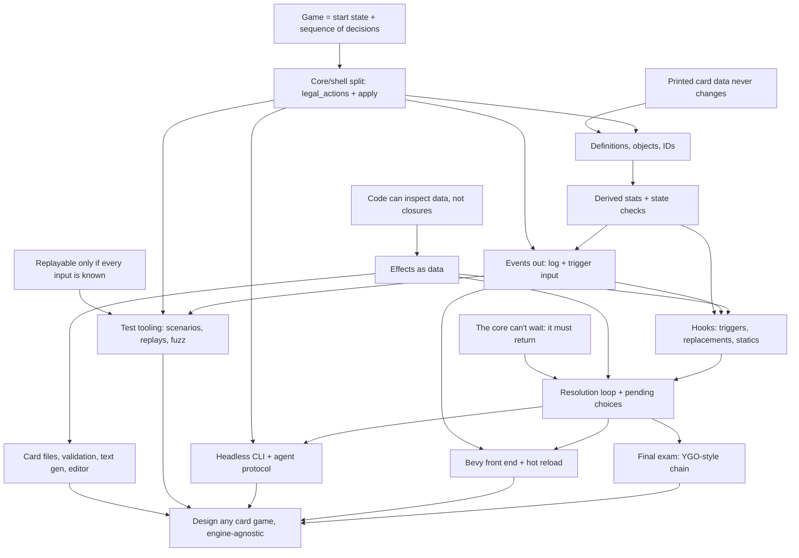

# Card game systems course

## Goal

Understand card game systems well enough to design MTG, Hearthstone, or Yu-Gi-Oh style games from scratch, plus original ones. Focus on code quality, extensibility, card data, card effects, tooling, and automated testing. The rules core is engine-agnostic Rust. Bevy is the main front end.

## How sessions work

- Teaching follows the `teach` skill, `.agents/skills/teach/SKILL.md`.
- One pi session per course session. Start with `/new`, `/name NN-topic`, `/md-log docs/course/sessions/NN-topic.md` (the file must exist first), then "continue the course".
- Every session opens with a short retrieval quiz on the previous session's nodes, and adjusts the knowledge map below if something didn't stick.
- Roles in exercises. First we agree on the design in discussion. The learner writes the design-bearing code (types, traits, key function signatures and bodies). The agent writes scaffolding and tests against that API, then reviews. Tests come before the implementation. He sees little learning value in typing out plain data types, so the agent drafts those, such as `Event` and `View`, for him to edit. Design choices and bodies stay his.
- End at a node boundary, not mid-node. Commit once per node.

## Knowledge map (from the 2026-09-28 probe, updated through session 04a)

Session 01 (R1, S, L, P, G all landed on the first node check):
- Determinism: a seeded RNG in the state, the clock in the shell (timer becomes an `EndTurn` input). Knows `HashMap`, `thread_rng` and `Instant::now` break replay.
- State is everything (Markov): hidden info like deck order is state, and UI hover/animation is not. `Game` has no log.
- `legal_actions` is the one definition of legality. The UI reads it. `apply` is `Ok` iff the action is listed, and `Err` changes nothing (validate before mutating).
- Proposed per-player `apply(player, action)` himself, citing simultaneous decisions.
- Rust reading is solid: `Clone` for search, `self` by value loses the game on `Err`, `?` does no rollback, owned `Vec` vs a borrowed iterator.
- Action granularity was the one probe miss. He picked `Attack(Vec<Id>)` because he read staging as imposing an order. Fixed once the draft-in-state idea was explicit. His own model was fixed-order yes/no per minion.
- Vocabulary slip: said the core is "influenced by events" when he meant actions. Actions in, events out.
- Retrieval: now says unprompted that death is a state check, not a setter side effect, and that a boxed closure is opaque.
- Seeds: answered "I don't know" on seed-shift test robustness (the abstract phrasing was the problem). It landed once shown as code: a seed fixes a stream, each random event takes the next number, and an unrelated extra draw shifts every later outcome.

Session 01 exercise (`crates/rules`, all green):
- He writes the validate/mutate split by instinct (`apply` checks membership, then an infallible `apply_action`). Derived `winner()` from health instead of setting a flag in N places.
- Strong TDD discipline: didn't implement WildBolt because no test pinned it. That was right, and the gap was in my tests.
- Pushed back on my review, correctly. Player identity (`PlayerId`, `Player`) and turn sequence (`TurnOrder`) are separate concepts, and I had wrongly called `TurnOrder` a second copy. Only the setup line that coupled them needed changing.
- Leans toward N-player generality (`TurnOrder`, `(idx + 1) % len`). Wants explicit targeting, since `opponent()` doesn't generalize.
- Removed an early `HashMap<PlayerId, _>` for determinism and simplicity, unprompted.
- Rust he produced: newtypes (`Deck`, `Hand`, a private-field `PlayerId` with `const fn new`), enum pending state, `std::mem::take`, `let`-`else`. Used `VecDeque` and changed `deck()` to return a `Vec` copy.

Session 02 retrieval and probe (all probe questions right; the edge is in design instinct, not concepts):
- Retrieval: seed streams (transfer to cosmetic RNG), one-place legality, and actions vs events all held. The OpenSpiel chance-player model had faded ("not sure what it means"). Re-taught as "a chance node is a Forage pick where the dice decide", and it landed.
- Probe, all right: a stable-ID-keyed buff survives a bounce (wrong); design X (one mutable attack number) ends at 0; the observer Giant costs 12 when created late; snapshot vs standing cost reductions; a fixed-point state-check loop; store damage and derive toughness (MTG anthem case); scan-on-read for a silenced aura; `Rc`/`&'a` block a Bevy `Resource`; zone-reset rules are per game (HS forward vs backward).
- The edge: when designing from scratch he still reaches for a stored mirror plus hooks. Notes: "counter would probably be a modifier on player state"; "3 is better performance, and when silenced it removes the aura from the player". He picks derived when shown a failing case, but defaults to mirrors for performance. Teach into this: one source of truth per fact, and cache the whole view at defined moments rather than patching incrementally.

Session 02 nodes (all landed on the node check):
- R2: printed data never changes, so it's shared via a `Copy` `DefId` and can be `static`. It's still an input in $s_0$: a balance patch breaks old replays unless the data version is pinned.
- B: Lure's `hand_index` failing case; `ObjectId` from a counter in `Game` (a global counter breaks replay once bot clones allocate); a stale ID lookup returns `None`; the zone-reset table is per game; the UI links a reset object through an old/new event (Arena `ObjectIdChanged`) or a stable card ID.
- C: "store history, derive the rest" plus "a stored copy of a derived fact is a mirror" (the same as session 01's UI legality check). His own question opened it: counters multiply, and his objection that generated cards break setup registration. Resolved with a history slice (`Vec<SpellCast { def, turn }>`) queried by filters, where "this turn" is a filter and needs no reset hook. Session 01's "full history is overkill" held only for one known question; an open card pool pushes toward history slices. He said "it's basically a log", and it is, but it lives inside `Game` (not the shell's log).
- Caching: he picked per-minion event-driven invalidation (miss). His model was "every change emits an event, so recache on every change." The dependent-values gap was shown with a silenced Captain leaving a stale Recruit, and that landed. He then asked whether a full rebuild is too costly. Answered with rough costs (about 100 steps per rebuild, and caching only pays when reads far outnumber actions). Ranking: no cache, then a lazy full rebuild (dirty flag), then incremental only with a real dependency graph.
- State checks: death is committed because it has consequences, and deriving it creates a fixed-point cycle. Collect then commit; loop to a fixed point. Outcome needs `Draw`. With N players, elimination must be committed, because a derived one is undone by a restore.

Session 02 exercise design (guided by questions, at his request, not presented):
- Got these right: the `DefId` candidates (index, enum, `&'static str`; not `String`); per-field `match` scatters a card's data; nested `Kind` instead of a flat struct (his own concern: "atk on spells"); an enum can't name a file-defined card. His note: an index breaks on reorder and a name on rename. He proposed UUIDs, with the codes known at compile time.
- Missed load-time validation: he picked "catch it when the effect resolves" and over-applied node B's stale-ID `None` to definitions. Fixed by splitting runtime staleness (`Option`) from fixed data (validate at load).
- Raised hot reload mid-game, which led to pinning the data version (R2). On "where does each game's table live" he proposed append-only versioned definitions in one table (the version goes in the `DefId`). That's valid, and I conceded.
- Gap: he didn't know effects can be data ("is there a point of cards as data if effects can't be data?"). Taught that code defines the vocabulary (enum plus interpreter) and data composes it (variant plus numbers). The draw-vs-damage check landed.

Session 02 exercise review (green: fmt, clippy, 13 unit + 57 spec tests). He moved the rule tests to `tests/spec/` and wrote `docs/conventions/testing.md`; all checks survived except "gone id has no def" (objects stay in the bag forever, by design):
- Strong: `History` as a list of events with turn numbers, plus `HistoryQuery` filters, and Giant's discount as data (`EffectAmount::History`). That's node C, including "this turn" as a filter with no reset hook. The aura is derived on read (no leave hook). A per-game `Arc` `Binder`. Fixed the session 01 threads (a pending `Picker` is checked before the turn check; targeting is relative to the caster). Added benchmarks before optimizing. Effects-as-data vocabulary arrived early (`Effect`, targeteers, `EffectSequence` hooks).
- Bugs, shown by throwaway probes: (1) `friendly_aura()` adds the source's own `obj.modifiers` to every friend, so personal buffs leak, while `obj.friendly_aura` is written and never read; (2) `ObjectBag` allocates twice (`Object::new(next_id())` then `insert` allocates the key), so the field is `ObjectId(0)` under key `ObjectId(6)`. That's the mirror lesson in a new place.
- (3) The state check kills one at a time and fires `on_death` inside the loop: not collect-then-commit. Quiz: he saw that the Medic case depends on board order ("I don't like it").
- (4) Unreachable error variants (`ApplyError::Lookup`, `DefinitionNotFound` in lookups). He first wanted to keep them all, then agreed `DefinitionNotFound` belongs to loading, not `apply`. He'll reshape `ApplyError`, and the tests follow his code.
- (5) He kept `CardDef: Default` (placeholder id, Monster 1/1 kind) and chose validation instead: `validate(defs) -> Result<(), CardDefError { NotFound, Duplicate, Placeholder }>` against a `card_ids!` macro's `ALL`. Taught `macro_rules!` (missed the `$( ... ),*` group syntax, then got it). His idea of deriving the code with `stringify!` was rejected by his own rename argument.
- (6) Untested speculative branches, listed in the open threads.
- (7) `MonsterCardDef::new(health, attack)` argument order. He fixes it.
- He fixed (1), (2), (4), (5) and (7), and wrote a `def_ids!` macro for the card constants. His own R1 lint caught a `HashSet` in `validate_duplicates`: membership only, never iterated, so a false positive, swapped to `BTreeSet` anyway.

Session 03 retrieval and probe (R2, B, C all held; every D probe right except one):
- Retrieval: versioned codes pin old replays (R2), the old/new ID report for a reset object (B), Vulture as a new History query with no new state (C).
- Probe, all right: the shell's own health numbers are a mirror (aura loss has no event); a push callback fails on the borrow and on R4; `ObjectId`s allocated in deck-list order leak hidden cards; an outbox field breaks `==` and `clone`; mid-resolution values must travel in the stream; value changes are found by diffing the whole view at checkpoints (he linked it to the state check unprompted); triggers read events inside the core.
- He proposed a log plus a reader cursor instead of draining. Accepted, with the log owned by the shell. He also asked whether triggers could read `History` through a cursor ("from history on resolution"). The Scavenger case (a minion summoned after a death, before the scan, reacts to a death it never saw) landed. He liked pattern 2: match triggers at event time, resolve later.
- Miss (D3): picked a `Looked { def }` entry addressed to the caster over a stored "P0 has seen X" fact. The reconnect case (a fresh `view` loses the knowledge) landed at once. Same mirror habit, this time with the knowledge held in the client. Re-check (a face-down Secret is hidden by `view` alone) was right.
- My sink quiz was flawed: `Option` also skips the work, so his answer was defensible and I regraded it. He didn't know `&mut impl Trait` is a generic (thought it was `dyn`), then asked the right follow-ups: `impl` vs `<O>`, and whether a const check can be stripped. He worried that a generic parameter ripples through every function. That instinct is right.
- He pushes back well and was right three times: brackets/blocks were premature (checkpoints already group a step); a checkpoint per `Effect` leaks the data encoding (Blast is one sentence, so one step); fatigue deserves its own event. He disliked a call-scoped `Option` field in `Game` ("mutable temp field") and chose to pass the observer through every function instead.

Session 03 nodes (all landed): D1 events are output ($E = f(s, a)$, not state, recomputable, returned; trace vs event-stream replay after a patch); D2 a step is what happened plus visible values; D3 `view(game, viewer)` is the one definition of visibility; D4 one event, three jobs (rules record, trigger input, shell output), with the six-engine comparison.

Session 03 exercise (green: 19 unit + 84 spec):
- He designed the observer API (ADR 0006). His pick of a `Views` handle that only exposes `of(viewer)` lets the type system enforce D3.
- His checkpoint placement was adopted over my per-`Effect` rule.
- Review fixes he made: `BoardEntered` before enter effects, deathrattle after `Died` and removal, `GameEnded` once. Kept by choice: unused `emtomb(_obs)` and `board_card(_viewer)` parameters, `reveal` moving the options through the event to avoid a clone, and `CardPlayed` recorded before effects resolve.

Session 04 retrieval and probe (concept only; the exercise moved to 04a):
- Retrieval held: D1 (after an in-place edit the event log shows what happened, the trace replays with today's data; his first pick was a misread, since his note had the right reasoning and the re-check was right), D3 ("revealed while in their hand" is a fact in `Game` read by `view`), D4 (the Scavenger gets +0 under pattern 2).
- Probe, all right: a closure hides targets from `legal_actions` (his note: "it loses type visibility"); a second `targets` closure drifts silently (the mirror); Ripple mid-card, where a Captain at 0 stays on the board, is hit again and still buffs (he derived all three from "it's still on the board"); only Ping's target belongs in the action (noted unprompted that Bolt is weird with N players); Hearthstone plays the Archer with no target but not Ping; a target chosen after the minion enters can be the minion itself; `Custom(CustomId)` as the escape hatch.
- Rust miss: thought a fn pointer or an `Arc<dyn Fn>` isn't `Clone`. Both are, and fn pointers are `Copy`.
- The edge is designing the data shape without prompting, not the concepts.

Session 04 nodes (all landed on the node check):
- E1 one source, many readers: card data read by interpreters (`apply_effect`, a target finder, `text`, an evaluator). A companion closure is a mirror. Cards are free, and a verb costs one arm per interpreter (no `_ =>`).
- E2 an effect is verb + selector + amount. `DamagePlayer`/`DamageMinion` is one verb split by target kind (Fireball would force a third). A verb takes the widest kind it acts on (damage: characters, draw: players). He wants restore as its own verb, not negative damage (agreed: it caps, has its own event and its own trigger).
- E3 list = one after another, target set = together. Blast is one `Damage` over every character, Zap is two effects. One effect = one sentence = one step, so a checkpoint per effect no longer leaks the encoding. A step boundary is not a state check (Ripple vs Wave differ only in the report; his note: "the observed events").
- E4 selector kinds by who picks: reference (rules), all (nobody), random (chance), chosen (player). The last three share one filter (kind, and friendly or enemy relative to the caster). Outrage's "that minion's owner" is a reference to the pick (Forge `Defined$ TargetedController`).
- E5 a choice whose options are known before the card moves is part of casting. One whose options appear during resolution is a pending pick (Forage; his own "summon a token, then choose a token" case; MTG 601.2c targets vs 608.2d choices). The count check miss was a dropped `EndTurn`, not the concept.

Session 04 design (his calls):
- He rejected both "target rule on the card" and "inside the effect, one target slot in `Play`": neither generalizes to two picks ("two minions", "a minion and a hero"), and listing every (card, target) pair multiplies. He was right and I conceded. The fix is action granularity (session 01's attacker draft), not `legal_actions`' role.
- He designed the targeting draft (ADR 0007). He wants the explicit commit because it's "easier to add auto-play later than to split the actions later", and cancel for a misclick or a change of mind.
- He raised heroes as objects ("players should have an object representation too") and tokens. Wants it as its own full session in this sequence.
- He raised dependent sequencing ("the second effect only happens if the first succeeds", for deny games). It's a second axis beside together/then.
- He split the 04 exercise in three and ordered the parts himself (see the course plan).

Session 04c probe (no retrieval quiz, at his request: session 04 had ended hours before; every hero question right, tokens the one gap):
- Which object is P's hero is a zone fact, stored once. He picked the slot over a bag scan, a board entry and a slot plus a back-pointer on the object (the mirror). His note: "maybe even inside the zones", which became the design.
- Hero is a kind on the definition, while being P's hero is a zone fact (his note: a hero in hand and one in play are both heroes).
- A replacement is a new object, and the card's data says what carries over. His note gave flexibility as the reason, not identity.
- Summon is not play (Barracks and the Squire; "squire was never played"). Unify where the rules unify: SabberStone's `Hero : Character` vs Forge's `GameEntity` and XMage's shared UUIDs, decided by whether damage to a player behaves like damage to a piece. A "damage your hero took this game" query keys by `PlayerId` across replacements.
- He saw at once that a hero left in its zone at 0 makes the removal loop run forever (a fixed-point pass must change what the next pass finds).

Session 04c nodes:
- Tokens: answered "I don't know". He proposed a `TokenCardDef` kind, and a piece decoupled from its card where vanishing is a limit of the types. Taught the rule "a fact that can differ between two copies of one definition belongs on the object" with Cackling Counterpart, and the per-game leave rules (MTG state check, YGO replacement, Hearthstone none). He pushed back: in Hearthstone a token is an uncollectible card. Conceded: two meanings, Hearthstone's uncollectible (definition) and MTG's created by an effect (object), each placed by the same rule. Node check right. His note: the "created by an effect" fact isn't stored today, and won't be until a rule reads it. `collectible` is out of scope, his call.
- Barracks names the Squire: Barracks v0 keeps summoning Squire v0 under ADR 0003 (right). I dropped the planned reference check: `def_ids!` constants plus `validate_not_found` already guarantee it until codes come from files.

Session 04c exercise (his design, ADR 0008; green: 18 unit + 106 spec):
- Decisions: `Zones.hero: ObjectId`; one static `base.hero.v0`; `Player.health` removed; `hero_id(p)`, plus `hero_health(p)`, which he first dropped and then kept; heroes have no attack value (`None`; `Some(0)` stays a distinct later value); `Damaged { target: ObjectId }`; `FatigueDamaged` carries the hero's `object_id`; a dead hero stays in its zone and is reported `Died`; `Summon { selector, def_id }` reported by `BoardEntered` alone; `HeroCard` in the view. He renamed `spawn` to `summon` and moved the card constants to `rules::static_card_definition`.
- Review probes found: a hero death recorded as `MinionDied` (fixed: `CharacterDied`, and the minion query filters minions); a hero card played from hand landing on the board (fixed: no board presence; he briefly added hero replacement on play, then dropped it); hero health skipping buffs instead of scoping the aura (fixed: one health path, auras reach minions by kind); a duplicate trailing checkpoint (fixed after one inverted flag).
- Kept by choice: `Player.playing`, a committed elimination with a re-check after a hero's death effect. No test can reach it while `Game::new` takes two decks.
- He made eight interface calls quickly and well, and the mirror habit didn't show (he rejected the back-pointer). What showed instead is structure for cases no test reaches: `playing`, hero replacement on play, the minion query's new filters.

Session 04a probe (no retrieval quiz, at his request):
- Frame for friendly and enemy: right. The Squire's deathrattle measures "enemy" from its owner. My question mixed "what the rules say" with "what the code does". He answered the code reading and noted "bug", so I regraded it right. He had already renamed `caster` to `owner` in a commit.
- Rust miss: thought `-2i32 as u8` panics in a debug build. Taught: an integer `as` keeps the low bits (254), and the overflow checks sit on arithmetic, never on casts. The follow-up (10 + 254 panics on the `+=`) was right. He then applied it unprompted: `EffectAmount::Static(u8)`, so a negative damage can't be written, `u8::try_from(count).unwrap_or(u8::MAX)` in `history_query`, and `saturating_sub` for the mana cost.
- Checkpoints: traced the duplicate trailing step that per-effect checkpoints add to Barracks. Right.

Session 04a exercise (green: 17 unit + 114 spec; his commits `1614884`, `9dd3360`, then `c4aef7c`):
- Asked to sketch the shape, he wrote it in code, and it held. The filter is independent axes, with an `EnumSet` per axis (`kind`: heroes, minions; `side`: friendly, enemy). Selectors are `All(filter)`, `Random(filter)` and references. One `Damage` over characters, and one amount type for every verb. Random over an empty set draws no number and does nothing, which matches Hearthstone, Metastone and SabberStone, unprompted. Spark, Bolt and Zap hit every enemy hero, so nothing assumes a seat.
- The one gap was applying the split to one side only. `PlayerSelector { All, Owner, Random, Enemy }` mixed who picks with side, so "a random opponent" had no variant. Shown that case, he mirrored the character shape (`All(sides)`, `Owner`, `Random(sides)`). This was the `DamagePlayer`/`DamageMinion` multiplication one level down.
- Wrote a generic `select_random<T: Clone>` shared by both selectors, unprompted. `apply_effects` now reads the owner from the source, so no caller can pass the wrong frame.
- He wrote the bodies before the tests. The existing 106 tests pinned the refactor, and the new behaviors got tests afterwards.
- His calls: keep the untested branches (`CharacterSelector::Itself`, `OwnerHero`, `AddFriendlyAura`, player `All` and `Random`); allow an empty filter (no load check); Stray Shot stays playable into an empty board and does nothing (may change in 04b); a checkpoint after each effect and after the card's own board entry, none trailing after `Play`, and empty steps from effects that do nothing are accepted until a UI cares; `side` stays the term (glossary: Owner, Side, Friendly, Enemy); `history_query` back to `pub(crate)`.
- `9dd3360` doesn't build alone: the member `Cargo.toml` uses `enumset` before the workspace entry, which landed in `c4aef7c`.

Solid:
- Card definition (never changes) vs object with its own ID and modifiers.
- Non-commuting modifiers ("set to 1" vs "+2") need an ordering rule. Noted himself that 1 vs 3 is a design choice.
- Replacement effects ("if X would happen, do Z instead") vs triggers ("whenever X happens"). A listener can't undo an event.
- Effects referring to cards by ID, not `Rc<RefCell>` or `&mut`. Game owns everything.
- Stable card ID vs object ID that changes on zone change (MTG 400.7).
- Expression problem: enum makes new operations cheap, new variants touch every `match`. Knows `_` arms hide the checklist.
- Core returns a pending choice instead of blocking.
- Effects as data (session 04): inspectability, interpreters as the readers of one source, verb + selector + amount, simultaneity in the target set. Session 04a: he designed the shape without prompting (independent axes, a set per axis). The slip was applying the split to one side only (players), and one forcing case fixed it.
- Player vs piece (session 04c): the player decides, the hero is an object in a zone of one, hero is a kind while P's hero is a zone fact, unify where the rules unify, summon is not play. Token meanings (Hearthstone uncollectible on the definition, MTG created on the object) landed after an "I don't know".

Partial:
- Pending choice: has the idea. Session 01 update: solid for simple drafts (Discover picks, attacker drafts, and Forage in the exercise are all state in `Game`). Session 04: targeting becomes a draft in state (04b). Not yet tested on a half-finished effect *mid-resolution* ("deal 3, then if it died draw" paused for a target, or his token case). That's session 06.

Gaps (teach into these):
- Timing, i.e. *when* things run. Put the state check in a health setter ("every change goes through the setter"). Dislodged by the "can't die this turn" expiry case, but still needs a proper node. Chose the trigger queue for decoupling reasons, not for re-entrancy and timing reasons. Session 04: no state check inside a card now holds (derived unprompted), and he separates a checkpoint from a state check. Trigger timing is still open (05).
- ~~Core to shell output.~~ Closed in session 03 (returned, observer at checkpoints, views per viewer).
- ~~Determinism sources.~~ Closed in session 01 (`HashMap`, `thread_rng`, `Instant::now`, and seeds as streams).
- Property-based testing. Sees crashes and rejected legal moves as fuzz findings. Missed invariants you assert yourself (card in two zones, replay divergence).

Rust: knows traits, generics, lifetimes, but they don't come naturally when designing. Explain *why* each trait, generic, or ownership choice is the one to make. Session 04: thought fn pointers aren't `Clone` (they're `Copy`). Session 04a: thought an integer `as` narrowing panics in debug (it keeps the low bits, and the overflow checks are on arithmetic). He then wrote a generic helper (`select_random<T>`) unprompted.

## Course plan

- Build a tiny Hearthstone-like game first, in `crates/rules`.
- Core track (A to G, T, K) is concept-first with one small exercise per session. Application track (H, I, J) gets one design session each. Implementation there is optional.
- Final exam (K): add a Yu-Gi-Oh style chain without rewriting the core. He knows YGO best.
- The tooling the course works toward: card data files with validation, generated rules text, test tooling (scenario DSL, replays, fuzzer), a headless CLI with a machine-readable protocol so bots and LLM agents can playtest, a visual editor, and hot reload.
- Session 04's exercise is three sessions, his split: 04a effect reshape, 04b targeting draft, 04c heroes, players and tokens as objects, all before 05. He moved 04c first. 04c and 04a are done, and 04b is next.

## Open threads

- Where does a half-finished effect live between `apply` calls? (node 06-G)
- Outside a pending pick, only the active player has legal actions, so an opponent's response is never offered. Sessions 06 and 08.
- Signed modifiers: `ModifierEffect` amounts are `u8` since 04a, so "-2 Attack" or "costs (1) more" needs its own verb (the sign in the verb, like restore). He didn't say whether that's intended. Settle it with the first debuff or cost-increase card.
- Random with no candidates: Stray Shot is playable into an empty board and does nothing (Bomb Lobber). The alternative is Deadly Shot's `REQ_MINIMUM_ENEMY_MINIONS`. Decide in 04b, once `legal_actions` reads effects for the draft.
- Hearthstone's random damage skips minions already at 0 health (the Advanced rulebook's "mortally wounded"). Our filters read the board, so a random pick after an earlier hit in the same card can land on a minion at 0. No card does that yet. Session 05 or 06.
- An empty filter (`EnumSet::empty()`) matches nothing, and he chose no load check. Revisit with session H's validation.
- A minion with an enter effect would get `BoardEntered` and its first enter effect in one step, and `play`'s checkpoint after the summon would add an empty step. Accepted under his empty-step rule. No card has an enter effect.
- `CharacterSideFilter` is also the side type of `PlayerSelectorFilter`, so the name says less than it covers. `mana_cost` sums discounts with `.sum::<u8>()`, which panics in debug past 255 (unreachable).
- 04b: `Chosen(filter)` takes the same `CharacterSelectorFilter` as `All` and `Random`. Opener: "What happens when an already targeted minion is clicked again?" Then decide "two different minions" vs "a minion. Then a minion." (a distinctness rule in the data, and the can-finish check needs two minions), a new pick action vs reusing `Pick { object_id }` (every target is an `ObjectId` by 04b, heroes included), and whether `Play` keeps its name now that it only opens a cast.
- The "Deal 1 damage to a minion. Then deal 1 damage to a hero." card needs the targeting draft, so it belongs to 04b.
- Hero replacement (concept in 04c, not built): a new object, with the card's data saying whether damage carries over (Hearthstone hero cards keep it, Jaraxxus sets 15). Queries about "your hero" key by `PlayerId`. No event reports a swap yet.
- N-player elimination: `Player.playing` is his committed record, kept by choice. Test it when setup takes more than two decks.
- Glossary terms he deferred until used more (Owner, Side, Friendly and Enemy went in during 04a): token (Hearthstone's uncollectible vs MTG's created by an effect, a flagged pair when it lands), summon (the code now says `summon`), graveyard (and the `emtomb` spelling). Character was added in 04c.
- `lib.rs`'s docstring still lists `cards` among the public data types, but the module is private now.
- Dependent sequencing (sessions 06 and 08): "if A succeeded, B" is a second axis beside together/then. Each verb reports what it did, a later effect's condition reads the report, and the report lives only while the card resolves (06's half-finished effect). Open 08 with the YGO conjunction table. What "succeeded" means differs per game, as MTG 118.12 in the verified facts shows, so it belongs in the data.
- Restore as its own verb (E2) has no card yet. Build it with the first card that restores.
- "Chosen" will split into chosen while casting (a target) and chosen during resolution (a pending pick), like MTG "target" vs "choose". Session 06.
- Playability with no target: a Hearthstone spell needs one (`REQ_TARGET_TO_PLAY`), and a Battlecry minion is played anyway (`REQ_TARGET_IF_AVAILABLE`). Matters once a minion has a targeted enter effect.
- Chance as an input (OpenSpiel style) for testing random effects without seeds. Session 07.
- `ObjectId`s are allocated in deck-list order before the shuffle, so an opponent who knows the deck list can name a hidden card from its ID. Fix: allocate after the shuffle. Hidden cards' IDs are visible by policy (Arena and Hearthstone do the same).
- Cause across steps ("this hit came from that deathrattle, from that Blast"): blocks or brackets, deferred to session 05 when triggers exist.
- Session 05: match triggers at event time and resolve later (pattern 2), not a `History` cursor (the Scavenger case). Decide how `HistoryEntry` and `Event` relate at the one place they're emitted.
- Knowledge as state: a "look at the top card" effect needs a "P0 has seen X" fact in `Game`, read by `view` (Forge `mayPlayerLook`, XMage `getLookedAt`).
- If History queries get expensive, cache a query result rebuilt at a checkpoint (an XMage watcher is a patched cache of one query). Measure first.
- Session H: versioned definitions in one append-only table (his design, ADR 0003) vs a per-game snapshot of one data release with unversioned codes. Test cases from session 03: (1) a card that names another card ("Barracks: summon a Recruit") must be re-versioned whenever the named card is patched; (2) one game can mix v0 and v1 Bolts unless a "current only" rule exists; (3) random pools must exclude old versions; (4) his design needs no release number in a replay and allows deliberate version mixing. I lean per-game release, because of (1). He wasn't sure his approach was right. Hot reload as a recorded input. Load-time validation of card codes referenced in data: today `def_ids!` constants plus `validate_not_found` guarantee it, and it needs its own pass once codes come from files. Stable codes in files vs runtime index. Barracks v0 naming `base.squire.v0` is the first real instance of case (1).
- Session 05 opener: collect-then-commit in his `remove_dead` (kills one at a time, `on_death` inside the loop). Since session 03, `kill` reports `Died` and removes the minion before its deathrattle runs, but still one minion per pass. Use the Medic card ("Deathrattle: give your other minions +2 health") as the red test. Also decide the order of simultaneous deathrattles. Since 04c, dead heroes are checked once after the minion loop and before the outcome; the order between two heroes dying together isn't pinned. A "whenever your hero takes damage" trigger must read `FatigueDamaged` as well as `Damaged`.
- Untested speculative branches in `rules` (`HistoryQueryKind::MinionDied`, whose scope and turn filters no card reads, `PlayerFilter::Active`, `TurnFilter::Current`, `on_board_leave`, hostile auras, `has_deck_presence`, `Player.playing`, `PlayerSelector::All` and `Random`, `CharacterSelector::Itself` and `OwnerHero`, `Effect::AddFriendlyAura`). The 04a ones are kept by his choice. Cut them or give each a test card when its session comes.
- Hand to board keeps the `ObjectId` and the bag keeps objects forever, so a "+500 until end of turn" in `obj.modifiers` would survive a bounce. Raise this when bounce arrives (the zone-reset table).

## Dependency map

## Sessions

| # | Nodes | Topic | Status |
|---|-------|-------|--------|
| 00 | probe | Knowledge probe and plan | done |
| 01 | R1, A | Game as a state machine, `legal_actions` + `apply` | done (exercise green: 3 rng + 20 contract tests) |
| 02 | R2, B, C | Definitions, objects, IDs; derived stats and state checks | done (green: 19 unit + 57 spec tests; review fixes applied) |
| 03 | D | Events out; return vs push | done (green: 19 unit + 84 spec; observer, views per viewer, six-engine comparison) |
| 04 | R3, E | Effects as data | done (concept only: E1 to E5; targeting draft designed) |
| 04c | B | Heroes, players and tokens as objects | done (green: 18 unit + 106 spec; ADR 0008; Barracks summons a Squire; PR #4) |
| 04a | E | Exercise: effect reshape | done (green: 17 unit + 114 spec; kind and side filters as sets, one `Damage`, Zap and Stray Shot, a checkpoint per effect; `c4aef7c`) |
| 04b | E, G | Exercise: targeting draft | next. Opens with the retrieval quiz on 04a (the `as` cast, the player-side axis split). `Chosen(filter)`, `Play` opens a cast, a pick per decision, `Commit`, `Cancel`. Ping, a two-minion card, and the minion-and-hero card. Opener: re-clicking a targeted minion. |
| 05 | F | Triggers, replacements, statics | |
| 06 | R4, G | Resolution loop, pending choices, stored half-finished effects | |
| 07 | R5, T | Scenario DSL, replays, determinism trap, invariant fuzzing | |
| 08 | K | YGO chain: spell speed, right to act, LIFO, SEGOC, missing the timing | |
| app | H | Card files, validation, text generation, editor (design session) | |
| app | I | Headless CLI + agent protocol (design session) | |
| app | J | Bevy front end + hot reload (design session) | |
