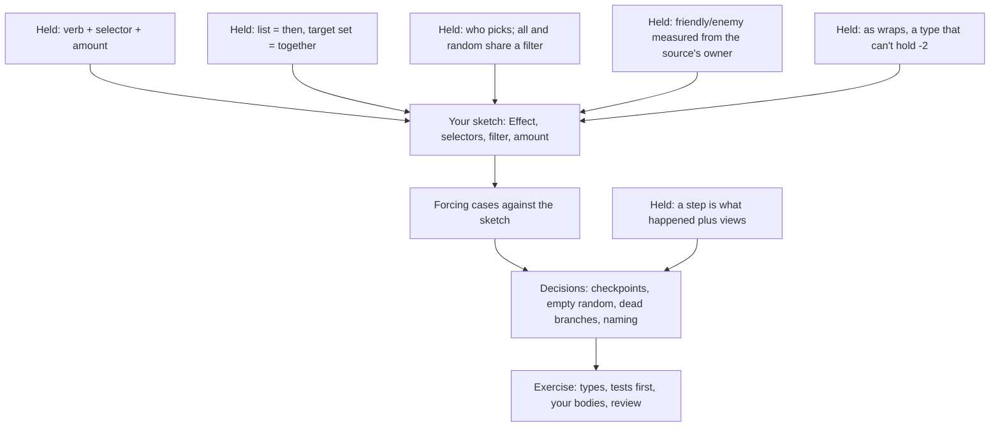

> [!quote] YOU

continue the course, no need for doing the recap questions I should came from another session


> [!question] Quiz
> P0's Barracks summoned a Squire. Suppose the Squire had "Deathrattle: deal 1 damage to each enemy minion." P1 casts Blast, and the Squire dies in the state check. Which minions take the 1 damage?
>
> After the reshape, selectors filter by kind and by friendly or enemy. Today `kill` runs `on_death` effects with `apply_effects(player_id, ..)`, and that `player_id` lands in `apply_effect`'s parameter named `caster`. The glossary defines Caster as "the player who played the card being resolved".
>
> 1. P0's minions: enemy is measured from the player whose spell killed it
> 2. P0's minions: enemy is measured from the active player
> 3. None: the Squire was never played, so it has no caster
> 4. P1's minions: enemy is measured from the Squire's owner


> [!failure] Quiz — incorrect ✗
> Your answer: 1. P0's minions: enemy is measured from the player whose spell killed it
> Correct answer: 4
>
> Note: bug
>
> "Enemy" in card text is relative to the card the text is printed on, which means its owner (Hearthstone says controller, and our game has no control change). The Squire belongs to P0, so its enemies are P1's minions. Who killed it and whose turn it is play no part. The code already passes the owner from `kill`. The weak spot is the name: the parameter is called `caster`, and the glossary defines a caster as whoever played the card. The Squire was summoned, not played, so under the glossary it has no caster, yet its text still needs a frame. The frame is the source's owner. For a played spell that happens to be the caster.


> [!quote] YOU

I got confused by the question, I did not verify the code and thought option 1 was correct and that would be a bug


> [!question] Quiz
> Damage's amount becomes `EffectAmount`, evaluated to an `i32`, and the interpreter marks it as `object.damage += amount as u8;` (`Object.damage` is a `u8`). A buggy card's amount evaluates to -2 and hits a Recruit with no damage on it. What happens?
>
> ```rust
> let amount: i32 = self.effect_amount(amount, owner); // -2
> let object = self.objects.get_mut(target);           // a Recruit, damage == 0
> object.damage += amount as u8;
> ```
> Assume a debug build (`cargo test`).
>
> 1. The Recruit's damage becomes 254, and it dies in the state check
> 2. A panic: the cast overflows in a debug build
> 3. A compile error: `as` can't narrow an `i32` to a `u8`
> 4. The Recruit's damage becomes 0: the cast saturates at the bottom


> [!failure] Quiz — incorrect ✗
> Your answer: 2. A panic: the cast overflows in a debug build
> Correct answer: 1
>
> An `as` between integer types never panics and never saturates. It keeps the low bits, so -2 (0xFFFF_FFFE) becomes 0xFE, which is 254. Overflow checks in debug builds cover arithmetic like `+=`. They don't cover `as`. Here `0 + 254` fits in a `u8`, so nothing panics, and the Recruit takes 254 damage. A negative amount quietly turns into a huge hit. (Only float-to-int `as` saturates.) The checked options are `u8::try_from(amount)`, which returns `Err` for -2, or `amount.clamp(0, 255) as u8`. The cleanest is a type that can't hold -2 at all, so a negative damage can't be written. This is the forcing fact behind the amount decision.


> [!question] Quiz
> Same line, same -2 amount, but this Recruit already has 10 damage on it. Debug build (`cargo test`). What happens?
>
> ```rust
> let amount: i32 = self.effect_amount(amount, owner); // -2
> let object = self.objects.get_mut(target);           // a Recruit, damage == 10
> object.damage += amount as u8;
> ```
> `Object.damage` is a `u8`. Integer `as` keeps the low bits, so `-2 as u8` is 254.
>
> 1. A panic on the `+=`: 10 + 254 overflows a `u8`
> 2. A panic on the `as`: -2 doesn't fit in a `u8`
> 3. Damage becomes 255: the `+=` saturates at the top
> 4. Damage becomes 8: the `+=` wraps around silently


> [!success] Quiz — correct ✓
> Your answer: 1. A panic on the `+=`: 10 + 254 overflows a `u8`
> Correct answer: 1
>
> The cast still quietly gives 254. Then 10 + 254 = 264, which doesn't fit in a `u8`, and in a debug build arithmetic overflow panics ("attempt to add with overflow"). So the overflow check exists, but it sits on `+`, `-` and `*`, never on `as`. In a release build (overflow checks off by default) the same add wraps to 8, so the bug turns into a 2-point restore that nobody notices. The result depends on the build profile and on how much damage was already there, and in no case is it what the data meant. That's why the cast has to be checked, or the type made unable to hold -2 in the first place.


> [!abstract] PI

You had the check right, just on the wrong operator: debug overflow checks apply to arithmetic, and `as` never checks. That's settled. Next strand, checkpoints:


> [!question] Quiz
> 04a adds "a checkpoint after each effect" inside `apply_effects`, and changes nothing else. P0 plays Barracks (one effect: summon a Squire, reported as `BoardEntered`). Nothing dies. Which steps does the observer record?
>
> ```rust
> // apply_effects, with the new rule
> for e in effects {
>     self.apply_effect(owner, source, e, obs);
>     obs.checkpoint(Views::new(self));
> }
>
> // play (unchanged)
> obs.event(&Event::Played { .. });
> obs.checkpoint(Views::new(self));
> self.apply_effects(player_id, object_id, self.on_play(object_id), obs);
> // a spell has no board presence, so no summon of the card itself
>
> // apply_action (unchanged): runs play, then
> obs.checkpoint(Views::new(self));
>
> // check_state: nothing dead, no outcome, so no event and no checkpoint
> ```
> A step is the events between two checkpoints.
>
> 1. Four: [Played], [BoardEntered], two empty steps
> 2. Three: [Played], [BoardEntered], then an empty step with the same views
> 3. Two: [Played], [BoardEntered]
> 4. Three: [Played], an empty step, then [BoardEntered]


> [!success] Quiz — correct ✓
> Your answer: 2. Three: [Played], [BoardEntered], then an empty step with the same views
> Correct answer: 2
>
> `Played` and its checkpoint make step 1. The Summon effect reports `BoardEntered`, and the new per-effect checkpoint closes step 2. Then `apply_action` adds its usual trailing checkpoint with no events since the last one, an empty step whose views equal step 2's. `check_state` adds nothing. It's the same duplicate you removed in 04c, and it now shows up on every spell. Spark gives [Played], [Damaged], [] where today it gives two steps. A minion with no effects still gives two, because `apply_effects` over an empty list never checkpoints. So per-effect checkpoints and the trailing checkpoint in `apply_action` overlap, and one of them has to give way. That's a decision for you.


> [!abstract] PI

The probe is done:
- **Frame for "enemy":** right. It's measured from the source's owner.
- **Integer casts:** this was the gap, and it's closed now. `as` keeps the low bits, and the overflow checks sit on arithmetic, never on casts.
- **Checkpoints:** right. You traced the duplicate trailing step without help.

## Plan

**Approach.** E1 to E5 held last session, and the probe found nothing in the concepts to re-teach. So 04a is the exercise, aimed at the edge the knowledge map records: designing the data shape without prompting. The plan said I'd draft the types for you to edit, but this time you sketch them first. I then run forcing cases against your sketch, so each design choice gets tested against a card instead of handed to you. Once the shape holds, I write the plain types as you sketched them, then the tests, and you write the bodies.

1. **Your sketch.** The `Effect` enum plus the selector, filter and amount types it uses, in rough pseudo-Rust. Then write Blast's and Zap's data with them. Writing card data is how you check the types.
2. **Forcing cases** against the sketch. Some candidates:
   - "Deal 2 damage to a random enemy minion" when the enemy has none (`Rng::below(0)` panics)
   - "the enemy hero" with three players
   - your hero vs the enemy hero
   - a negative amount
3. **The remaining decisions.** These are the ones your sketch doesn't settle:
   - **Checkpoints:** which checkpoint gives way, the trailing one or the per-effect one, and what a no-op effect reports.
   - **Random over an empty set:** the card resolves and does nothing (Hearthstone's Bomb Lobber, SabberStone's `RandomTask` → `STOP`, Metastone), or it can't be played (Deadly Shot's `REQ_MINIMUM_ENEMY_MINIONS`). Also whether a card should pin that case.
   - **Unused branches:** `AddFriendlyAura`, `MinionSelector::Itself`, and the player selectors `All`, `RandomPlayer` and `NextPlayer`, which become unused once their cards move.
   - **Naming:** the `caster` parameter, now that the frame is the source's owner.
4. **Tests first** against the agreed API. You write the bodies, then I review with throwaway probes.

**Mine, unless you object:**
- Zap costs 2 and reads "Deal 1 damage to the enemy hero. Then draw a card."
- Candidates come in seat order, with each player's hero first and then their board left to right. Hearthstone's rulebook orders AoE hits by play order, and "your Heroes are older than every minion".



If the plan works for you, reply with your sketch. These are the cards it has to express:

| Card | Text |
|---|---|
| Spark | Deal 1 damage to the enemy hero. |
| Bolt | Deal 2 damage to the enemy hero. |
| Wild Bolt | Deal 3 damage to a random hero. |
| Blast | Deal 2 damage to every character. |
| Forage | Reveal the top 2 cards of your deck. Pick one to put in your hand. |
| Barracks | Summon a 1/1 Squire. |
| Zap (new) | Deal 1 damage to the enemy hero. Then draw a card. |

Chosen targets stay out of scope until 04b. If something in the plan is wrong, say so before you sketch.


> [!quote] YOU

Done, did it in code, wdyt?


> [!abstract] PI

The checks pass: fmt, clippy, 17 unit tests and 106 spec tests. The unit test count dropped by one because the test for `get_player_after` went with it. Your commit renamed `caster` to `owner`, which settles that term, so I added **Owner** to the glossary ("The player an object belongs to").

## What the sketch gets right

- **The filter is two independent axes, with a set for each.** That's E2's split applied again to selectors, and you did it without a prompt. Blast is `all()`. "Any side" needs no `Any` variant. A third kind of character costs one new variant, where an enum listing every combination would need $2^n - 1$.
- **`EffectAmount` is now a `u8`.** A negative damage can't be written anymore, so the probe's lesson became a type. Draw and Reveal use the same amount type, so every verb has the same verb + selector + amount shape.
- **Random over an empty set does nothing and draws no number.** That matches Hearthstone, Metastone and SabberStone, and `below(0)` can't be reached.
- **Spark, Bolt and Zap hit every enemy hero.** Nothing assumes a seat order anymore, and `get_player_after` went with its last caller.

## Forcing cases

1. **Player selectors didn't get the new shape.** `PlayerSelector { All, Owner, Random, Enemy }` mixes who picks with whose side. Try writing "a random opponent draws a card": no variant fits, and you'd need `RandomEnemy`. That's the `DamagePlayer`/`DamageMinion` multiplication again, one level down. On the character side the same text is just `Random(filter)`. Also, no card uses `All`, `Random` or `Enemy`.
2. **The sets allow an empty filter.** `kind: EnumSet::empty()` matches nothing, ever, and the types allow it. That's the cost of sets over a combination enum. Session 02's load-time `validate` could reject it.
3. **Modifiers can't go negative either.** `ModifierEffect` uses the same `EffectAmount`, so "-2 Attack" or "costs (1) more" can't be written. The sign has to move into the verb, as in `DebuffAtk` or `IncreaseManaCost`. That's your restore-as-its-own-verb rule, now applied to modifiers. Is that what you intended?
4. **The probe's cast shows up again.** `history_query` does `.count() as u8`, so the 256th spell would wrap Giant's discount back to 0. No real game gets there, but `u8::try_from(n).unwrap_or(u8::MAX)` saturates instead.

**Smaller things:**
- The `kind_filter` closure tests the side, not the kind, so its name is wrong.
- `history_query` went from `pub(crate)` to `pub`. Did you mean that?
- Candidates come out minions first, then heroes. Hearthstone hits heroes first, because "your Heroes are older than every minion". I'd swap the two blocks. That only changes the order of Blast's hits within its one step.

## Decisions

Reply as "1a 2b ...", or in free text:

1. **Player selectors:**
   - (a) cut down to `Owner` until a card needs more
   - (b) mirror the character side, `Owner | All(sides) | Random(sides)`, with nothing testing it yet
   - (c) keep them as they are
2. **The other unused branches** are `CharacterSelector::Itself`, `OwnerHero`, and `AddFriendlyAura` together with `Object.friendly_aura`. Cut them or keep them?
3. **The empty filter:**
   - (a) reject it in `validate`
   - (b) leave it
4. **Random over an empty set:**
   - (a) pin it with a card, e.g. Stray Shot: "Deal 2 damage to a random enemy minion"
   - (b) leave the branch untested

   With (a), the card also needs a playability rule: it resolves and does nothing (Bomb Lobber), or it can't be played (Deadly Shot).
5. **Checkpoints** (from the probe):
   - (a) `Play` drops its trailing checkpoint, and each move that ends a step makes its own: `Played`, each effect, `BoardEntered`
   - (b) keep both, and accept the empty trailing step
   - (c) a checkpoint after an effect only if that effect reported something

   Under (a) and (b), an effect that does nothing still produces an empty step. Examples are Forage on an empty deck or a random pick from nothing. (c) needs `apply_effect` to say what it did, which is the start of the "if you do" report from the dependent-sequencing thread.
6. **The name `side`.** The glossary lists "side" as a word to avoid, as a synonym for player. Here it means friendly vs enemy, which is a different concept.
   - (a) keep `side`, take it off Player's avoid list, and add Friendly and Enemy as terms
   - (b) rename it, e.g. `relation`

You wrote the bodies before any tests, so nothing tests Zap or the empty random pick yet. Once these are settled, I'll write those tests plus the checkpoint ones. They'll go red where your code doesn't match yet.


> [!quote] YOU

1 b, 2 keep, 3 leave it. 4 a, currently legal actions returns it playable? I would leave it as is for now, may change with 4b. 6 a. history_query meant yes as it now can be written on card definition. 5 I did some modifications we keep it is as until it matters like for the ui


> [!abstract] PI

Now the Stray Shot card literal and the tests.


> [!abstract] PI

Now the tests in `tests/spec/cards.rs`:


> [!abstract] PI

I wrote the tests. fmt and clippy pass, and the suite is at 113 passing and 1 failing. The failure is in your checkpoint change, covered under 5 below.

**4. Is Stray Shot playable?** Yes. `legal_actions` offers `Play` for every card in hand whose cost fits your mana, and it never looks at the effects. So Stray Shot into an empty board can be played and does nothing, like Bomb Lobber. A test now pins that, and it stays that way, as you said. I'll note it as an open thread for 04b: once `legal_actions` reads effects for the draft, we decide whether a random effect with no candidates blocks the play, as Deadly Shot does.

**5. Checkpoints.** Your code now does option (a). `apply_effects` checkpoints after each effect, `Pick` and `EndTurn` keep their own checkpoint, `Play` has no trailing one, and an effect that does nothing still gives an empty step. The one red test is `every_apply_ends_with_a_checkpoint_showing_the_game_it_leaves`. A minion with no effects, like the Recruit, reports `BoardEntered` after the last checkpoint ("seed 0, step 6: events after the last checkpoint: [BoardEntered …]"). The card's own entry onto the board needs a checkpoint. If you put it inside `summon`, Barracks ends with an empty step, which your rule accepts.

**`history_query` as `pub`:** what a card definition holds is the type, `EffectAmount::History(HistoryQuery)`. The method only evaluates a query, so making it `pub` lets a shell call it. Nothing outside the crate can name `HistoryQuery` today, though, because `history` is private and `lib.rs` doesn't re-export it. So the change does nothing for now. It's your call.

**6.** The glossary now has Side, Friendly and Enemy, "side" is off Player's avoid list, and Player vs Side is a flagged pair. Owner went in earlier.

**Tests added:**
- **Stray Shot:** I added the card, `base.stray_shot.v0`: 1 mana, "Deal 2 damage to a random enemy minion".
- **`cards.rs`:**
  - Zap is in the cost list and in the "hits the caster's enemy" loop.
  - `zap_draws_the_top_card_of_its_casters_deck`
  - `stray_shot_hits_one_enemy_minion_only`: over 50 seeds, exactly one of two enemy Recruits dies, and the friendly Recruit and both heroes are untouched.
  - `stray_shot_can_hit_either_enemy_minion`
  - `stray_shot_is_playable_with_no_enemy_minion`
  - `stray_shot_with_no_enemy_minion_does_nothing`
- **`events.rs`:**
  - `zap_reports_its_hit_on_the_enemy_hero_then_its_draw`
  - `zaps_hit_and_draw_are_separate_steps`
  - `blast_hits_the_heroes_before_any_minion`

All of the new tests pass with your code.

**Smaller things:**
- Commit `9dd3360` won't build on its own. `crates/rules/Cargo.toml` uses `enumset = { workspace = true }`, but the root `Cargo.toml` entry and `Cargo.lock` aren't committed. That's fine if the PR gets squashed. Otherwise, put them in your next commit.
- `apply_effects` now reads the owner from the source. The frame comes from the source's owner by construction, so no caller can pass the wrong one.
- `PlayerSelectorFilter` reuses `CharacterSideFilter`, whose name now says less than the type covers. `SideFilter`?
- `mana_cost` does `.sum::<u8>()`. That's arithmetic, so in debug it panics if two discounts add up past 255. No card can reach that today.

Once you've fixed the `BoardEntered` checkpoint, tell me and I'll review with throwaway probes, then we close the node.


> [!quote] YOU

done, I believe we are done, commit everything and we can close


> [!abstract] PI

Everything passes: fmt, clippy, 17 unit tests and 114 spec tests. Committing the exercise code:


> [!abstract] PI

Now the close-out edits to `COURSE.md`.


> [!abstract] PI

Session 04a is closed. Before committing your code, I re-ran the checks and they all passed: fmt, clippy, 17 unit tests and 114 spec tests. A throwaway probe on checkpoint placement showed what we agreed: no duplicate trailing step, and an empty step only after an effect that did nothing. The exercise is in commit `c4aef7c`, on top of your `1614884` and `9dd3360`. Your `9dd3360` doesn't build on its own: the crate's `Cargo.toml` uses `enumset`, but its workspace entry only landed in `c4aef7c`. That's fine if the PR gets squashed. Nothing has been pushed.

**`COURSE.md` changes:**
- **Knowledge map:**
  - **04a probe.** The "enemy" frame was right, once I regraded my ambiguous question. You missed the `as` cast at first, then applied it unprompted three times. The checkpoint trace was right.
  - **04a exercise.** You designed the selector shape without prompting: independent axes, an `EnumSet` per axis, `All` and `Random` over one filter, and nothing drawn from an empty random set. The one slip was splitting only the character side. You fixed the player side after one forcing case. You also wrote a generic `select_random` unprompted. The entry records your calls, and that `9dd3360` doesn't build alone.
  - **Solid and Rust lines.** The effects-as-data edge is marked as moved, and the cast miss and the generic are recorded.
- **Open threads:**
  - The 04a decisions are removed, since they're settled.
  - New:
    - signed modifiers need their own verb (unconfirmed whether you meant that)
    - Stray Shot's playability, to decide in 04b
    - Hearthstone's random damage skips minions already at 0 health (05 or 06)
    - the empty filter, to revisit with session H
    - a minion with an enter effect would get an empty step
    - the `CharacterSideFilter` name, and the `.sum::<u8>()` overflow
  - The list of untested branches is updated, now including the ones you kept on purpose.
  - The 04b thread notes that `Chosen(filter)` uses the same filter.
- **Sessions table:** 04a is done, and 04b is next. 04b opens with a retrieval quiz on 04a.

This closing commit also includes the glossary (Owner, Side, Friendly, Enemy, and the Player vs Side pair), the random-targets research report, its facts in `verified-facts.md`, this log, and the empty 04b log.

To start 04b:

```
/new
/name 04b-targeting-draft
/md-log docs/course/sessions/04b-targeting-draft.md
continue the course
```

Committing now.
