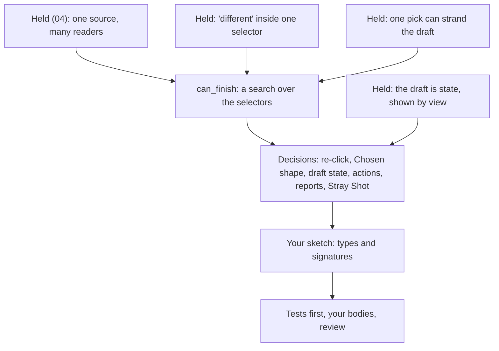

> [!quote] YOU

continue the course, skip the review questions because I just did another course


> [!abstract] PI

Skipping the retrieval quiz. The probe still runs, aimed at the 04b design questions: picks that depend on each other, what a draft reports, and how picks bind to effects.


> [!question] Quiz
> Exactly one minion is on the board (any side), and P0 has the mana. ADR 0007: a card is offered for play only when its draft can be finished. Which of these cards does `legal_actions` offer?
>
> Twin Shot: "Deal 1 damage to two different minions."
> Double Tap: "Deal 1 damage to a minion. Then deal 1 damage to a minion."
>
> Assume Double Tap's two picks may name the same minion, since its text doesn't say "different".
>
> 1. Only Double Tap
> 2. Both
> 3. Only Twin Shot
> 4. Neither


> [!success] Quiz — correct ✓
> Your answer: 1. Only Double Tap
> Correct answer: 1
>
> Twin Shot needs two distinct minions, and there's one, so its draft can't finish and it isn't offered. Double Tap's two picks are independent: each needs one minion, and the same one satisfies both. "Both" would treat "different" as decoration. "Neither" would read distinctness into Double Tap's text, which doesn't ask for it. "Only Twin Shot" would mean Double Tap requires two minions while Twin Shot doesn't.


> [!question] Quiz
> P0 casts Shove: "Deal 1 damage to a minion. Then deal 1 damage to a different friendly minion." P0's board: one Recruit. P1's board: one Captain. Shove is offered (Captain first, then Recruit, works). P0 picks his own Recruit first. What does `legal_actions(P0)` list next?
>
> The draft's rule for each pick, as implemented: list every minion that matches the next pick's filter and isn't already picked. `Cancel` is always listed while a draft is open. `Commit` is listed once every pick is filled.
>
> 1. Pick the Captain, plus Cancel: the filter skips to whichever pick is still open
> 2. Commit: the Recruit moves to the second pick, and the Captain fills the first
> 3. Only Cancel: no friendly minion is left that isn't picked
> 4. Pick the Recruit again, plus Cancel: distinctness is checked at Commit


> [!success] Quiz — correct ✓
> Your answer: 3. Only Cancel: no friendly minion is left that isn't picked
> Correct answer: 3
>
> Note: I think only cancel since here the picks are ordered, if the effect was "deal 1 damage to a friend and a enemy minion" then I think the user could choose both in any order
>
> The second pick needs a friendly minion other than the first pick, and the only friendly minion is the Recruit, already taken. Under the stated rule nothing matches, so only Cancel remains. The draft was finishable when it opened and stopped being finishable after one legal pick. Checking "can it finish" once, at Play, isn't enough when picks constrain each other: every pick the draft offers also has to leave the rest finishable. The rule as stated never revisits an earlier pick, never reorders picks, and checks distinctness when it lists each pick, not at Commit.


> [!abstract] PI

Saving the researcher's report and its facts before going on.


> [!question] Quiz
> P0 opens Ping's draft and picks P1's Captain. ADR 0007 says the draft is hidden from P1. Which report from `apply` keeps it hidden?
>
> On your note: you're right that Shove's picks are ordered. Any order works with no ambiguity when the filters can't overlap, as with "a friendly and an enemy minion": every click fits exactly one slot. Once the filters overlap ("a minion and a different friendly minion"), a click on your Recruit fits both slots, and the core has to decide which one it fills. Every engine I checked asks in order: MTG announces targets per "target" word, Forge and XMage keep one target definition per word and exclude earlier picks, and Hearthstone's Barbed Nets won't let you undo the first target while choosing the second.
>
> Now the question. ADR 0006: the observer's `event(&Event)` has no viewer, so every observer gets every event, and events name objects by `ObjectId` only. `checkpoint` hands over `Views`, whose only method is `of(viewer)`. `Game::view` is the one definition of what a player sees.
>
> 1. No event. A checkpoint, where view(P0) shows the draft and view(P1) doesn't
> 2. A TargetPicked event, since it names the Captain by ObjectId only
> 3. No event and no checkpoint. P0's shell remembers the picks it sent
> 4. A TargetPicked event, and the shell drops it from P1's feed


> [!success] Quiz — correct ✓
> Your answer: 1. No event. A checkpoint, where view(P0) shows the draft and view(P1) doesn't
> Correct answer: 1
>
> Every event reaches every observer, so any draft event tells P1 that a draft exists and which object was picked. An ID-only event hides a card's face, not the fact that P0 is aiming at the Captain. A shell that filters events per player becomes a second definition of visibility next to `view`, which is the D3 rule broken. A shell that remembers its own picks is a mirror held in the client: after a reconnect, a fresh view has no draft, the same failure as the `Looked` event in session 03. What's left is the draft as state in `Game`, shown by `view` to its owner only, and delivered at a checkpoint so P0's shell gets it back after each pick.


> [!question] Quiz
> Suppose "different" can only live inside one selector: `Chosen { filter, count }` picks `count` different targets, and two separate `Chosen` selectors may name the same object. Picks are listed as in Shove (matches the next pick's filter, not already picked by that selector). Which check at `Play` is enough to guarantee no draft ever gets stuck?
>
> Shove got stuck because its second pick had to differ from a pick made under another filter. Under this rule, Twin Shot is one `Damage` with `Chosen { minions, count: 2 }`, and Double Tap is two `Damage` effects, each with `Chosen { minions, count: 1 }`.
>
> 1. The candidates of all selectors together number at least the total count
> 2. A search over pick orders, since one selector's pick can use up another's candidate
> 3. Each Chosen selector has at least count candidates
> 4. Each Chosen selector has at least one candidate


> [!failure] Quiz — incorrect ✗
> Your answer: 1. The candidates of all selectors together number at least the total count
> Correct answer: 3
>
> With "different" confined to one selector, a pick in one selector never removes a candidate from another, so the selectors are independent. Inside one selector every pick uses the same filter, so after k of its picks at least count minus k candidates remain whenever it started with count. Counting per selector at Play is therefore exact, and no pick can strand the draft. A total across selectors fails because the filters differ: three minions and no hero don't finish "a minion, then a hero". One candidate each fails for Twin Shot with one minion. The search is what cross-selector "different" (Shove, MTG's "another target") would force, and that coupling is exactly what this rule removes.


> [!quote] YOU

continue


> [!abstract] PI

He picked the pooled total, so I'm checking whether that was the abstract wording or the model itself. Same rule, now with a concrete board:


> [!question] Quiz
> Is Prod offered, and if P0 plays it, can the draft finish?
>
> Prod: "Deal 1 damage to a minion. Then deal 1 damage to an enemy minion."
> Data: two `Damage` effects, `Chosen { filter: any minion, count: 1 }` then `Chosen { filter: enemy minion, count: 1 }`. Separate selectors may name the same minion.
>
> P0's board: two Recruits. P1's board: empty. It's P0's turn and he has the mana.
>
> The rule from the last question: "different" lives only inside one selector, and `Play` is offered only if the draft can finish.
>
> 1. Not offered: the second pick has no enemy minion to name
> 2. Offered, but it gets stuck at the second pick, and only Cancel is left
> 3. Offered and finishable: three candidates cover the two picks
> 4. Offered and finishable: the second pick can name a Recruit already picked


> [!failure] Quiz — incorrect ✗
> Your answer: 2. Offered, but it gets stuck at the second pick, and only Cancel is left
> Correct answer: 1
>
> Note: I dont see how to properly implement not offer, maybe by spliting condition and effects where a card can only be played if conditions are meet, this could be usefull for other cards like Pokemon Evolution or "If the enemy has a secret" in heartstone, but always offering may be fine
>
> Each selector is checked against its own filter. The first selector (any minion) has two candidates. The second (enemy minion) has zero, because both Recruits are P0's. Since the draft can't finish, Play isn't listed, whatever the other selector has. A pooled total adds the first selector's two candidates and gets 2 ≥ 2, but those candidates don't match the second filter, so the total says yes when the answer is no. Reusing a picked Recruit doesn't help, because the issue is the filter, not distinctness. That's why the check runs per selector: each `Chosen` needs `count` candidates under its own filter.


> [!quote] YOU

but in your exemple, how would u handle a "A select a minion, then select a different enemy minion" effect where the possible picks are 1 friendly and 1 enemy or 2 different enemies.


> [!abstract] PI

Your miss on Prod wasn't about distinctness. You saw the draft would get stuck. What you didn't see is how `legal_actions` can know that in advance without new data, and your card is the right one to show it with.

## Your card

"Deal 1 damage to a minion. Then deal 1 damage to a different enemy minion." That's two selectors where the second has to differ from the first pick. It's Shove's shape, and it's MTG's "another target".

The check is one question you can ask at any point in the draft: given the picks so far, can the remaining picks still be filled? Call it `can_finish(picks)`. It answers by trying. Take the next selector and list its candidates under its own filter, minus whatever its "different" rule excludes. For each candidate, ask `can_finish(picks + candidate)`. If no selector is left, the answer is yes.

`legal_actions` uses that one function in two places:
- `Play` is listed only if `can_finish([])` is true.
- While the draft is open, a candidate `c` for the next pick is listed only if `can_finish(picks + c)` is true.

Your boards, with the Captain and the Knight on P1's side:

| Board | `Play` listed? | First pick offers | Second pick offers |
|---|---|---|---|
| P0: Recruit. P1: Captain | yes | the Recruit only | the Captain |
| P0: nothing. P1: Captain, Knight | yes | Captain or Knight | whichever is left |
| P0: Recruit. P1: Captain, Knight | yes | all three | after the Recruit, Captain or Knight. After an enemy, the other enemy |

On the first board the Captain matches the first filter but isn't offered, because picking it leaves the second pick with no options. So the draft can never get stuck. `Cancel` is for a change of mind, not an escape hatch.

The cost is small. The search visits at most the product of the candidate counts. Three picks over 15 characters is 3,375 leaves, and `any` stops at the first success.

## Where the data comes from

You don't need a separate condition list. The selectors already hold every filter and every "different" rule, so `can_finish` is one more reader of the effect data, like `apply_effect` (that's E1). A hand-written condition such as "playable if the enemy has a minion" would be a second copy of what the selector already says. That's the `targets` closure from session 04 again, and it drifts the same way.

The per-selector count from the earlier question is this same search in its easy case. When no selector's candidates depend on another selector's picks, the search can't fail partway, so a count gives the same answer.

## On your note

- **Conditions that no selector implies are real.** Deadly Shot ("Destroy a random enemy minion") has `REQ_MINIMUM_ENEMY_MINIONS` in its data, because a random selector would accept an empty board. That's the Stray Shot decision.
- **Pokemon evolution works like a target.** The card goes onto a matching Pokemon you have in play, so "can I play it" means "is there a Pokemon to put it on".
- **"If the enemy has a Secret" usually changes what the card does at resolution, not whether you can play it.** That belongs to the dependent-sequencing thread in sessions 06 and 08.
- **"Always offer, and let Cancel recover" is a defensible position.** MTG's rules work that way. If a cast can't finish a step, it's illegal and reverses completely, payments included (CR 601.2, 733.1). The cost for us: `legal_actions` would list dead ends, a random-playout bot or the fuzzer would walk into them, and "listed" would stop meaning "can be completed". ADR 0007 already picked the other side.

None of the planned 04b cards needs cross-selector "different". Ping has one pick, "two different minions" stays inside one selector, and in the minion-then-hero card the two filters can't match the same character. Your card is the first that needs the search.

## Probe result

- **Held:** "different" vs independent picks; why one check at `Play` isn't enough once picks constrain each other; the hidden draft as state, shown by `view` at a checkpoint with no event.
- **The edge:** deriving "can the draft finish" from the selectors. You missed it twice, first with a pooled count across different filters, then with "offered, but stuck" plus a note that not offering would need condition data. The search above fills that gap.

## Plan

**Approach.** The concepts held, so 04b is mostly the exercise. I'll start with one node: `can_finish` as a reader of the selector data, checked with a quiz. Then come your decisions, then your sketch of the types. After that I write the tests first, you write the bodies, and I review with throwaway probes.

These are your decisions, in this order:
1. **The opener:** what happens when an already picked minion is clicked again?
2. **The shape of `Chosen`:** a `count` for "different" inside one selector, and whether cross-selector "different" (your card, plus the search) goes into 04b or becomes an open thread.
3. **What the draft state stores.**
4. **Actions:**
   - reuse `Pick { object_id }` or add a new action
   - whether `Play` keeps its name
   - whether `EndTurn` is listed during a draft
   - ADR 0007 implies Bolt still plays in a single action with no `Commit`. Confirm that.
5. **Reports:** what each draft action reports, where `Played` moves, and what `view` shows the drafter.
6. **Stray Shot:** what happens when it's random into an empty board.

The cards are Ping ("Deal 2 damage to a minion."), Twin Shot ("Deal 1 damage to two different minions.") and the minion-and-hero card. I'll pick their costs unless you object.



If the plan works for you, say so. I'll check the `can_finish` node first, then open with the re-click question.


> [!quote] YOU

sounds good


> [!question] Quiz
> P0 plays Shove. Which minions does `legal_actions(P0)` offer for the first pick?
>
> Shove: "Deal 1 damage to a minion. Then deal 1 damage to a different friendly minion."
> Selector 1: any minion. Selector 2: friendly minion, different from pick 1.
>
> P0's board: Recruit. P1's board: Captain, Knight.
>
> The rule: a candidate c for the next pick is listed only if can_finish(picks + c). can_finish tries each candidate of the next selector, under its own filter and "different" rule, and succeeds when no selector is left.
>
> 1. Recruit
> 2. Captain
> 3. Knight


> [!success] Quiz — correct ✓
> Your answer: 2. Captain, 3. Knight
> Correct answer: 2, 3
>
> Note: is this good game design? wont the user getconfused that a minion cannot be choosen on "choose any minion"?
>
> Try each candidate and ask whether the rest can finish. Captain first: selector 2 needs a friendly minion other than the Captain, and the Recruit fits, so yes. Knight first: same, the Recruit fits. Recruit first: selector 2 needs a friendly minion other than the Recruit, and P0 has no other, so no. All three match selector 1's filter, but only the two enemies keep the draft finishable. A per-selector count would say 3 and 1 and offer all three, then leave the Recruit pick stranded. Cross-selector "different" is exactly where the count stops being enough and the search is needed.


> [!abstract] PI

That node landed. On your note: yes, it can confuse players, and I'd split it into two questions.

**The engine's rule stays.** `legal_actions` never lists a pick that leads to a dead end. The alternative is worse for the player: they click the Recruit, which looks fine, and then find themselves stuck with only `Cancel`. A greyed-out minion confuses less than a trap one click later. The core can also explain the exclusion, because it knows the reason ("no other friendly minion would be left"), so a UI tooltip doesn't need a second rules engine. That's for later.

**The card is the problem, and the designer fixes it, not the engine.** Shove puts the loose filter first and the tight one second, and that's where hidden candidates come from. Swap the order: "Deal 1 damage to a friendly minion. Then deal 1 damage to a different minion." On the same board, the first pick offers the Recruit, the only friendly minion, and the second offers the Captain or the Knight. Nothing that matches a filter gets hidden. When one filter sits inside the other (friendly is a subset of any), putting the tight one first means either every first-pick candidate works or the card isn't playable at all. Shove's wording only causes trouble in rare boards like this one. Real games mostly avoid the situation: Hearthstone allows one target per action, with Barbed Nets as an exception, and MTG's paper rules just reverse an illegal cast. So I'd keep the general engine rule and let card text avoid loose-then-tight wording where it matters.

None of our 04b cards has this shape anyway.

## Opener

What should happen when the player clicks a minion he has already picked during the draft? Think about it for two cards:

- **Twin Shot:** "Deal 1 damage to two different minions." P0 picked the Captain as the first of the two, then clicks the Captain again.
- **Double Tap:** "Deal 1 damage to a minion. Then deal 1 damage to a minion." P0 picked the Captain for the first effect, then clicks the Captain again.

Answer in free text: what the core does in each case, and which actions that needs beyond `Pick`, `Cancel` and `Commit`.


> [!quote] YOU

use choose isntead of pick for targetting. Pick is for reveraled cards. We could offer an "Unchoose" option for TwinShot, but not for douple tab, so I think consistency is more important no? so I guess the only way to undo would be to cancel, if commit was per effect I could see it working, e.g. for double tap: Choose -> Unchoose -> Chosse -> Commit -> Choose -> Commit


> [!abstract] PI

I added **Choose** to the glossary, defined as naming what an effect will act on while playing the card, before it resolves. Choose vs **Pick** is now a flagged pair: you choose from what's already in play while playing a card, and you pick from revealed cards while a card resolves.

## The opener, settled

- **Twin Shot:** a second click on the Captain isn't listed, because one selector's choices are all different.
- **Double Tap:** a second click on the Captain is a legal `Choose` for the second effect.
- **Undo:** only `Cancel`.

I agree with the outcome, with one correction to the reasoning. The core never sees a click, only actions, and `Choose { captain }` and `Unchoose { captain }` are different actions. So `Unchoose` would work for Double Tap too. The ambiguity is in the UI, where one gesture would mean two things. If you ever want a consistent undo, it's `Back`, which removes the last choice. It's a button rather than a click on a minion, and it works the same on every card. Adding it later just means a new variant. Until then, Hearthstone's Barbed Nets also doesn't let you undo the first target, so Cancel-only isn't unusual.

Per-effect commit can mean two things, and neither fits 04b:
- **Commit resolves that effect.** Then the second effect's choice comes after the first effect has happened and after the card is paid. That's a choice made during resolution (E5, session 06), and Cancel stops being free once the first commit has gone through.
- **Commit only confirms.** Then it's `Back` with an extra click per effect.

## Remaining decisions

These don't shape the data. Reply as "1a 2b ...":

1. **"Different" across selectors** (your Shove-style card plus the search):
   - (a) Open thread. In 04b, "different" exists only inside one selector, so `can_finish` is a per-selector count. (recommended: no 04b card needs more, and a later field for "different from choice N" doesn't break the shape)
   - (b) Build it now, with a card and the search.
2. **Cards with nothing to choose**, like Bolt:
   - (a) `Play` resolves them in one action, and only a card with choices opens a draft. That's ADR 0007 as written.
   - (b) Every card is `Play` plus `Commit`. One rule for all cards, but ADR 0007 gets superseded, and the test helpers send an extra action.

   Also, does `Play` keep its name under your pick?
3. **`EndTurn` during a draft:**
   - (a) Not listed. A draft lists only `Choose`, `Cancel` and `Commit`, the same way a pending pick lists only picks. The shell's turn timer sends `Cancel` and then `EndTurn`, and both get recorded. (recommended)
   - (b) Listed, and it throws the draft away.
4. **Stray Shot** (random, with no candidates):
   - (a) Keep it playable, doing nothing. `can_finish` reads only `Chosen` selectors. (recommended)
   - (b) Not playable without a candidate. `legal_actions` would also read random selectors, as with Deadly Shot.

**Mine unless you object:**
- Opening a draft, `Choose` and `Cancel` report no event and one checkpoint each. `Played`, paying the cost and leaving the hand all move to `Commit`. The drafter's view shows the card and the choices made so far, and the opponent's view shows nothing.
- The cards:

| Card | Cost | Text |
|---|---|---|
| Ping | 1 | Deal 2 damage to a minion. |
| Twin Shot | 2 | Deal 1 damage to two different minions. |
| Crossfire | 2 | Deal 1 damage to a minion. Then deal 1 damage to a hero. |

After that, it's your sketch, in code or pseudo-Rust:
- the `Chosen` selector
- the draft state
- the `Action` changes
- the signature of the can-finish check
- the three cards as data

Forcing cases come after that. One of them will be how each effect finds its own choices at resolution.


> [!quote] YOU

1b. 2 I think a. 3a. 4a at least for now. we think we should change from play/commit to draft/play so that we offer action draft for cards that require targetting and then play once targets are choosen, for cards that do not have draft we simply offer play.


> [!abstract] PI

Settled: 1b, 2a, 3a, 4a. I like the rename, and I've added **Draft** to the glossary: a card a player has started to play but hasn't played yet, with the choices made so far.

**Why `Draft`/`Play` works better than `Play`/`Commit`.** `Play` keeps the meaning it already has in the glossary: pay the cost, take the card from the hand, resolve it. Its legality becomes one rule with no special case. A card can be played when it's in hand, affordable, and every choice it needs has been made:

- Bolt needs no choices, so `Play { bolt }` is listed in the idle state.
- Ping needs one, so the idle state lists `Draft { ping }`. `Play { ping }` shows up only inside the draft, after the `Choose`.

Two side notes:
- ADR 0007's text says "playing it opens a draft" and "an explicit commit". The decision is unchanged and only the names moved, so the record stays as written. The glossary carries the names.
- In card games, "draft" also commonly means building a deck by picking cards (MTG Draft, Hearthstone Arena). Nothing in this game does that yet. If a mode like that ever arrives, the two meanings will collide.

**1b needs a fourth card.** I'd use Shove as first written: "Deal 1 damage to a minion. Then deal 1 damage to a different friendly minion." You flagged that loose-then-tight wording can confuse players, but here that's the reason to pick it. Look-ahead on each choice only shows on a board when a candidate matches its filter and still has to be hidden. If the tight filter comes first, filters that nest never hide anything, so code that checks only at `Draft` would pass every test, and the per-choice search would go untested. Tell me if you'd rather use a different card.

| Card | Cost | Text |
|---|---|---|
| Ping | 1 | Deal 2 damage to a minion. |
| Twin Shot | 2 | Deal 1 damage to two different minions. |
| Crossfire | 2 | Deal 1 damage to a minion. Then deal 1 damage to a hero. |
| Shove | 1 | Deal 1 damage to a minion. Then deal 1 damage to a different friendly minion. |

## Your sketch

Code or pseudo-Rust is fine. It should cover:

1. The `Chosen` selector: the filter, the count, and how "different" across selectors is written. Forge marks a choice as different from every earlier choice (`TargetUnique$`). XMage tags the choices and names which ones to avoid (`AnotherTargetPredicate`).
2. The draft state, meaning what's stored and what's derived.
3. The `Action` changes: `Draft`, `Choose`, `Cancel`, and `Play`'s new rule.
4. The signature of the can-finish check, and where `legal_actions` calls it.
5. All four cards written as data.

Once I have that, I'll run forcing cases against it. One of them will be how each effect finds its own choices at resolution.


> [!quote] YOU

hey, I am having second thoughts about this while doing the sketch, a couple things I want to point out, if the choice is on the effect we cannot reuse the choice, e.g. "Choose a minion, give it +1+1, if its a pirate also give it haste" I see this as two effects acting on the same choice. if can_finish looks past the first effect the first effect could mutate the board and make the choice no longer aplicable, e.g. "Deal 1 damage to a minion then give a minion +1+1". with can_finish a choice on the first effect can never fail but a choice on third effect can so it should still be handled. Are choices on the midlle of the card effect resolution usefull? which games use them and how they handle this?


> [!abstract] PI

You found the forcing case I had queued for after the sketch, so we can handle it now. Taking your three points in order.

## 1. Reusing a choice

You're right. If the choice lives inside the effect, a second effect can't refer to the same minion. "Choose a minion. Give it +1/+1. If it's a Pirate, also give it Haste" is two effects acting on one choice, and so is Outrage's "that minion's owner" from E4. Both MTG engines handle this, in two different ways:

- **XMage** puts the targets on the ability as a list, and each effect points into that list by position. Leeching Bite adds two targets, and its second effect reads `SecondTargetPointer`.
- **Forge** declares the target on the first sub-ability that uses it, and later sub-abilities refer back to it. Decimate ends in `DB$ Destroy | Defined$ Targeted`.

For us, that gives two options:

- **(A) The card declares a list of choices, and effects refer to them by index.** Each choice is a filter, a count, and which earlier choices it must differ from. The selector becomes `Chosen(i)`. `can_finish` reads that one list, the draft's choices line up with it one to one, and "different" refers to an index. This supersedes one sentence of ADR 0007, "the rule for each target lives in the effect that uses it". ADR 0007 rejected a different option: one target slot on the card, which couldn't express two choices. A list doesn't have that problem.
- **(B) The first effect that uses a choice declares it, and later effects refer back to it.** ADR 0007 stays as written. The cost is that choice numbers are implicit (the nth `Chosen` in effect order), so inserting an effect shifts every reference after it. `can_finish` also has to walk the effects to find the choices.

I lean toward (A). It's your call, though, and it decides the shape of your sketch.

The Pirate part is a condition read at resolution. That's the dependent-sequencing thread for sessions 06 and 08, so it's out of 04b, as are the tribe and Haste themselves.

## 2. A choice that stops matching

These are two checks at two different moments:

- **When choosing.** `can_finish` asks whether the choices can all be made on the board as it is now. It can't predict resolution, and it doesn't need to.
- **At resolution.** An earlier effect might have changed the chosen object, so it may no longer fit its filter. MTG handles this in 608.2b: as the spell resolves, any target that's no longer legal is skipped, and the rest of the spell still happens. If every target is illegal, the spell does nothing.

Today none of our verbs can make a chosen target stop matching partway through a card. Our filters check kind and side. Damage changes neither, deaths wait for the state check, and there's no bounce or control change yet. So the resolution-time check has nothing to catch yet. It goes into the open threads with MTG's answer attached, next to the existing "a bounce keeps the `ObjectId`" thread. Your +1/+1 example would only hit it once a filter reads something damage changes, like "an undamaged minion".

## 3. Choices in the middle of resolution

Yes, they're useful, and you've already built one: Forage. They're needed when the options don't exist yet when the card is played. That's E5.

- **Hearthstone:** a Battlecry or spell target is chosen when the card is played. Discover is chosen during resolution, from cards that didn't exist before.
- **MTG:** targets are announced while casting (601.2c). Other choices are made "while applying the effect" (608.2d), as with "look at the top three cards, put one into your hand".
- **Yu-Gi-Oh:** an effect that targets selects its targets when it's activated. An effect that doesn't target selects its cards when it resolves. That timing is why "can't be targeted" protection doesn't stop non-targeting effects.

The difference is what each player knows when the choice is made. A choice made at play time commits before anything happens, and the opponent sees it and can respond to it (sessions 06 and 08). A choice made at resolution sees the board as it is at that moment, so it fits by construction. The cost is that the card has to pause halfway, which means storing a half-finished effect (session 06).

So "Deal 1 damage to a minion. Then give a minion +1/+1" could be either of two different cards:
- **Drafted:** both choices are made before anything happens. This is 04b.
- **Chosen during resolution:** the second minion is chosen after the damage lands. That's 06.

Both are legitimate designs, and the card's data decides which one it is. That's the open thread where "chosen" splits into a target and a pending pick.

**Your call:** (A) or (B)? Then carry on with the sketch on that shape.


> [!quote] YOU

1a. draft done and I changed quite a few things, I have no idea how to implement can_fill_preconditions still and there is no chossing mid resolution and no uniqueness in between chooses, wdyt?


> [!abstract] PI

The probe ran Ping with P1's board empty, then Draft, Choose and Cancel. I've deleted it, and the tree is back to your sketch.

| Step | What `legal_actions(P0)` listed |
|---|---|
| Idle, no enemy minion | `Draft { ping }` |
| After `Draft` | `Choose { P1's hero, choice 0 }`, `Cancel` |
| After that `Choose` | the same `Choose` again, `Cancel` |
| After `Cancel` | still `Choose` and `Cancel` |
| Game after `Cancel` == game before `Draft`? | `false` |

## What works

- The choices are declared on the card, effects refer to them by id, and Ping as data reads cleanly.
- `Choose` names the choice it fills. That's an explicit answer to your "any order" note, and it settles the overlap problem in the protocol itself. See decision 4.
- You flagged the checks in `choice_fulfilled` as "not needed", and you're right. The listing already validated every target.

## Mechanical bugs

1. **The filter combines kind and side with `||` instead of `&&`.** That's why P1's hero passed an enemy-minion filter.
2. **`Choose` writes to `self.objects.get_mut(object_id)`, which is the target, not Ping.** So Ping's choice never fills up, and the same `Choose` comes back forever.
3. **`Cancel` clears the targets but never sets the player back to `Idle`.**
4. **`Play` is listed in a draft when `actions.is_empty()`.** Once bug 1 is fixed, a choice with no candidates lists `Play` with the choice still empty, and resolution panics on `expect("Choice not fulfilled")`. The rule should be "every choice complete", not "nothing left to choose".

## Forcing cases

**A. Where the chosen targets live.** On the `Object`, they sit in game state outside the draft. They outlive it: the spell keeps them in the bag forever. And `Cancel` has to clean them up by hand, which is where the leftover empty entries that broke `==` came from. More importantly, `can_finish` has to ask "what if I choose X?" without changing the game. With the choices stored in `Game`, every hypothetical means mutating and undoing, or cloning the whole game. Put them in the draft instead, as `Draft { object_id, chosen: Vec<(ChoiceId, ObjectId)> }`. Then the search is a pure function over a plain `Vec`, and `Cancel` is just `interaction_state = Idle`, which restores the exact game from before `Draft` by construction. The half-finished play lives with the player, like Forage's options. Bugs 2 and 3 can't happen in that shape.

**B. `preconditions` repeats `choices`.** Every declared choice has to be made, so `Precondition::Chosen(c)` per choice is a second copy of the list. Consider a card that declares a choice and forgets its precondition. `preconditions` is empty, so the idle state lists `Play`, and resolution panics on `Chosen(0)`. Two lists that must agree is the mirror habit again. The fact can be derived instead: a card needs a draft if and only if `choices` isn't empty. Your Deadly Shot idea, a condition that isn't a choice, can come back as its own list once a card needs one.

**C. Two definitions of "characters matching a filter".** `resolve_character_selector`'s `all` closure is one, and `scan_for_valid_choices` plus `fulfill_character_selection_filter` is the other. They already disagree: one uses `&&` and the other `||`, and they order heroes and minions differently. Bug 1 is the mirror drifting on its first day. One function, `characters(owner, filter)`, can serve `All`, `Random` and `Chosen`.

**D. Speculative structure that's already wrong.**
- `AtMost`: `is_satisfied(0, n)` is true, so the choice counts as done before anything is chosen, and no `Choose` is ever listed for it.
- `AtLeast`: listing stops at the minimum, so it behaves exactly like `Exactly`.
- `unique`: `is_valid_choice` always excludes targets already chosen, so `false` does the same thing as `true`. MTG 115.3 never lets one "target" repeat anyway, and the same minion twice is two choices.
- `Choosing`: that's session 06.

No card uses any of these.

**E. Ids that name nothing.** `Chosen(ChoiceId(3))` on a card with one choice, or two choices sharing an id, panics during a game through `unwrap` or `expect`. Card data is fixed, so this belongs in load-time validation, as in session 02.

## How to implement `can_finish`

```
can_finish(card, chosen):
    open = the first choice of card with fewer than count entries in chosen
    if there is no open choice: return true
    for each t in candidates(card, open, chosen):
        if can_finish(card, chosen + (open, t)): return true
    return false

candidates(card, choice, chosen):
    characters(owner, choice.filter)
    minus targets already chosen for this choice
    minus targets chosen for any choice this one must differ from
```

`legal_actions` uses it like this:
- **Idle:** list `Draft { c }` if `c` has choices and `can_finish(c, [])` is true.
- **In a draft:** for each open choice and each candidate `t`, list `Choose` if `can_finish(chosen + (choice, t))` is true. List `Play` if no choice is open. Always list `Cancel`.

The search tries every way to complete the draft and stops at the first one that works. Even if the player fills choices in any order, the search can fill them in a fixed order, because whether a completion exists doesn't depend on order. The whole thing only works if `chosen` is a value you can pass in. That's forcing case A.

## Decisions

Reply as "1a 2b ..." or in free text:

1. **Where the chosen targets live:** (a) in `Draft { object_id, chosen }` (recommended) (b) on the `Object`
2. **`preconditions`:** (a) drop it, and derive "needs a draft" from `choices` (recommended) (b) keep both lists, plus a load check that they agree
3. **`AtMost`, `AtLeast`, `unique`, `Choosing`:** (a) cut them (recommended) (b) keep them, and fix `AtMost` and `unique`
4. **Choice order:**
   - (a) any order, with `Choose` naming the choice. At the start of Double Tap, both `Choose { 0, x }` and `Choose { 1, x }` are listed for every minion, so the UI has to route a click to a choice.
   - (b) effect order. `Choose { object_id }` fills the next open choice. That's how MTG, Forge, XMage and Barbed Nets work.
5. **Cross-choice "different" (your 1b):** how is it written in the data? With any order the rule is a symmetric pair ("choices 0 and 1 differ"). With effect order, it can be "differs from these earlier choices", Forge style.
6. **Ping:** any minion, as in the card table, or enemy minions only, as in your data?
7. **`ChoiceId`:** an explicit id found by search (yours) or the index in `choices`. Either way, the load check from E applies.

**Smaller things:** `EffectAmount` moved into `choice.rs`, but every verb uses it. "chacter" is a typo. The draft still needs a checkpoint after `Draft`, `Choose` and `Cancel`, plus its part of the view. I'll draft the `View` type once the shape settles.


> [!quote] YOU

fixed the mechanical bugs, fixed B, C. on D decided to keep the at most/least and tried to fix their bug, defered choosing to session 6, removed unique. 1a while drafting then b after play. 2 droped. 4 Choice Definition Order. 5 not sure yet. 6 any minion, fixed. 7 I prefer the search. actually I decided to remove at least and at most but key the bound as they will eventually exist, take a look, I decided we should show actions a single choice at a time


> [!abstract] PI

Checks are green: fmt, clippy, 17 unit and 114 spec tests. I'll rerun the throwaway probe on the new shape before reviewing.


> [!abstract] PI

Ping works end to end now. The probe is deleted again.

| Step | Result |
|---|---|
| P1's board empty | only `EndTurn`, so Ping isn't offered |
| P1 has a Recruit | `Draft { ping }` |
| After `Draft` | `Choose { 0, recruit }`, `Cancel`, and **0 checkpoints** |
| `Cancel`, then compare with the game before `Draft` | equal |
| `Choose`, then `Play` | the Recruit dies, 1 mana is paid, Ping leaves the hand |

## What's right

- `Draft { of_object_id, chosen }` holds the choices as a plain value. That makes `Cancel` a reset to the default state, and you get back exactly the game from before the draft, which the probe confirms.
- `All`, `Random` and `Chosen` now share one function, `scan_characters_with_filter`. The `||` can't come back.
- "Needs a draft" is derived from `choices`, with no second list to keep in sync.
- Choices are filled one at a time, in the order they're declared. That's how MTG, Forge, XMage and Barbed Nets work.

## Bugs in the search

1. In the `Draft` branch, `self.can_finish_choices(candidate, &mut chosen)` passes the candidate where the card should go. So the look-ahead asks about the Recruit's choices, finds none, and always says yes.
2. An early `return true` skips `chosen.pop()`. The caller's `chosen` keeps the entries the recursion pushed, so the next candidates get tested against choices the player never made. The simplest fix is to never mutate the list. Take `&[(ObjectId, ChoiceId)]` and build `[chosen, &[(c, id)]].concat()` for each branch.
3. When the first open choice can't be completed, the loop goes on to the later choices instead of returning `false`. The answer still comes out right, but the search explores every order of choices. Stop at the first open choice.
4. `Draft`, `Choose` and `Cancel` don't checkpoint. `properties::every_apply_ends_with_a_checkpoint_showing_the_game_it_leaves` will fail as soon as Ping is in its decks.

## The real issue: without decision 5, the look-ahead never hides anything

None of bugs 1 to 3 changes a single listed action today, and that isn't luck. Without "different" between choices, the choices are independent. Within one choice, if `Draft` was offered, there were at least `count` candidates. After `k` choices at least `count - k` remain, so no candidate can strand the draft. The look-ahead on each `Choose` is code no board can reach, and it had a bug in it from the first day with nothing to catch it. That's the "structure for cases no test reaches" pattern again.

So decision 5 decides whether that code earns its place:
- **(a) Defer cross-choice "different".** That's 1a after all. The look-ahead on `Choose` goes away. `can_finish` stays, called only at `Draft`, and needs at least `count` candidates per choice.
- **(b) `different: bool` on `CharacterChoice`, meaning "differs from every earlier choice".** Declaration order makes "earlier" well defined. This is Forge's `TargetUnique$`, and it covers every two-target "another" card I know of. With Shove as the test card, the look-ahead becomes reachable and testable.
- **(c) `different_from: Vec<ChoiceId>`.** XMage-style tags. More general, but no card needs it.

## Chosen targets on the object after `Play`

In session 03 you rejected a call-scoped `Option` field in `Game` ("mutable temp field") and passed the observer through every function instead. `choice_targets` after `Play` has the same shape: a field that only means something while the card resolves, and that then stays on the object forever. It's also appended to with `push` and read with `find`, so once bounce exists, a card played twice would resolve against its first play's targets. The alternative is the observer's path: pass `&chosen` from `apply_action` through `play` and `apply_effects` into `resolve_character_selector`. The only reason to keep the targets on the object would be a card that remembers its target after resolving, and no card does that.

## Interface and data

- `ChoiceId` isn't exported from `lib.rs`. A shell can't build `Action::Choose` or read its id, and neither can the spec tests. They can only copy actions out of `legal_actions`.
- With one choice open at a time, the draft already implies `choice_id` in `Choose`. Keeping it makes the action self-describing, and dropping it makes the action smaller.
- Load checks from forcing case E are still missing. `Chosen(ChoiceId(1))` on Ping panics at resolution, and two choices with one id make `find` silently return the first.

## Decisions

Reply as "5b 8a ...":

5. Cross-choice "different": (a) defer it (b) `different: bool` (c) `different_from: Vec<ChoiceId>`
8. Chosen targets during resolution: (a) a parameter, like the observer (recommended) (b) on the object, as now
9. Export `ChoiceId` from `lib.rs`: (a) yes (recommended) (b) no
10. `choice_id` in `Choose`: (a) keep it (b) drop it
11. Load checks: (a) add `CardDefError` variants for an unknown choice id and a duplicate one (recommended) (b) leave them out for now

**Smaller things:**
- The commented-out `AtMost` and `AtLeast`, and the unused `upper_bound`, describe code that doesn't exist. Keeping `AmountBound` is your call, but I'd delete those lines.
- Your call on Shove's wording stands.

**Next.** Once these settle, I'll write the ADR that supersedes 0007: choices declared on the card and referenced by id, filled one at a time in declaration order, with `Draft`, `Choose`, `Cancel` and `Play`. Then I'll draft the `View` change (the drafter sees the card and its choices, the opponent sees nothing) and write the tests.


> [!quote] YOU

1 finished, 2 intended, when returning true it also returns the valid option it found. 3 and 4 fixed. 5 b. "The only reason to keep the targets on the
 object would be a card that remembers its target after resolving, and no card
 does that." no ? a minion like, select a minion, deal 2 damage to it every tunr would do this. 7 yes. 8 I am ok with keeping it. 9 yes, will do it after your response. what do we need to decide about shove?


> [!abstract] PI

To check the `chosen.len()` line in `scan_for_valid_choices`, I'll add Crossfire and Shove in a scratch copy outside your tree. Your working tree stays untouched.


> [!abstract] PI

Confirmed: with three minions on the board, neither card is offered. Next I'll patch only the suspected line in the scratch copy, to confirm that's the cause and to see the look-ahead do its job.


> [!abstract] PI

## Your points

**Bug 2.** Agreed. The `Draft` branch now clones `chosen` for each candidate, so whatever the search leaves behind on success can't leak into the next candidate. Returning the completion it found is fine.

**Remembered targets.** You're right, and my claim was wrong. "Choose a minion. At the start of your turn, deal 2 damage to it" is a real card shape. Its target outlives the play, and the 04c rule puts it on the object: it's a fact that can differ between two copies of the same card. So 8b stands. That card isn't in scope (it needs triggers, session 05), but it raises one point for when it arrives: what the link means once the chosen minion dies. Until then, one small fix fits your choice. `Play` appends to `choice_targets` with `push`, and `Chosen` reads them with `find`. Once bounce exists, a card played twice would resolve against its first play's targets. Assign the targets instead of appending them.

**Shove.** Nothing is left to decide unless you object. My proposal was "Deal 1 damage to a minion. Then deal 1 damage to a different friendly minion.", cost 1, and you hadn't confirmed it. The probe below shows why that wording matters: it's the case where the look-ahead hides a candidate. With your `different: bool`, it's choice 0 (any minion), then choice 1 (friendly minion, `different: true`).

## A new bug

`scan_for_valid_choices` counts every choice where it should count only its own:

```rust
if self.check_choice_count_fulfilled(chooser_id, choice.id, chosen.len() as u8) {
```

After choice 0 is filled, `chosen.len()` is 1, so choice 1, which also needs 1, looks filled before it has anything. Every card with two choices is affected. I ran it in a scratch copy outside your tree, with Crossfire and Shove added and three minions on the board:

| | Your code | With `chosen_for_choice.len()` on that line |
|---|---|---|
| `Draft` offered | neither card | both |
| Shove's first choice | n/a | P1's two Recruits only. P0's Recruit is hidden: its second choice would need a different friendly minion, and P0 has only one |
| Crossfire after choosing a minion | n/a | both heroes |

That's the first time the look-ahead can be observed, so it now gets a test. The scratch copy is deleted.

## ADR

I wrote ADR 0009, which supersedes 0007, and committed only the two ADR files (`6187dff`). It records:
- choices declared on the card, with an id, a filter, a count and `different`
- effects that refer to a choice by its id
- `Draft`, `Choose` one at a time in declaration order, `Cancel` and `Play`
- the look-ahead on every `Choose`
- the hidden draft

The rejected options are listed too, including any-order filling and "always offer, let Cancel recover".

## Two loose ends

- **Load checks:** I read your "7 yes" as yes to them, meaning `CardDefError` variants for a `Chosen` id that names no choice and for two choices with one id. Is that right?
- **Decision 10:** does `Choose` keep `choice_id`, now that only one choice is open at a time?

**Smaller things:**
- Ping's only choice has `different: true`, which does nothing because there's no earlier choice.
- The commented-out `AtMost` and `AtLeast` and the unused `upper_bound` are still there.

After your answers and the `chosen.len()` fix, I'll draft the `View` change and write the tests: Ping, Twin Shot, Crossfire and Shove, the draft actions, `Cancel` equality, look-ahead hiding, and the hidden draft.


> [!quote] YOU

I dont see the bug, can u create a test for it? I added shove, on the smaller things I would keep as is, I added choice def validation, 10: it does


> [!abstract] PI

Writing it as a red test in a new topic module, `tests/spec/drafts.rs`, plus `draft`, `choose` and `cancel` builders in `support.rs`.


> [!abstract] PI

Here are three tests, all red now, in `crates/rules/tests/spec/drafts.rs`. Each one builds the same board: Shove in P0's hand, one Recruit on P0's board, one on P1's.

| Test | Today |
|---|---|
| `shove_can_be_drafted_with_an_enemy_minion_and_one_friendly_minion` | fails: `Draft { shove }` isn't listed |
| `shoves_first_choice_skips_a_minion_that_would_leave_the_second_choice_empty` | fails at `apply(draft(shove))`, because the draft is illegal |
| `shoves_second_choice_offers_a_friendly_minion_different_from_the_first` | same |

I also added the `draft`, `choose` and `cancel` builders to `support.rs`, and `mod drafts;` to `main.rs`.

## The trace

Shove is legal on this board: the enemy Recruit can take choice 0, then P0's Recruit takes choice 1. Here's what `can_finish_choices(shove, [])` does:

1. Choice 0 has 0 of 1 targets, so it's open. It tries the enemy Recruit and pushes `(enemy, 0)`.
2. In the recursive call, choice 0 has 1 of 1 and is filled. Choice 1 has 0 of 1 and is open, so it calls `scan_for_valid_choices(shove, choice 1, [(enemy, 0)])`.
3. The first line of `scan_for_valid_choices` is:
   ```rust
   if self.check_choice_count_fulfilled(chooser_id, choice.id, chosen.len() as u8) {
       return Vec::new();
   }
   ```
   `chosen.len()` is 1, but that 1 is choice 0's target. Choice 1 needs 1, so `1 == 1` says choice 1 is filled, and it returns no candidates.
4. Choice 1 has no candidates, so this branch fails. The branch with P0's Recruit fails the same way, and `Draft` is never listed.

Ping and Twin Shot don't show the bug, because a single choice's count and the total are the same number. Every card with two choices hits it.

**The fix is to delete those three lines rather than correct them.** Both callers already skip a filled choice before they call `scan_for_valid_choices`, using the per-choice count. That makes two places that decide "is this choice filled": the callers got it right, and the copy didn't. It's the mirror again, this time inside one function. I deleted the lines in a scratch copy outside your tree, and everything went green: 20 unit and 117 spec tests, the three new ones included. The copy is gone, and your tree has only my test changes.

## Next

- Twin Shot and Crossfire aren't in the loader yet. Add them as data, or tell me to.
- The `View` change I'd draft, for you to edit:
  ```rust
  pub struct PlayerView {
      // ...
      /// The card being drafted and its choices so far. `None` unless the viewer is drafting.
      pub draft: Option<DraftView>,
  }

  pub struct DraftView {
      pub object_id: ObjectId,
      pub chosen: Vec<(ObjectId, ChoiceId)>,
  }
  ```
- Then the rest of the tests:
  - Ping, Twin Shot and Crossfire from `Draft` to `Play`
  - `Draft` not listed when the choices can't be filled
  - `Cancel` restores the game, with no mana paid and the card still in hand
  - one checkpoint and no event for each draft action, with `Played` only at `Play`
  - the draft hidden from the opponent
  - `EndTurn` not listed during a draft
  - `assert_unlisted_rejected` extended to `Draft`, `Choose` and `Cancel`
  - the new cards added to the random-playout decks, so the invariant checks run through drafts

Once you've fixed the line, should I write the `View` change and those tests?


> [!quote] YOU

I am ok with one player seeing that the other player is choosing, I changed the view


> [!abstract] PI

The Shove tests pass with your fix, along with the rest: 20 unit and 117 spec tests. `just check::all` stops at clippy, though:

```
error: this `.into_iter()` call is equivalent to `.iter()` and will not consume the `Vec`
```

That's `chosen.into_iter()` in `draft_view`, and `.iter()` fixes it.

**ADR.** Showing the draft to both players reverses the "hidden from the opponent" line in ADR 0009, so I wrote ADR 0010. It restates the draft decision with the draft visible to every player, lists the hidden draft as the rejected option, and records one consequence: a cancelled draft tells the opponent that one card in your hand has choices, and what was chosen for it. The card's face stays hidden, because `DraftView` carries only the `ObjectId`. I committed only the two ADR files (`c6bd5f5`), and 0009 is now marked superseded.

**Your `DraftView`:**
- `chosen: Vec<ObjectId>` drops the choice ids. That's fine, because choices fill in declaration order, so the position already says which choice a target belongs to.
- `DraftView` isn't exported from `lib.rs`. Tests can read `player_view(&view, p0).draft` field by field, but they can't build a `DraftView` for `assert_eq!`. Should I add it to the `pub use game::view::{...}` list?

**Still open:**
- Twin Shot ("Deal 1 damage to two different minions", 2 mana) and Crossfire ("Deal 1 damage to a minion. Then deal 1 damage to a hero", 2 mana) aren't in the loader yet. You or me?
- With those two answered, I'll write the rest of the tests:
  - each card from `Draft` to `Play`
  - `Draft` not offered when the choices can't be filled
  - `Cancel` restoring the game
  - one checkpoint and no event per draft action, with `Played` only at `Play`
  - both players seeing the draft, with the face still hidden from the opponent
  - no `EndTurn` during a draft
  - the unlisted-action check extended to the new actions
  - the new cards in the random-playout decks


> [!quote] YOU

I remove dthe choice_id cause I dont see the viewer caring for what choice is this being choosen to, added the cards


> [!abstract] PI

Before writing tests against your API, I'm checking the conventions in the events and views tests.


> [!abstract] PI

The fixture is needed by the events and views tests too, so it goes in `support.rs`. Next come the report and view tests, then the playout model.


> [!abstract] PI

Now the report tests in `events.rs` and the view tests in `views.rs`.


> [!abstract] PI

The 04b exercise is done, and all checks pass: fmt, clippy, 20 unit tests and 142 spec tests. Nothing of yours or mine is committed yet beyond the two ADRs. Your code and my tests both wait for your review.

## What I wrote (tests only)

**`tests/spec/drafts.rs`**, 22 tests:
- **Offered or not:** Ping, Twin Shot and Shove, each with a board where it can be drafted and one where it can't.
- **What each choice lists:** Ping may choose a friendly or an enemy minion. Twin Shot's second target skips the first. Shove's first choice hides P0's own Recruit, and its second choice lists only that Recruit. Crossfire offers either hero after the minion.
- **During a draft:** `Play` appears only once every choice is filled. The opponent has no actions. Drafting and choosing pay nothing and keep the card in hand. `Cancel`, with or without a choice made, returns a game equal to the one before `Draft`.
- **On `Play`:** the cost is paid, the card leaves the hand and the owner acts freely again. Each card deals its damage only to the targets chosen.

**`events.rs`**, 2 tests:
- `Draft`, `Choose` and `Cancel` each report one checkpoint and no event.
- Twin Shot reports `Played`, then one step with both hits, in the order they were chosen.

**`views.rs`**, 4 tests:
- Both players see the drafted card and its targets.
- The opponent still gets no face on the drafted card.
- The draft is gone after `Cancel` and after `Play`.

**`support.rs`**:
- the `table` fixture, which sets up P0's hand plus some Recruits on each board
- `apply_all`
- the unlisted-action check, which now also tries `Draft`, `Cancel` and `Choose` on every id

**Playouts:**
- The four new cards are in `sample_deck` and in the independent model.
- The driver records the targets chosen in each draft and marks their damage on the model's boards when the card is played, so the board check covers drafted cards.

Every new test passed against your code on the first run. Once the `chosen.len()` line was fixed, your implementation already matched every behavior we'd agreed on.

**Cost:** the spec run went from 1.0s to 6.5s. The random playouts are most of that, because a drafting card in hand runs the search on every `legal_actions` call, and the unlisted-action check now tries six actions per id instead of two.

## Not pinned, by design

- **Assigning `choice_targets` instead of pushing them:** no card can be played twice until bounce exists.
- **A target that stops matching its filter during resolution** (MTG 608.2b): no current verb can cause that.
- **A card that remembers its target** (your "deal 2 damage to it every turn"): that needs triggers, in session 05.

These go into the open threads when the session closes.

## Next

1. Review the tests. Then you commit your code and my tests as one node commit, or tell me to.
2. If you agree 04b is finished, I'll close the session: knowledge map, open threads, sessions table, and the 05 log file, with the close-out commit.


> [!quote] YOU

tests are taking too long, optimize


> [!abstract] PI

I'll measure before changing anything, to see which tests take the time.


> [!abstract] PI

`random_playouts_keep_every_invariant_and_terminate` takes 6.3s, and the other playout-based properties add 0.5 to 1.6s each. Next I'll split that cost across the invariant checks, in a scratch copy.


> [!quote] YOU

also add benchs for drafting


> [!abstract] PI

The smoke run passes. Now real numbers for the new groups, next to their old counterparts:


> [!abstract] PI

The spec tests went from 6.5s to 0.4s, faster than the 1.0s they took before this session, and `just check::all` passes in about 1s. I changed only test and bench code. Your core code is untouched.

## Where the time went

One test, `random_playouts_keep_every_invariant_and_terminate`, took 6.3 of the 6.5 seconds, and the unlisted-action check was almost all of that. At every step of every game it tried around 720 actions that shouldn't be legal. Each try costs one `legal_actions` call inside `apply` plus a full comparison of the game, about 0.7 µs each. The core itself wasn't slow. The check just ran a huge number of times.

## Changes

1. **The unlisted-action check compares the game once per step instead of once per action** (`support.rs`). All the rejected actions run on one copy, followed by a single comparison. If anything fails, it reruns each action on a fresh copy to name the culprit. I planted a bug where a rejected `Cancel` zeroes the player's mana, and the check reported `rejected Cancel { object_id: ObjectId(0) } for PlayerId(0) changed the game`.
2. **Only the invariant test runs the invariant checks** (`playout.rs`). It now calls `checked_playout`. The replay and observer properties need only a decision log, so they call the plain `random_playout`. That's the one real loss of coverage: those 150 extra games are no longer checked for invariants, though each still checks its own property. The 200 checked games remain.
3. **The 200 seeds run across all 12 cores** (`properties.rs`, `for_each_seed_in_parallel`). A failing seed still fails the test with its message.

## Benchmarks (`benches/game.rs`)

The existing benchmark ids are unchanged, so your earlier baselines still compare. New ones, in release builds:

| Bench | Time |
|---|---|
| `legal_actions/early`, `mid`, `late` (for comparison) | 287 ns, 534 ns, 975 ns |
| `legal_actions_drafting/idle`: the idle state offering a `Draft` with the most minions on the boards | 1.10 µs |
| `legal_actions_drafting/open`: the open draft offering the most `Choose` actions | 1.18 µs |
| `playout/seeds_0_to_9` | 432 µs |
| `playout/drafting_seeds_0_to_9`: the same deck plus Ping, Twin Shot, Crossfire and Shove | 1.14 ms |

Both drafting states come out of the drafting deck's own playouts. Drafting games take about 2.6 times as long. Part of that is a longer game, since random `Draft` and `Cancel` actions add steps, and part is the search that runs on every `legal_actions` call while a drafting card is in hand.

## Next

Same as before. Review the tests and the bench, then commit your code and my changes as the 04b commit. After that, tell me whether to close the session.


> [!quote] YOU

sounds good, commit everything and lets close the session


> [!abstract] PI

Committing the node first. The checks ran green after the last change, and nothing has changed since.


> [!abstract] PI

Now the close-out edits to `docs/course/COURSE.md`.


> [!abstract] PI

Session 04b is closed. Your code, my tests and the benchmarks went in as the node commit `4bb2960`, after green checks.

**Changes to `COURSE.md`:**
- **Knowledge map:**
  - **Probe:** what held: "different" vs independent choices, a draft one pick can strand, and the draft as state shown by `view`.
  - **The edge:** deriving "can the draft finish" from the choices themselves. You missed it twice, first with a pooled count, then with "offered, but stuck" plus a separate condition list. The search landed once taught.
  - **Your design calls:** `Choose` vs `Pick`; `Draft`/`Play`; `Cancel` as the only undo; choices on the card (you found the reuse case yourself); one choice at a time in declaration order; `different: bool`; targets kept on the object; the draft visible to both players.
  - **The exercise:** the mirror habit came back as one fact computed in two places rather than as stored state, which is now listed under Gaps. Also the speculative branches, and the search you wrote from pseudo-code. The test runtime went from 6.5s to 0.4s.
- **Open threads:**
  - Removed the 04b items that are now settled.
  - Stray Shot stays playable into an empty board.
  - Added: re-checking a chosen target at resolution (MTG 608.2b); `choice_targets` being appended rather than replaced, plus cards that remember a target; `AmountBound` and "up to N targets"; XMage-style tags and `Back`; tight-first card wording for session H.
  - Updated: the choose vs pick split for session 06, and playability for a minion with a targeted enter effect.
- **Course plan:** all three parts of session 04 are done.
- **Sessions table:** 04b is done, and 05 is next. It opens with the retrieval quiz on 04b, then collect-then-commit with the Medic card.

The same commit includes the glossary (Draft, Choose, and the Choose/Pick pair), the multi-target research report and its entry in the verified facts, and the empty 05 log. ADRs 0009 and 0010 were committed when they settled.

To start the next session:

```
/new
/name 05-triggers
/md-log docs/course/sessions/05-triggers.md
continue the course
```

Committing now.
