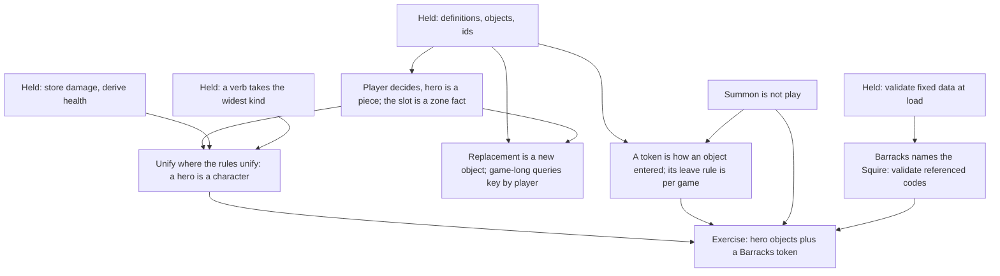

> [!quote] YOU

continue the course , a bunch of project reorganziations happenned on the meantime, one that will certainly affect u is the course file location, flag any inconsistency u find. a bunch of terms were settled and renames happened too.


> [!abstract] PI

I read the moved `docs/course/COURSE.md`, the conventions, the glossary, the ADRs and the code. The checks pass on this branch: fmt, clippy, 18 unit tests and 93 spec tests.

## Inconsistencies

1. `docs/course/verified-facts.md` says rustc and cargo are 1.92.0 on this machine. `rust-toolchain.toml` now pins 1.96.0, and `rustc --version` reports 1.96.0. The pin is already the source of truth, so I'd delete the line instead of updating it, since each fact gets one home.
2. In `docs/conventions/testing.md`, the assertion message example compares `game.health(recruit).unwrap()` with `Some(3)`. That doesn't type-check, because `health` returns `Option<i32>`. The real test at `tests/spec/state_check.rs:43` has no `.unwrap()`.
3. Some prose in `COURSE.md` uses names the glossary lists as ones to avoid:
   - "entry" where the glossary says "effect". This is in E3, in the dependent sequencing thread, and in the 04a row ("a checkpoint after each entry").
   - "side", in E4 and the 04a row ("kind and side, relative to the caster"). Here it means friendly vs enemy, and the glossary has no term for that. "Enemy hero" comes up today, so it may get settled this session.
   - "death check" where the glossary says "state check" (lines 66 and 113), "instance" where it says "object" (under Solid), and "heal" where it says "restore" (session 02 nodes).
4. `COURSE.md` still uses some code names from before the renames: `Picker`, "targeteers", "Monster 1/1", `MonsterCardDef::new`, `card_ids!` with `ALL`, and `DamagePlayer`/`DamageMonster` in E2. Most of these record what the code was at the time, so leaving them is defensible. E2 is different: it describes code that still exists, now named `DamageMinion`, so I'd update that one.
5. The knowledge map heading says "the 2025-09-28 probe". Session 00 was committed on 2026-09-29, so it's probably 2026-09-28.
6. The code names some things the glossary doesn't have:
   - `Graveyard`, and `emtomb`, which is a misspelling of "entomb".
   - `spawn`, for a minion entering the board.
   - `COURSE.md` also says "character" (Blast hits "every character"), with no glossary entry.

   Character, token and summon are today's topic, so those three should get settled in this session.

## Checked, nothing to change

- Every path in `COURSE.md`, the teach skill, `CLAUDE.md` and the docs points to the new locations. Old `course/...` paths appear only in past session logs, and those are never edited.
- `00-probe-and-plan.md` has been empty since it was created.
- ADR 0005 says the state check removes all dead minions at once, but `remove_dead` still removes one per pass. An ADR can record a decision before it's built, and the session 05 opener already tracks this one.
- The glossary already says a hero is what takes damage, while the code keeps `health` on `Player`. That gap is what 04c is about, so I'll leave it for the session.

## Proposal

- Items 1, 3, 4 and 5 go into the end-of-session edit. Those files are in the close-out commit, and `COURSE.md` gets rewritten then anyway.
- Item 6 gets glossary terms as each one is settled.
- Item 2 is a one-line fix in a conventions doc that the close-out commit doesn't include. I can make it now and leave it for your review.

Tell me if you'd split it differently. After that, 04c starts with the retrieval quiz on E1 to E5.


> [!quote] YOU

do 1, 2, 3, 4, 5 now and commit. 6 we will not do until they are more used. no need for retrieval quiz I did the last session a couple of hours ago


> [!abstract] PI

Now the edits.


> [!question] Quiz
> Heroes become objects. Each player has one hero at a time, and a card like Jaraxxus can replace it mid-game with a new object. Where should the game record which object is player P's hero?
>
> Status: the doc fixes are committed as 6008d37 (COURSE.md, verified-facts.md, testing.md). 04c starts here with a short probe to find your edges on heroes, players and tokens.
>
> Facts about the current code:
> - `ObjectBag` never removes an object, even after it leaves play.
> - `Board` holds a player's minions, left to right.
> - `Player` holds `mana`, `max_mana`, `health`, `interaction_state` and `zones` (hand, deck, board, graveyard).
>
> 1. A `hero` field in P's `Player`, beside the zones
> 2. The first entry of P's `Board`, ahead of the minions
> 3. A `hero` field in P's `Player`, plus a `hero_of` field on the object
> 4. No field: find the bag object whose kind is Hero and whose owner is P


> [!success] Quiz — correct ✓
> Your answer: 1. A `hero` field in P's `Player`, beside the zones
> Correct answer: 1
>
> Note: maybe even inside the zones
>
> Which object is P's hero is a zone fact, like which objects are in P's hand. Nothing else records it, so it has to be stored, and it should be stored once.
>
> - Scanning the bag finds two heroes after Jaraxxus, because the replaced hero object is still in the bag with kind Hero and owner P. "Derive the rest" works only when something stored is the source, and here nothing is.
> - Putting the hero first on the board makes every minion selector, board-full count and position skip index 0. The board's order means minions, left to right.
> - A `hero_of` field on the object is a second copy of the same fact. After a replacement, the old object still says `hero_of: Some(P)` unless a hook clears it. That's the mirror pattern.


> [!question] Quiz
> In MTG, a token in any zone other than the battlefield ceases to exist. Where should an engine record "this object is a token"?
>
> MTG cards that make tokens:
> - Raise the Alarm: "Create two 1/1 white Soldier creature tokens."
> - Cackling Counterpart: "Create a token that's a copy of target creature you control." The copied creature can be an ordinary card from a deck.
>
> When the token leaves the battlefield, the engine has to know to remove it. When an ordinary creature card dies, it stays in the graveyard.
>
> 1. On the card definition, as a `token: bool` field
> 2. Derived: a token has no `CardPlayed` entry in History
> 3. On the object, set by the effect that creates it
> 4. Derived: a token's definition appears in no deck list


> [!question] Quiz — I don't know
> Your answer: I don't know
> Correct answer: 3
>
> Note: this is a very deep question I believe, I dont think the token: bool field is ideal, maybe a TokenCardDef ? the thing is, if a minion has a card definition it could also its card form, so tokens are basically another card type, which may be a good invariant, like how when minion return to hand they are cards on heartstone, this way tokens disapearing when destroyed is a design decision. an alternative would be having the creature representation decoupled from the card, this way tokens do not need to have a card representation and it disapearing when killed is a tech limitation. same for heroes.
>
> Being a token is about how this object came into the game, not about what card it shows. Cackling Counterpart's copy uses the definition of an ordinary deck card, and it's still a token. So the fact belongs on the object, set by whatever creates it.
>
> - A flag on the definition marks the Soldier, but it can't mark a copy of a deck card without marking every copy of that card, the one in the graveyard included.
> - "Not in any deck list" fails the same way: the copied card is in a deck list.
> - "Never played" confuses summon with token. An ordinary card put onto the battlefield straight from the deck by an effect was never played either, and it isn't a token.
>
> In Hearthstone, a token returned to the hand plays like any other card, so the flag has no rules effect there. Whether being a token matters is decided per game, like the zone-reset table.


> [!question] Quiz
> Which statement about "hero" is right?
>
> Hearthstone facts (HearthSim protocol docs):
> - Every hero is a Card entity with card type HERO. That covers the starting heroes and the hero cards, such as the Death Knight heroes.
> - A hero card sits in the hand like any other card until it's played. Playing it replaces the player's current hero.
> - The Player entity points at its current hero through a `HERO_ENTITY` tag.
>
> 1. Hero is a role only: the object becomes a hero when it enters P's hero slot
> 2. Hero is a fact on the object, set by the effect that makes it P's hero, like a token
> 3. Hero is a kind on the definition, so any object of that kind P owns is P's hero
> 4. Hero is a kind on the definition, and which object is P's hero is a zone fact


> [!success] Quiz — correct ✓
> Your answer: 4. Hero is a kind on the definition, and which object is P's hero is a zone fact
> Correct answer: 4
>
> Note: I think it is a zone fact because the hero in play and the hero in hand are both heroes but one is in hand other on board/hero slot
>
> "Hero" means two things here, and they live in two places.
>
> - Kind: a hero card is a hero before anyone plays it. Its definition carries hero data, such as health and armor. That belongs on the definition, like a minion's attack and health.
> - Being P's hero is a zone fact: the object P's hero slot holds right now (`HERO_ENTITY`). That's the stored field from the first question.
>
> Why the others fail:
> - Kind only: a hero card still in P's hand would count as P's hero, and so would the replaced hero still sitting in the bag.
> - Role only: it drops the hero data the definition has to carry.
> - Flag on the object: that's a second copy of what the slot already says, and it goes stale after a replacement. Token-ness is different, because nothing else records how an object entered the game. Which object is P's hero is already recorded in the slot.


> [!abstract] PI

Right. Both objects are heroes by kind, and only the slot says which one is P's hero.


> [!question] Quiz
> Heroes are objects, and each hero object stores its own damage, like a minion. How should the engine handle both replacement cards?
>
> Two cards for our game, modeled on Hearthstone's hero cards and Lord Jaraxxus:
> - Card A: "Replace your hero with Knight. It keeps your hero's damage."
> - Card B: "Replace your hero with Jaraxxus." Jaraxxus has 15 printed health and starts undamaged.
>
> In both cases, buffs on the old hero never carry over to the new one.
>
> 1. The same object each time, with its definition swapped for Knight's or Jaraxxus's
> 2. A new object each time, and its health reads the old hero's damage from History
> 3. Damage moves from hero objects to `Player`, and Card B resets it to zero
> 4. A new object each time, and the card's data says whether the old damage is copied onto it


> [!success] Quiz — correct ✓
> Your answer: 4. A new object each time, and the card's data says whether the old damage is copied onto it
> Correct answer: 4
>
> Note: I guess having it as data is more flexible
>
> Replacing the hero gives P a new piece, so it's a new object, the same way a zone change does. The old object keeps its buffs and damage, and they stay behind with it. Copying the damage is something Card A does, so it lives in Card A's data. Card B copies nothing and gets 15 from Jaraxxus's definition.
>
> - Swapping the definition keeps `obj.modifiers` on the same object, so the buffs carry over unless a hook clears them. That hook is one more place to forget.
> - Damage on `Player` splits damage into two paths again, one for heroes and one for minions, which is the split this session removes. Card B would also need a reset hook.
> - Reading damage from History over-applies "derive the rest". Damage is stored where it's marked (ADR 0005), and History doesn't record it.


> [!abstract] PI

I'll start the engine research now so it's ready for the last probe question: how MTG engines that have no hero objects let one spell target either a player or a creature.


> [!question] Quiz
> P plays Barracks, a spell: "Summon a Squire." Under Hearthstone's rules, which of these happen?
>
> The Squire is a 1/1 token minion with two hooks:
> - `on_play_effect`, its Battlecry: "Draw a card."
> - `on_board_enter`: "When this enters the board, deal 1 damage to the enemy hero."
>
> Select every option that happens.
>
> 1. The Squire's `on_board_enter` effect runs
> 2. Barracks gets a `CardPlayed` History entry
> 3. A `Played` event names the Squire
> 4. A `BoardEntered` event names the Squire
> 5. The Squire's `on_play_effect` runs
> 6. The Squire gets a `CardPlayed` History entry


> [!success] Quiz — correct ✓
> Your answer: 1. The Squire's `on_board_enter` effect runs, 2. Barracks gets a `CardPlayed` History entry, 4. A `BoardEntered` event names the Squire
> Correct answer: 1, 2, 4
>
> Note: the way I see it squire was never played
>
> In Hearthstone every minion that reaches the board is "summoned", but only one cast from the hand is "played". A Battlecry fires only when its minion is played from the hand (hearthstone.wiki.gg, Summon and Battlecry).
>
> - Barracks was played from the hand, so it gets the `CardPlayed` entry and the `Played` event.
> - The Squire was summoned, so it gets everything that comes with entering the board: the `BoardEntered` event and its `on_board_enter` effect.
> - Everything that comes with being played skips the Squire: no `CardPlayed`, no `Played`, no Battlecry.
>
> Your code already splits it this way. `play` records the play and runs `on_play_effect`, then calls `spawn`. `spawn` only puts the minion on the board and runs `on_board_enter`. A summon effect calls `spawn` alone.


> [!abstract] PI

Right. The Squire was never played, so nothing tied to playing a card touches it.


> [!question] Quiz
> SabberStone makes the Hearthstone hero a `Character`, the same base type as a minion. Forge and XMage never make an MTG player into a piece like a creature. What in the rules decides this?
>
> How the three engines deal damage:
> - SabberStone: `Hero : Character` and `Minion : Character`. The `Controller`, which is the player, is a separate type.
> - Forge: `Player` and `Card` share an abstract class, `GameEntity`, whose `addDamageAfterPrevention` is abstract. `Player` implements it with `int life`, and `Card` implements it with marked damage.
> - XMage: `Player` and `Permanent` share only `getId()`, which returns a UUID. `DamageTargetEffect` looks up each target id as a permanent first, then as a player, and calls that side's own `damage`.
>
> MTG: damage to a player causes life loss (120.3a). Damage to a creature is marked on it (120.3e).
>
> 1. MTG allows more than two players, and a hero piece per player only works with two players
> 2. In Hearthstone damage marks a hero as it marks a minion. In MTG a player takes damage differently from a creature
> 3. Every MTG object needs a card behind it, and a player has no card to put behind a piece
> 4. An MTG player holds zones such as a hand and a library, and a piece on the battlefield can't hold zones


> [!success] Quiz — correct ✓
> Your answer: 2. In Hearthstone damage marks a hero as it marks a minion. In MTG a player takes damage differently from a creature
> Correct answer: 2
>
> Unify where the rules unify. In Hearthstone, a hero takes damage the way a minion does: it's marked, health is derived from it, and the hero dies at 0 or less. Armor is extra on top. One type with one damage path loses nothing. In MTG, damage to a player is life loss, and infect gives poison counters instead. Damage on a creature is marked and wears off at end of turn. These really are two behaviors, so the branch has to live somewhere. Forge puts it behind an abstract method, one implementation per type. XMage puts it inside each verb.
>
> - Zones: in Hearthstone too, the player holds the zones and the hero is a separate piece. Holding zones belongs to the player, not to the piece that represents them.
> - Cards: an MTG token is an object that "isn't represented by a card" (111.1), so objects don't need cards.
> - Multiplayer: one hero per player works for any number of players, as Hearthstone's own modes show. The count isn't the obstacle.


> [!question] Quiz
> A new card: "Costs (1) less for each damage your hero has taken this game." P's first hero took 6 damage. Then Card B replaced it with Jaraxxus, a new and undamaged object, and Jaraxxus has taken 2 damage since. The card should cost 8 less. Which source gives 8?
>
> Recap: each hero object stores its own damage. Card B makes a new hero object and copies no damage. The old hero object stays in the bag.
>
> 1. History entries for damage to heroes, each naming the hero's player, counted for P
> 2. History entries for damage to heroes, each naming the hero's object, counted for P's current hero
> 3. P's current hero's printed health minus its current health
> 4. The `damage` field of the object in P's hero slot


> [!success] Quiz — correct ✓
> Your answer: 1. History entries for damage to heroes, each naming the hero's player, counted for P
> Correct answer: 1
>
> "Your hero" in "your hero has taken this game" means whichever piece represented you at the time, across replacements. The identity that lasts the whole game is the player's, so History has to key the entries by `PlayerId`.
>
> - Keyed by the hero's object: the 6 were dealt to the old object, so a query for the current hero finds only 2. The object id changes on replacement, which is the stable id vs object id split from session 02.
> - The `damage` field: it says how hurt this piece is right now. It isn't a record of what happened. It gives 2, and if Card A had copied the damage over, it would have given 8 by accident.
> - Printed minus current health is the same 2, derived another way.
>
> An entry can name both the object and its player. The point is that this query reads the player.


> [!question] Question
> What should the 04c exercise build?
>
> Concept check from the probe: everything held except token-ness. So the session can be short on concept and spend its time on the exercise design, where you make the calls.
>
> Heroes as objects means: a hero kind on the definition, a hero slot per player, hero health derived from damage marked on the hero object, Spark/Bolt/Wild Bolt/Blast and fatigue damaging that object, events naming the hero by ObjectId, the outcome read from heroes, and the view showing each hero.
>
> Tokens in Hearthstone have no rule of their own, so a `token` flag on the object would have no test to read it. Building tokens means a summon verb plus a token definition that no deck contains, and the card table must check that every code an effect names exists.
>
> Hero replacement (Jaraxxus) exercises "new object, the old one keeps its buffs".
>
> 1. Heroes as objects, plus Barracks summoning a token (Recommended)
> 2. Heroes as objects only
> 3. Heroes, Barracks token, and a Jaraxxus-style replacement card
> 4. Concept only today, exercise in the next session


> [!example] Answer
> 1. Heroes as objects, plus Barracks summoning a token (Recommended)


> [!abstract] PI

Settled: heroes as objects, plus Barracks summoning a token.

## Plan

The probe showed the hero concepts are already in place, so I won't re-teach them. Here's how the session runs:
1. **Token node.** The only node that gets the full treatment, because it's the one gap. A token is a fact about how an object entered the game, not a kind of card. What happens to a token that leaves play is a separate rule for each game: MTG makes it cease to exist, Yu-Gi-Oh removes it, Hearthstone does nothing special. That's why our core gets no `token` flag until some rule reads it.
2. **Barracks node.** Barracks is the first card whose data names another card. That links to the load-time validation from session 02: every code an effect names must exist in the table. It also feeds the ADR 0003 trade-off for session H, since Barracks gets a new version every time the Squire changes. A short connect, then a check.
3. **Exercise design, one decision at a time.** You make the interface calls:
   - where the hero slot lives (`Player` or `Zones`)
   - the hero definition's shape and how each player gets one (`Game::new` takes it, or a default)
   - `hero_health` and `health` for heroes
   - what happens to `Target::Hero(PlayerId)` in `Damaged`
   - whether fatigue names the hero object
   - how a dead hero and the outcome fit the state check
   - the hero's view shape
   - the shape of `Summon`
   - the error for an unknown referenced code

   Smaller things that touch one call site are mine, for example whether heroes get their ids before or after the deck objects.
4. **Roles as usual.** I draft the plain data types (`Event`, `View`, the card literals) for you to edit. I write the tests first against the agreed API. You write the slot, the health derivation, the summon and the validation.

The 04a boundary stays where it is. `DamagePlayer` keeps its shape and damages each selected player's hero object, and Blast stays two effects. Merging them into one `Damage` over every character is 04a's job, and it gets easier once heroes are objects.



H3 stays concept only. Nothing in this exercise replaces a hero.

Shall I go ahead, starting with the token node?


> [!quote] YOU

yes


> [!abstract] PI

## Node: what a token is

**Why now.** Barracks is about to put a Squire into our game. MTG and Yu-Gi-Oh have rules just for tokens. Hearthstone has none. Pick the wrong place for token-ness and the core either can't express MTG's copy tokens, or it carries a flag that no test ever reads.

**The truth to build on.** A card definition is shared by every copy of the card, which is what the glossary says it is. So if two objects with the same definition can differ on some fact, that fact can't live on the definition. It lives on the object. The rule has no exceptions.

Two of your fields already fit it:
- Printed attack can't differ between two Recruits, so it's on the definition.
- Damage can differ, so it's on the object. That's why `Object` has `damage`.

**Applying it to tokens.** Cackling Counterpart's token and the original creature card share one definition. One is a token and the other isn't. So token-ness can differ between copies, and it goes on the object, set by the effect that creates it. In plain words, the definition answers "what is this", and token-ness answers "how did this get into the game". A deck at setup and a mid-game effect are two different answers. Kind is part of "what is this", so a `TokenCardDef` kind mixes the two questions.

**What a token rule does.** Being a token only matters when some rule reads it, and that rule differs per game. Each version maps onto something you already know:

| Game | Token leaving play | Mechanism you know |
|---|---|---|
| MTG | It reaches the graveyard, its "dies" triggers fire, then it ceases to exist (111.7, 704.5d) | A state check, after the move |
| Yu-Gi-Oh | "Simply removed from the field" instead of going anywhere | A replacement: the move never happens |
| Hearthstone | Nothing special. A bounced token comes back as a playable card | No rule at all |

So you were right that it's a design decision. It just isn't a decision about the card. It's a rule in each game about objects that carry the flag, and those rules hook in at different times.

**What this means for our core.** We're building Hearthstone's rules, and no rule there reads token-ness. A `token` flag would be an untested speculative branch, the kind the open threads already ask us to cut. The Squire is an ordinary minion definition that simply appears in no deck. Barracks makes a new object from the counter and puts it on the board with `spawn`. If an MTG-style rule ever arrives, the flag goes on the object, and the effect that creates the token sets it.

Next is the check on this node. If any of this doesn't sit right, push back first.


> [!quote] YOU

I agree with almost everything, following heartstone I think token should have definitions and then they can be cards, but I do see value in having token on the definition not object, I guess it depends on the definition of token, when a spell card summons a recruit, is it a token? I would say it is not, it is just the card. for me token is an uncollectable card.


> [!abstract] PI

You're right that it comes down to the definition of token. The word covers two different concepts, and the rule from the node puts each one in a different place.

**Hearthstone's token means an uncollectible card.** The real property is "a deck can't contain this card". It can't differ between two Squires, so it goes on the definition, as your reading says. The wiki agrees: token is "an unofficial term for most uncollectible minions that are summoned directly into play by other cards". When a spell summons a Recruit, the Recruit isn't a token. Its definition is collectible.

**MTG's token means an object that no card represents.** It's created by an effect, and rules read it. Two objects with the same definition can differ on it (Cackling Counterpart), so it goes on the object. Under this meaning, your summoned Recruit would be a token. Barracks creates it from nothing and doesn't take it from a deck.

So your question splits exactly along the two meanings. Hearthstone says no, and MTG would say yes. Neither meaning breaks the rule: each fact sits where it can or can't differ between copies. Where I went wrong was treating MTG's meaning as the only one.

Effect on the exercise: nothing changes in what we build. The Squire gets an ordinary definition, it's a card that can sit in a hand, and nothing in the core reads "token" in either sense. A `collectible: bool` on the definition is your meaning made explicit. Like the object flag, it waits for a rule that reads it, such as a deck check in `Game::new`. I'll add it to the design decisions so you can choose whether that check is in scope.

You've now named the term ("token is an uncollectible card"). You said to hold the new glossary terms until they're used more, so I'm not writing it yet. When it goes in, MTG's meaning goes with it under Flagged ambiguities.

Next is the node check: deciding which facts go on the object and which on the definition.


> [!quote] YOU

I think collectible is out of the scope of this session


> [!abstract] PI

Agreed, `collectible` stays out of this session.


> [!question] Quiz
> A Squire object is on P1's board. Which of these facts belong on the object rather than on the card definition?
>
> Select every fact that belongs on the object.
>
> 1. Its printed attack is 1
> 2. A deck can't contain it
> 3. Its owner is P1
> 4. An effect created it, rather than a deck
> 5. It has 1 damage
> 6. It is a minion


> [!success] Quiz — correct ✓
> Your answer: 3. Its owner is P1, 4. An effect created it, rather than a deck, 5. It has 1 damage
> Correct answer: 3, 4, 5
>
> Note: 4 we dont have today
>
> Ask of each fact: can two objects with the same definition differ on it?
>
> - Created by an effect: yes. A Recruit drawn from a deck and a Recruit summoned by an effect share a definition. This is MTG's sense of token.
> - 1 damage: yes, one Squire can be hurt and another not.
> - Owner P1: yes, both players can each have a Squire.
> - A deck can't contain it: no, that holds for every Squire. This is Hearthstone's sense of token.
> - It is a minion: no, kind is what the card is.
> - Printed attack 1: no, it's printed.


> [!question] Quiz
> Barracks v0's effect names `base.squire.v0`, a 1/1. A balance patch makes the Squire 2/1 by adding `base.squire.v1`. Under ADR 0003, what does Barracks v0 summon in a game started after the patch?
>
> ADR 0003: a card definition is identified by a stable string code that carries a version, in one append-only table. Changing a card adds a new version and leaves the old one in place.
>
> Correction to the plan: the exercise needs no new reference check. Today a reference can only be a `def_ids!` constant, and `validate_not_found` already fails if a constant has no definition. That check becomes necessary when codes come from files (session H).
>
> 1. The Squire from the data release the game was started with
> 2. The old 1/1 Squire, until a Barracks v1 that names the v1 Squire is added
> 3. Nothing: loading fails, because the v1 Squire supersedes the v0 Squire
> 4. The new 2/1 Squire, because the newest version of a code is the one used


> [!success] Quiz — correct ✓
> Your answer: 2. The old 1/1 Squire, until a Barracks v1 that names the v1 Squire is added
> Correct answer: 2
>
> Barracks v0's data says `base.squire.v0`, and the append-only table still has that definition, so the old Squire it is. To summon the new one, the patch also has to add Barracks v1, a new version of a card that didn't change in any way you can see.
>
> This is case (1) from the session H open thread, and Barracks is the first real instance. The considered option in ADR 0003, unversioned codes pinned to one data release per game, avoids re-versioning Barracks. The price is that every replay records its release. Session H weighs the two. Nothing changes today.
>
> - "The newest version wins" would make old replays summon the new Squire, which breaks what versioned codes are for.
> - Nothing is ever superseded in an append-only table.
> - There is no data release in ADR 0003. That's the alternative it rejected.


> [!abstract] PI

The node landed. On to the exercise design. Answer the way you like, "1a 2b ..." or in free text. I've kept my leanings out of the decisions that carry the design and put in only the cases that force a choice.

**1. Hero slot.** In `Player` or in `Zones`, holding a plain `ObjectId`? You leaned toward `Zones`.

**2. Hero definition and setup.** What data does a hero definition carry, and where does each player's hero definition come from? The forcing facts:
- Nearly every test calls `Game::new(seed, decks)` or `with_deck_order`.
- Under ADR 0001, the hero definition is an input to the start state like the decks, so a replay has to know it.
- Only one hero exists today.

**3. Health API.** Today `hero_health(p)` reads `Player.health`, and that field goes away, because keeping it next to the hero object would be a mirror. Some questions:
- Does `health(hero_id)` return `Some`?
- Do we keep `hero_health(p)`, or add `hero(p) -> ObjectId`, or both?
- Should `attack(hero_id)` be `None` or `Some(0)`? Hearthstone says heroes "by default do not have an Attack value".

**4. `Damaged`'s target.** Today it's `Target::Hero(PlayerId) | Target::Minion(ObjectId)`. ADR 0006 says events name objects by id only, and `view` decides what each player sees.

**5. Fatigue.** `FatigueDamaged { amount, player_id }` now marks damage on the hero object. Should it stay as it is or name the hero? In session 03 you argued fatigue deserves its own event. In session 05, a "whenever your hero takes damage" trigger will read damage events.

**6. A dead hero.** Two options:
- It stays in the slot at 0 health or less, and the outcome reads it.
- It leaves the slot, and the slot becomes `Option<ObjectId>`.

Also, does a `Died` event name the hero? With two players, the game ends at the first state check that finds a dead hero. Elimination with N players is still an open thread.

**7. `Summon`'s shape.** An effect is verb + selector + amount. What does Barracks' effect look like? The forcing facts:
- `Draw` and `Reveal` take a `PlayerSelector`, but Barracks only needs `Caster`.
- "Summon two" is common in Hearthstone, but no card here needs it yet.
- Should the new object come with its own event, or is `BoardEntered` enough?

**8. View.** I'll draft `PlayerView.hero_health: i32` as `hero: HeroCard { object_id, def_id, health }`. Accept it or edit it.

**Mine, unless you object:**
- Heroes get their ids before the deck objects.
- The hero is `base.hero.v0`, named "Hero", with 10 health, as today.
- Barracks is a spell costing 2: "Summon a 1/1 Squire."
- The Squire is `base.squire.v0`, a 1/1 that costs 1 and is in no deck.
- Spark, Bolt, Wild Bolt and Blast keep their effects. `DamagePlayer` now marks damage on each selected player's hero. Merging the two damage verbs waits for 04a.


> [!quote] YOU

1 zones and objectId. 2 The hero is base.hero.v0, static, later it will be parametrized, no point in doing it while we only have one. 3 Player.health is removed, only hero(p) -> ObjectId, health returns some because the impl accepts any objectId, should be None by default and Some(0) is a possible valid value. 4 Damaged { target: ObjectId, ... }. 5 carry the object_id. 6 stays, I dont see why not. Died is emited for heros. 7 Summon { selector: PlayerSelector, def_id: DefId }, BoardEntered enough. 8 yes.


> [!question] Quiz
> Suppose `find_dead` also scans each hero zone. For a hero, the loop body only reports `Died` and leaves the hero in its zone, as decision 6 says. Blast drops P1's hero to 0. What happens?
>
> Today's state check:
>
> ```rust
> pub(crate) fn check_state(&mut self, obs: &mut impl Observer) {
>     self.remove_dead(obs);
>     self.decide_outcome(obs);
>     obs.checkpoint(Views::new(self));
> }
>
> fn remove_dead(&mut self, obs: &mut impl Observer) {
>     while let Some(object_id) = self.find_dead() {
>         self.kill(self.objects.get(object_id).player_id, object_id, obs);
>         obs.checkpoint(Views::new(self));
>     }
> }
>
> fn decide_outcome(&mut self, obs: &mut impl Observer) {
>     if self.outcome.is_some() {
>         return;
>     }
>     // reads each hero's health, sets self.outcome, reports GameEnded
> }
> ```
>
> 1. `Died` is reported once, then `decide_outcome` ends the game
> 2. The loop ends after one pass, because the hero has already been reported
> 3. The loop never ends, because every pass finds the same hero again
> 4. `decide_outcome` runs inside the loop and stops it once the outcome is set


> [!success] Quiz — correct ✓
> Your answer: 3. The loop never ends, because every pass finds the same hero again
> Correct answer: 3
>
> A fixed-point loop only ends if each pass changes what the next pass finds. For a minion, removing it from the board is that change. A hero that stays in its zone at 0 changes nothing, so `find_dead` returns it forever. Nothing records "already reported" unless you add a mirror that does, and `decide_outcome` runs after the loop, not inside it.
>
> The fix keeps your decision 6. Heroes aren't part of the removal loop at all. Check them once, after the loop, where `decide_outcome` already reads hero health: report `Died` for each dead hero, then `GameEnded`. The early return on `self.outcome` makes that happen exactly once. It's also the order ADR 0005 states: remove dead minions until a pass removes none, then decide the outcome. A deathrattle that damages a hero gets to count before the outcome is decided.


> [!abstract] PI

Correct. With heroes checked once after the loop, your decision 6 stands as it is.

Next I draft the data types and write the tests. Let me see what the current tests touch.


> [!abstract] PI

Now the data type drafts. Construction sites in your code are left broken on purpose, so the compiler gives you the list of what to change.


> [!abstract] PI

Now the tests. First the support helpers:


> [!abstract] PI

Now `events.rs`: updating the hero targets and adding the new reports.


> [!abstract] PI

Now `state_check.rs`, `setup.rs`, `derived.rs`, `views.rs` and `cards.rs`:


> [!abstract] PI

Now the playout model, so the random games include Barracks and check the heroes:


> [!abstract] PI

Checking what the compiler now reports in your code. This is your checklist:


> [!abstract] PI

Now I'll check that the tests compile, in a throwaway worktree with `todo!()` stubs. The stubs never touch your tree.


> [!abstract] PI

Clippy passes on every target with the stubs, so the tests compile against the agreed API. Formatting one line in your tree, then removing the throwaway worktree:


> [!abstract] PI

The drafts and tests are ready for your review. Nothing is committed. The library doesn't compile yet, and that's on purpose: the errors are your checklist.

**What I drafted (data only):**
- `event.rs`:
  - `Damaged { target: ObjectId, .. }`.
  - `FatigueDamaged { amount, player_id, object_id }`.
  - `Target` deleted.
- `view.rs`: `PlayerView.hero: HeroCard { object_id, def_id, health }`, replacing `hero_health`.
- `definition.rs`:
  - `CardDefKind::Hero(HeroCardDef { health })`.
  - `Effect::Summon { selector: PlayerSelector, def_id: DefId }`.
- `loader.rs`:
  - `HERO` (10 health, cost 0).
  - `SQUIRE` (1/1, cost 1).
  - `BARRACKS` (spell, cost 2, `Summon { Caster, SQUIRE }`).
  - All three are in `def_ids!` and exported from `rules::cards`.

**Your checklist.** `cargo check` reports these first:
- `binder.rs`: six `match`es need a `CardDefKind::Hero` arm.
- `resolve.rs`: `Target` is gone, so `DamagePlayer` has to name the hero object. `apply_effect` also needs a `Summon` arm, which the compiler will report once the import is fixed.
- `zone_move.rs`: fatigue marks damage on the hero and reports its `object_id`.
- `view.rs`: fill in `hero`.

The compiler won't point at these:
- `Zones.hero` and setup that creates the heroes. Heroes take their ids before the deck objects.
- `Game::hero(p)`.
- `health`, `attack` and `mana_cost` answering for a hero.
- Removing `Player.health` and `hero_health`.
- Reporting hero deaths once, after the removal loop, then `GameEnded`.

**New tests (14).**
- `setup`:
  - `each_player_starts_with_a_hero`
  - `each_hero_is_an_object_apart_from_every_card`
- `derived`:
  - `a_hero_has_health_and_no_attack_or_cost`
  - `a_captain_does_not_buff_its_owners_hero`
- `cards`:
  - `barracks_summons_a_squire_at_the_right_end_of_its_casters_board`
  - `a_summoned_squire_has_its_printed_stats`
  - `each_barracks_summons_a_new_object`
- `events`:
  - `barracks_reports_its_play_then_the_squire_entering_the_board`
  - `a_hero_brought_to_zero_is_reported_dead_once_before_the_game_ends`
  - `a_minion_dying_with_a_hero_is_reported_dead_first`
  - `heroes_brought_to_zero_together_are_each_reported_dead_before_the_draw`. The order between the two heroes isn't pinned; session 05 decides simultaneous order.
- `state_check`: `a_hero_brought_to_zero_stays_in_its_zone`
- `views`: `both_players_see_each_hero_with_its_definition_and_current_health`
- `every_card_pays_its_printed_cost` now also covers Barracks and the Squire.

**Changed tests.**
- `hero_health(&game, p)` is a support helper now, reading `health(hero(p))`.
- Hero targets in events use `game.hero(p)`.
- `zone_ids` includes the heroes, so every invariant over zones also covers them. That includes rejecting `Play` and `Pick` on a hero id.
- The random playout deck gains two Barracks, the board model summons a Squire for each, and every step checks that a hero has no cost and no attack.

**One behavior I pinned that we didn't discuss.** `a_captain_does_not_buff_its_owners_hero`: the Captain's aura buffs minions only, as Hearthstone's "your other minions" auras do. If you meant it to buff every friendly character, tell me and the test goes.

I checked the tests in a throwaway worktree with `todo!()` stubs. They compile, and clippy with `-D warnings` is clean on every target. Formatting is clean in your tree. Nothing has run yet, so every test is red until the library compiles.


> [!quote] YOU

finished I believe


> [!abstract] PI

`just check::all` stopped at the format check. Let me see what fmt flags and run the rest:


> [!abstract] PI

Clippy is clean, and you've already renamed `hero` to `hero_id` in the tests. The only fmt issue is the line your rename made longer in `support.rs`. Running the tests:


> [!abstract] PI

Green: 18 unit tests and 106 spec tests. Before I trust that, I'll probe a few behaviors the tests don't pin, in a throwaway copy so your tree stays untouched:


> [!abstract] PI

I fixed the one long line your `hero_id` rename caused in `support.rs` with `cargo fmt`. `just check::all` now passes: fmt, clippy, 18 unit tests and 106 spec tests.

**What's good**
- `Zones.hero` is set once in `Zones::new`, so there's no window where a player has no hero.
- `health` checks zone membership (`hero_id(owner) == object_id`), so a replaced hero object would stop answering.
- `DamagePlayer` and fatigue both mark damage on the hero object, and that is the only place hero health is stored.
- Renaming `spawn` to `summon` matches Hearthstone's word.

**Issues.** I found the first two with throwaway probes, since no test covers them:

1. **History records a hero death as a minion death.** The hero goes through `kill`, which pushes `HistoryKind::MinionDied`. The probe found one such entry after Blast killed a hero. History is the record of what happened, and this entry is false. Any "minions that died" query would count heroes, including the existing `HistoryQueryKind::MinionDied`. You can fix it either way:
   - The hero path reports `Died` and skips `kill`. Nothing reads hero deaths yet.
   - `kill` records an entry that depends on the kind.
2. **A hero card in a hand can be played onto the board.** `has_board_presence(Hero)` is `true`, so playing a `HERO` from the hand calls `summon`. The probe shows the hero on the board as a minion, while the hero zone still holds the original. No real deck holds a hero card today, but nothing stops one from holding it. Did `true` mean "in play"? If so, the board is the wrong place for it.
3. **`Player.playing` and the re-check after a hero's death effect can't be tested.** `Game::new` takes exactly two decks, and the game ends at the first dead hero. So nothing behaves differently with or without the flag, and heroes have no death effect for the re-check to see. Keeping elimination as a stored fact is the right instinct from session 02, because elimination has to be committed. But it's speculative code that no test can pin. I'd cut it and leave N-player elimination as an open thread.
4. **`hero_health(p)` stayed public.** Decision 3 was "only `hero_id(p)`". If you keep the method, I'll drop my test helper, which duplicates it. If you meant to remove it, it goes and the helper stays.
5. **Hero health skips buffs.** The hero branch in `health` is printed health minus damage, with no buffs. That makes the Captain test pass by bypassing buffs for heroes. It doesn't scope the aura to minions: `modifiers` still hands friendly auras to every object a player owns. Nothing buffs a hero today, so this is a note, not a bug. But a future "+2 health to your hero" would need both paths changed.
6. **Minor: every apply now ends with three identical checkpoints instead of two.** The new `checkpoint` at the end of `remove_dead` fires even when no hero died. The probe saw four checkpoints on a Spark, with the last three showing the same view.

How do you want to handle 1 to 4? 5 and 6 are your call, and leaving them is fine.


> [!quote] YOU

1 and 2 fixed, 3 I prefer to keep it, 4 yea I changed my mind and decided it is finde to keep it. 6 fixed. 5 fixed too


> [!abstract] PI

Since you kept `hero_health`, I dropped my duplicate test helper. The tests now call `game.hero_health(p)`. The checks pass: 18 unit tests and 106 spec tests.

**Fixed well**
- 5: Health now has one path for heroes and minions, which matches ADR 0008. Auras reach only objects of kind minion, which is a better fix than having heroes skip buffs.
- 1: `kill` records each character's death, and the `MinionDied` query filters for minions. That's node C applied: store what happened, filter when you read. You also gave that query its scope and turn filters, which closes that item in the open threads, though no card reads it yet.
- 2: Heroes no longer go to the board.

**New things to decide or fix**

A. **Playing a hero card from the hand now replaces the hero.** `play` sets `zones.hero = object_id`. That's hero replacement, which this exercise left as concept only. No test pins it, and its semantics weren't chosen. Today the new hero starts at full printed health, like Jaraxxus, and nothing reports the swap except the view. You can:
- keep it, and tell me Jaraxxus or hero card semantics so I can write the tests, or
- drop it, and a played hero card resolves like a spell that does nothing. No deck holds one today.

B. **The checkpoint flag is inverted.** `let player_died = dead_players.is_empty();` is true when no hero died. With two players it still works out: a hero death always ends the game, and `decide_outcome` adds the final checkpoint after `GameEnded`. But `playing` exists for the case where a hero dies and the game goes on. There, the apply would end with no final checkpoint, which breaks the property test that every apply ends with a checkpoint. The simplest shape is what you had before: one unconditional checkpoint at the end of `check_state`, and none in `remove_dead` or `decide_outcome`. A hero's `Died` and `GameEnded` then share the last step.

C. **`CreatureDied` uses a name the glossary avoids.** The glossary lists "creature" under Minion as a name to avoid. The entry covers heroes and minions, which Hearthstone calls characters. `CharacterDied`? "Character" isn't in the glossary yet, since you deferred it, but this would be its first use in code.

D. **`lib.rs` now exports `CardDef`, `CardDefLoader` and `CardDefError` at the root.** `CardDefLoader` and `CardDefError` are already in `rules::cards`, so they now have two paths. `CardDef` is newly public, along with its fields. Did you mean to do that? We didn't discuss it.

3 (keep `playing`) and 4 (keep `hero_health`) are recorded as your calls.


> [!quote] YOU

A droped it. B fixed. C add it to the glossary as minior or player. D I am just reorganization the imports, and changed it again, can u fix the tests?


> [!abstract] PI

The card constants now live in `rules::static_card_definition`. I'm pointing the tests, and the bench that breaks the same way, at the new path:


> [!question] Question
> Which glossary entry for the hero-or-minion concept?
>
> Status: tests and the bench now import from `rules::static_card_definition`. `just check::all` is green (18 unit, 106 spec). B checks out: every apply still ends with a checkpoint, and the duplicate trailing one is gone. A is dropped. One stale line: the `lib.rs` docstring still lists `cards` among the public data types.
>
> On C, two things to settle:
> - The word. The code says `CreatureDied`, but the glossary lists "creature" under Minion as a name to avoid. Hearthstone's own term is "character" ("Heroes cannot be targeted by spells or effects that specify 'minion' rather than 'character'"). In MTG, a creature is roughly a minion, never a player.
> - What it covers. You wrote "minion or player". The glossary splits Player (makes decisions) from Hero (the piece that takes damage), and `CreatureDied` is reported for the hero object, not the player. So I'd define it as a minion or a hero.
>
> 1. Character: a minion or a hero. Rename CreatureDied to CharacterDied (Recommended)
> 2. Creature: a minion or a hero. Keep CreatureDied


> [!example] Answer
> 1. Character: a minion or a hero. Rename CreatureDied to CharacterDied (Recommended)


> [!abstract] PI

Renamed to `CharacterDied` in all three places. The glossary now has **Character**: "A minion or a hero.", under Cards. The checks still pass: 18 unit tests and 106 spec tests.

That finishes the 04c exercise. Here is where it ended:
- Each player's hero is an object, in `Zones.hero`. Its health is computed on read through the same path as a minion's, and auras reach minions only.
- `DamagePlayer` and fatigue mark damage on the hero object. `Damaged` and `FatigueDamaged` name the hero by `ObjectId`.
- A hero at 0 stays in its zone. It's reported `Died` once, after the minion removal loop and before `GameEnded`, and History records it as `CharacterDied`.
- Barracks summons a new Squire object for its caster through `summon`, reported only as `BoardEntered`.
- Your calls, kept as you wanted:
  - `Player.playing` stays.
  - `hero_health` stays public.
  - The card constants now live in `rules::static_card_definition`.
- One stale line, which is yours to fix or leave: the `lib.rs` docstring still lists `cards` among the public data types.

Proposed commit, after your review, of everything under `crates/` (src, tests, bench):

> 04c exercise: heroes are objects in a hero zone, Barracks summons a Squire; hero deaths reported once before the outcome

No test is red. The course docs (`COURSE.md`, glossary, verified facts, research reports, this log) go in the session close-out commit, not this one.

Review with `git diff -- crates/`. Shall I commit? After that we can close the session.


> [!quote] YOU

commit and push


> [!quote] YOU

commit push and open the pr


> [!abstract] PI

Committed as `5fbdfdc`. Now I'll push the branch `heroes-players-tokens`, not `main`, and open a PR against `main`:


> [!abstract] PI

I committed, pushed and opened the PR.

- **Commit:** `5fbdfdc` holds everything under `crates/`. `just check::all` passed right before it, with 18 unit tests and 106 spec tests.
- **Push:** the branch `heroes-players-tokens` is on `origin` and tracks it. Nothing went to `main`.
- **PR:** https://github.com/EMachad0/CardGameEngine/pull/4. It merges into `main` and carries three commits: the doc drift fixes, ADR 0008 and the exercise. Merging it is your call.

These are still uncommitted, waiting for the session close-out:
- `docs/CONTEXT.md` (the Character entry)
- `docs/course/verified-facts.md`
- the two research reports
- this session's log

The close-out also updates `COURSE.md`: the knowledge map, the open threads and the sessions table, with 04c done and 04a next. It also creates the 04a log if it's missing. I'd push that commit to the same branch so PR #4 carries it. Shall I close the session now?


> [!quote] YOU

yes


> [!abstract] PI

Now the close-out edits to `COURSE.md`:


> [!abstract] PI

Session 04c is closed. Here's what changed in `docs/course/COURSE.md`:

- **Knowledge map:**
  - The heading now says it's updated through 04c.
  - There are three new blocks:
    - **Probe:** every hero question right, with your notes.
    - **Nodes:**
      - Tokens: your "I don't know", your pushback that a Hearthstone token is an uncollectible card, and my concession that there are two meanings, each placed by the "can two copies differ" rule.
      - The Barracks version case.
    - **Exercise:** your interface calls, the four review fixes, and `playing` kept by choice.
  - The mirror habit didn't show this time. What showed instead was structure added for cases no test can reach.
  - Solid gains "player vs piece" and the two token meanings.
- **Course plan:** 04c is done, and 04a's selectors now resolve to `ObjectId`s.
- **Open threads:**
  - 04a now has to merge `DamagePlayer` and `DamageMinion` into one `Damage`. The question of who "each enemy hero" means is still open, and it becomes a filter over hero objects.
  - **New threads:**
    - hero replacement (concept only)
    - N-player elimination through `Player.playing`
    - the glossary terms you deferred (token, summon, graveyard)
    - the stale `lib.rs` docstring
  - **Updated threads:**
    - Session H: Barracks is the first real "card that names another card" case. Referenced codes are validated by the constants until data comes from files.
    - Session 05: hero deaths come after the minion loop. A hero-damage trigger must read `FatigueDamaged` too.
    - The list of untested speculative branches gains `playing` and `Summon`'s untested selectors.
- **Sessions table:** 04c is done (18 unit + 106 spec, ADR 0008, PR #4), and 04a is next. It opens with a retrieval quiz on 04c, tokens first.

The same commit carries the glossary's new Character entry, the two new research reports with their facts in `verified-facts.md`, this log, and the existing empty 04a log. It goes on `heroes-players-tokens` and is pushed, so PR #4 includes it.

To start 04a:

```
/new
/name 04a-effects-reshape
/md-log docs/course/sessions/04a-effects-reshape.md
continue the course
```

I'm committing and pushing now.
